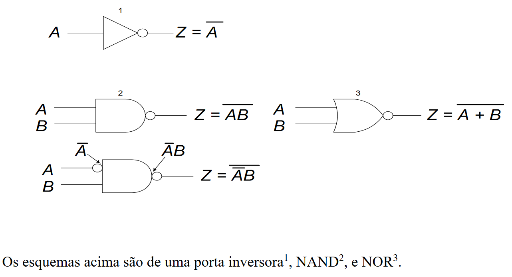

# Sistemas Digitais

## Representação de Quantidades Binárias

- Nos sistemas digitais eletrônicos, a informação binária é representada por tensões que estão presentes no circuito eletrônico

## Portas Lógicas e Álgebra Booleana

- Uma relação funcional acaba tornando-se uma tabela verdade

| A | Z = f(A) |
| - | -------- |
| F |     F    |
| V |     V    |

| A | Z = f(A) |
| - | -------- |
| F |     V    |
| V |     F    |

- Existem relações do tipo Z = f(A, B) dependente de duas variáveis lógicas A e B. Sendo os exemplos:

  
  

- Estas relações podem ser estendidas da forma Z = f(A, B, ..., Y). Ex:
  
  

- Além do AND e OR, há a existência do inversor no qual terá como saída o complemento lógico da entrada. F -> V e V -> F

  

## Teoremas da Álgebra de Boole

- O fato de uma variável só poder assumir um de dois valores nos conduz ao complemento do complemento de uma variável A ser a própria variável A, isto é: A = ~~A

  

### Provas (Tarefa)

## O Teorema de Morgan

  

- O complemento de vários ANDs é igual a vários ORs do complemento das variáveis
- O complemento de vários ORs é igual a vários ANDs do complemento das variáveis

## Funções Lógicas