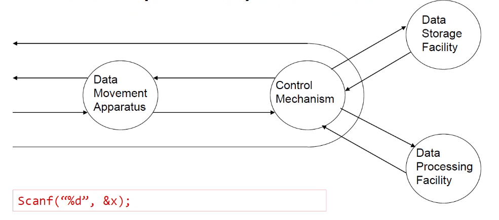
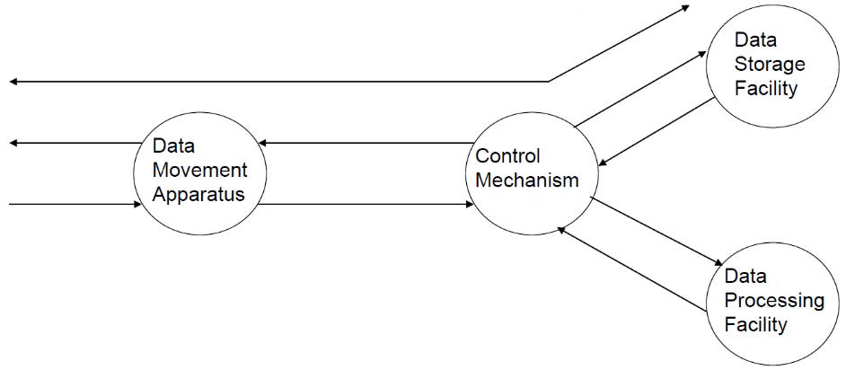
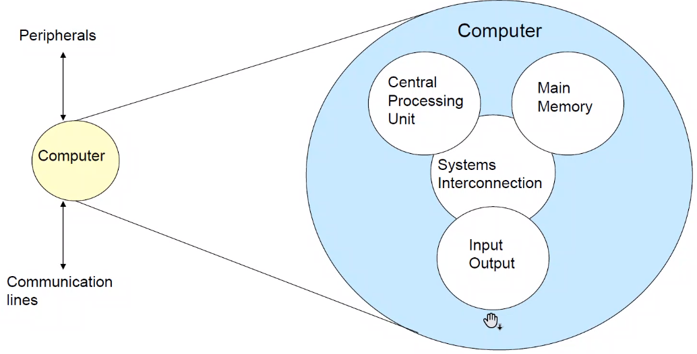

# Arquitetura e Organização de Computadores 1

## Objetivo

- Estudo de um sistema de computação sob dois pontos de vista:
  - **Arquitetural** - se refere aos atributos do sistema visíveis a uma programador de linguagem de máquina e
  - **Organizacional** - as unidades operacionais e sua interconexão que realizam a arquitetura
- Vamos estudar a estrutura e a função de um computador
  - **estrutura** - a forma em que os componentes estão interconectados e
  - **função** - o comportamento de cada componente individualmente
  - Cada componente pode, por sua vez, de forma hierárquica, se decomposto em subcomponentes, descrevendo a sua estrutura e função

## Arquitetura & Organização

- Exemplo:
- É uma questão de projeto arquitetural se o computador deve ter uma instrução de multiplicação. Mas é uma questão organizacional se a instrução deve ser implementada com uma unidade de multiplicação ou através de repetidas somas
  - Muitas fabricantes oferecem uma família de modelos de computadores, todos com a mesma arquitetura, mas com diferenças na parte organizacional. Resultam assim em modelos com preços e desempenhos diferentes, mas podendo executar os mesmos programas escritos
  - Toda a família Intel x86 compartilha a mesma arquitetura básica
  - A família IBM System/370 compartilha a mesma arquitetura básica
    - Isto determina a compatibilidade de código - pelo menos para as versões anteriores
  - A organização difere entre diferentes versões

## Estrutura & Função

- Em cada nível o projetista se preocupa com a estrutura e a função
  - Estrutura: a maneira em que os componentes são interelacionados
  - Função: a operação de cada componente, individualmente

## Visão Funcional

### Operações (1)

- Data movement
  - ex., teclado para vídeo (keyboard to screen)

### Operações (2)

- Storage
  - internet download para unidade de disco

### Operações (3)

- Processamento de/para memória
  - ex., atualizando saldo bancário

### Operações (4)

- Processamento da memória para E/S
  - impressão do saldo bancário

## Estrutura de um Computador - Visão Top-Down

## Estrutura - A Unidade de Processamento

## Estrutura - A Unidade de Controle

## Evolução dos Computadores e Desempenho

### História dos Computadores

#### A Era Mecânica (1600s-1940s)

- Wilhelm Schickhard (1623)
  - Astrônomo e Matemático
  - Cálculos de adição, subtração, multiplicação e divisão
- Blaise Pascal (1642)
  - Matemático
  - Primeira máquina operacional de produção em série
    - 50 cópias
  - Somente somava e subtraia
  - Apresentou problemas operacionais e de manutenção
- Gottfried Liebniz (1673)
  - Filósofo, cientista, matemático e inventor
  - Melhorou a máquina de Pascal
  - somava, subtraia, multiplicava e dividia
- Charles Babbage (1822)
  - Matemático - "Pai do computador moderno"
  - Buscava mais precisão nos cálculos
  - Máquina de Diferenças (Difference engine)
    - Primeiro acordo científico governamental
    - Cálculo automático de tabelas matemáticas
    - *Primeira máquina utilizada para resolver um problema*
  - Máquina Analítica (Analytic engine)
    - Realizava qualquer operação matemática
    - Dados em cartões perfurados
    - Estrutura moderna: E/S, armazenadores, ALU
    - Adição em 1 segundo, multiplicação em 1 minuto
  - Estas máquinas sofriam de problemas mecânicos
- George Boole (1847)
  - Análise matemática da Lógica (Mathematical analysis of logic)
  - Investigou as Leis do Pensamento
- Herman Hollerith (1889)
  - Fundou *Tabulating Machine Company* (tornou-se a IBM)
  - Em 1880 o censo gastou 5 anos para tabular os dados (montar em forma de tabela)
  - Estimativas de tabulação
    - 1890: 7,5 anos
    - 1900: 10+ anos
  - A máquina de Tabulação de Hollerith reduziu as estimativas de 7,5 anos para 2 meses
- Konrad Zuse (1938)
  - Construiu o primeiro computador mecânico operacional, o Z1
    - Máquina binária (Binary machine)
  - O governo alemão não deu continuidade ao desenvolvimento
    - W.W.W.II já tinha começado
  - Howard Aiken (1943)
    - Projetou o Harvard Mark I
    - Implementação da máquina de Babbage

#### A Era Eletrônica

- Geração 1 (1945 - 1958)
  - ENIAC - Mauchly e Echert - University of Pennsylvania
  - Desenvolvido para calcular tabelas de disparos de artilharia
  - Considerado o primeiro computador eletrônico
    - O Colossus provavelmente é o primeiro, mas foi reconhecido recentemente
  - Processava 5000 adições por segundo
  - Detalhes:
    - 18000 válvulas
    - 70000 resistores
    - 10000 capacitores
    - 6000 chaves
    - 30 x 50 feets
    - 140 kW de potência
    - Sistema Númerico Decimal
    - Programado manualmente através de chaves e plugges
- IAS (Institute for Advanced Studies)
  - John von Neumann e Goldstine
  - A partir da ideia do ENIAC desenvolveram o conceito de programa armazenado em memória
  - Esta arquitetura é conhecida como "Von Neumann architecture" e tem sidoo a base para o projeto de computadores desde então
  - Aspectos
    - Processamento em representação binária
    - Dados e instruções (programas) são armazenados em uma única memória de leitura e escrita
    - Conteúdos de memória são endereçados por posição, sem considerar o conteúdo ele próprio
    - Execução sequencial
- Este período é o início das longas disputas por patentes, direitos autorais, créditos, etc. Disputa John Von Neumann vs. Alan Turing
- Geração 2 (1958 - 1964)
  - Mudança tecnológica
  - Transistores
  - Linguagens de Alto Nível
  - Aritmética de Ponto Flutuante
- Geração 3 (1964 - 1974)
  - Surgimento do Circuito Integrado
  - Memória de Semicondutor
  - Microprogramming
  - Multiprogramming
- Geração 4 (1974 - presente)
  - Large scale integration / VLSI
  - Single board computers
- Geração 5 (? - ?)
  - VLSI / ULSI
  - Computer communications networks
  - Inteligência Artificial
  - Máquina massivamente parelelas

#### Resumo: gerações de computadores

- Válvulas - 1946 - 1957
- Transistor - 1958 - 1964
- Small Scale Integration - 1965 on
  - Up to 100 devices on a chip
- Medium Scale Integration - to 1971
  - 100 - 3000 devices on a chip
- Large Scale Integration - 1971 - 1977
  - 3000 - 100000 device on a chip
- Very Large Scale Integration - 1978
  - 100000 = 1000000000 device on a chip
- Ultra Large Scale Integration
  - Over 1000000000 devices on a chip

### Estrutura da Máquina IAS - John von Neumann

  

#### IAS - detalhes

- 1000 x 40 bit words
  - Binary number
  - 2 x 20 bit instructions
- Set of Registers (storage in CPU)
  - Memory Buffer Register
  - Memory Address Register
  - Instruction Register
  - Instruction Buffer Register
  - Program Counter
  - Accumulator
  - Multiplier Quotient

#### Fetch Execution Cycle

  

#### IAS - Conjunto de Instruções

  

### Mudança Tecnológica: Transistores

- Substituiram as válvulas
- Menor
- Mais barato
- Menor dissipação de calor
- Dispositivos de estado sólido
- Fabricado com o material silício (Sand)
- Desenvolvido em 1947 no Bell Labs
- William Shockley et al.

### Mudança Tecnológica: Microelectrônica

- Literalmente - "small elctronics"
- Um computador é feito de portar lógicas (gates), células de memória (memory cells) e interconexões (interconnections)
- Isto pode ser feito em semicondutor
  - ex. silicon wafer

### Moore's Law

- Gordon Moore - cofundador da Intel
- A lei de Moore está relacionada com o aumento da densidade de componentes de um chip
- Previsões de Moore:
  - Número de transistores dobrará num período de 18 meses
  - O custo de um chip permanecerá o mesmo
- Densidades maiores de integração significa caminhos elétricos menores, resultando em maior desempenho
- Tamanho menores resulta em aumento da flexibilidade
- Redução das necessidades por potência elétrica e refrigeração
- Um número menor de interconexões aumenta a confiabilidade

### Crescimento na quantidade de transistores na CPU

  

### Gargalo da Arquitetura de Von Neumann

- Aumento da velocidade do processador
- Aumento da capacidade de memória
- Velocidade da memória é inferior a velocidade do precessador

  

### Trends in DRAM use

  

### Soluções para a perda de desempenho

- Aumentar o número de bits recuperados a cada acesso
  - Make DRAM "wider" rather than "deeper"
- Mudar a interface DRAM
  - Cache
- Reduzir frequência de acesso à memória
  - Cache mais complexa e cache no chip
- Aumentar largura debanda de interconexão
  - Barramentos de alta velocidade
  - Caching
  - Buffering
  - Hierarquia de barramentos - Estruturas de barramentos mais elaborados
  - Configurações com múltiplos de processadores

### Melhorias na organização e na arquitetura do chip

- Aumentar velocidade de hardware do processador
  - Deve-se fundamentalmente a redução do tamanho das portas lógicas no chip
    - Mais portas, empacotamento mais próximo, aumento na taxa de clock
    - Redução no tempo de propagação dos sinais
- Aumentar tamanho e velocidade das caches
  - Dedicando parte do chip do processador para cache
  - Tempos de acesso à cache caem significamente
- Mudar organização e arquitetura do processador
  - Aumenta velocidade de execução efetiva
  - Paralelismo

### Problemas associados com a velocidade do relógio e a densidade lógica

- Potência
  - A densidade de potência (Watts/cm²) aumenta com a densidade da lógica e da velocidade do relógio
  - Dissipação do calor
- Atraso do circuito RC
  - Velocidade em que os elétrons fuem são limitados pela resistência e capacitância dos fios metálicos que os conectam
  - O atraso aumenta à medida que o produto RC aumenta
  - Fiação de interligação mais fina, aumenta a resistência
  - Fiação mais próxima, aumenta a capacitância
- Latência da memória
  - Velocidade da memória impacta a velocidade do processador
- Solução:
  - Dar mais ênfase nas abordagens de organização e arquiteturas para melhorar o desempenho

### Ténicas Avançadas para Ganhos de Desempenho

- Pipelining
- On board cache
- On board l1 & l2 cache
- Branch prediction
- Data flow analysis
- Speculative execution
- Superscalar architectures
- Multi-Threading

### Aumento da capacidade de cache

- Normalmente, dois ou três níveis de cache entre processador e memória principal
- Densidade de chip aumentada
  - Mais memória cache no chip
  - Acesso mais rápico à cache
- Chip Pentium dedicou cerca de 10% da área do chip à cache
- Pentium 4 dedica cerca de 50%

### Lógica de execução mais complexa

- Explorar o Paralelismo em Nível de Instruções
- Pipeline funciona como linha de montagem
  - Diferentes estágios de execução de diferentes instruções ao mesmo tempo ao longo do pipeline
- Superscalar permite múltiplos pipelines dentro de um único processador
  - Instruções que não dependem uma da outra podem ser executadas em paralelo

  

### Intel: melhorias na performance

  

### Tendência

- Múltiplos cores
  - Múltiplos processadores em único chip
    - Grande cache compartilhada
  - Se o software puder usar múltiplos processadores, dobrar o número de processadores quase dobra o desempenho
  - Assim, use dois processadores mais simples no chip ao invés de um processador mais complexo
  - Com dois processadores, caches maiores são justificados
    - Consumo de potência da lógica de memória menor que lógica do processamento

### Lei de Amdahl

- Gene Amdahl (AMDA 67)
  - A lei de Amdahl é usada para encontrar a máxima melhora esperada para um sistema em geral quando apenas uma única parte do mesmo é melhorada
- *Speedup* em potencial do programa usando múltiplos processadores
- Concluiu que
  - Código precisa ser paralelizável
  - *Speedup* é limitado, gerando retornos decrescentes para uso de mais processadores
- Dependente da tarefa:
  - Servidores ganham mantendo múltiplas conexões em múltiplos processadores
  - Bancos de dados podem ser divididos em tarefas paralelas

### Dicas importantes para um bom projeto

1. Projetar dando atenção a Lei de Moore
2. Usar abstração para simplificar o projeto
3. Tornar o caso comum mais rápico
4. Melhorar o desempenho explorando o paralelismo
5. Melhorar o desempenho explorando o pipelining
6. Melhorar o desempenho aplicando a predição
7. Empregar sistema hierárquico de memórias
8. Obter estabilidade pelo emprego de redundância
