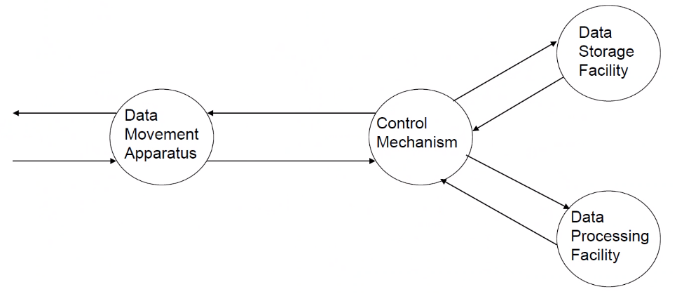

# Arquitetura e Organização de Computadores 1

## Objetivo

- Estudo de um sistema de computação sob dois pontos de vista:
  - **Arquitetural** - se refere aos atributos do sistema visíveis a uma programador de linguagem de máquina e
  - **Organizacional** - as unidades operacionais e sua interconexão que realizam a arquitetura
- Vamos estudar a estrutura e a função de um computador
  - **estrutura** - a forma em que os componentes estão interconectados e
  - **função** - o comportamento de cada componente individualmente
  - Cada componente pode, por sua vez, de forma hierárquica, se decomposto em subcomponentes, descrevendo a sua estrutura e função

## Arquitetura & Organização

- Exemplo:
- É uma questão de projeto arquitetural se o computador deve ter uma instrução de multiplicação. Mas é uma questão organizacional se a instrução deve ser implementada com uma unidade de multiplicação ou através de repetidas somas
  - Muitas fabricantes oferecem uma família de modelos de computadores, todos com a mesma arquitetura, mas com diferenças na parte organizacional. Resultam assim em modelos com preços e desempenhos diferentes, mas podendo executar os mesmos programas escritos
  - Toda a família Intel x86 compartilha a mesma arquitetura básica
  - A família IBM System/370 compartilha a mesma arquitetura básica
    - Isto determina a compatibilidade de código - pelo menos para as versões anteriores
  - A organização difere entre diferentes versões

## Estrutura & Função

- Em cada nível o projetista se preocupa com a estrutura e a função
  - Estrutura: a maneira em que os componentes são interelacionados
  - Função: a operação de cada componente, individualmente

## Visão Funcional

### Operações (1)

- Data movement
  - ex., teclado para vídeo (keyboard to screen)

### Operações (2)

- Storage
  - internet download para unidade de disco

### Operações (3)

- Processamento de/para memória
  - ex., atualizando saldo bancário

### Operações (4)

- Processamento da memória para E/S
  - impressão do saldo bancário

## Estrutura de um Computador - Visão Top-Down

## Estrutura - A Unidade de Processamento

## Estrutura - A Unidade de Controle

## Evolução dos Computadores e Desempenho

### História dos Computadores

#### A Era Mecânica (1600s-1940s)

- Wilhelm Schickhard (1623)
  - Astrônomo e Matemático
  - Cálculos de adição, subtração, multiplicação e divisão
- Blaise Pascal (1642)
  - Matemático
  - Primeira máquina operacional de produção em série
    - 50 cópias
  - Somente somava e subtraia
  - Apresentou problemas operacionais e de manutenção
- Gottfried Liebniz (1673)
  - Filósofo, cientista, matemático e inventor
  - Melhorou a máquina de Pascal
  - somava, subtraia, multiplicava e dividia
- Charles Babbage (1822)
  - Matemático - "Pai do computador moderno"
  - Buscava mais precisão nos cálculos
  - Máquina de Diferenças (Difference engine)
    - Primeiro acordo científico governamental
    - Cálculo automático de tabelas matemáticas
    - *Primeira máquina utilizada para resolver um problema*
  - Máquina Analítica (Analytic engine)
    - Realizava qualquer operação matemática
    - Dados em cartões perfurados
    - Estrutura moderna: E/S, armazenadores, ALU
    - Adição em 1 segundo, multiplicação em 1 minuto
  - Estas máquinas sofriam de problemas mecânicos
- George Boole (1847)
  - Análise matemática da Lógica (Mathematical analysis of logic)
  - Investigou as Leis do Pensamento
- Herman Hollerith (1889)
  - Fundou *Tabulating Machine Company* (tornou-se a IBM)
  - Em 1880 o censo gastou 5 anos para tabular os dados (montar em forma de tabela)
  - Estimativas de tabulação
    - 1890: 7,5 anos
    - 1900: 10+ anos
  - A máquina de Tabulação de Hollerith reduziu as estimativas de 7,5 anos para 2 meses
- Konrad Zuse (1938)
  - Construiu o primeiro computador mecânico operacional, o Z1
    - Máquina binária (Binary machine)
  - O governo alemão não deu continuidade ao desenvolvimento
    - W.W.W.II já tinha começado
  - Howard Aiken (1943)
    - Projetou o Harvard Mark I
    - Implementação da máquina de Babbage

#### A Era Eletrônica

- Geração 1 (1945 - 1958)
  - ENIAC - Mauchly e Echert - University of Pennsylvania
  - Desenvolvido para calcular tabelas de disparos de artilharia
  - Considerado o primeiro computador eletrônico
    - O Colossus provavelmente é o primeiro, mas foi reconhecido recentemente
  - Processava 5000 adições por segundo
  - Detalhes:
    - 18000 válvulas
    - 70000 resistores
    - 10000 capacitores
    - 6000 chaves
    - 30 x 50 feets
    - 140 kW de potência
    - Sistema Númerico Decimal
    - Programado manualmente através de chaves e plugges
- IAS (Institute for Advanced Studies)
  - John von Neumann e Goldstine
  - A partir da ideia do ENIAC desenvolveram o conceito de programa armazenado em memória
  - Esta arquitetura é conhecida como "Von Neumann architecture" e tem sidoo a base para o projeto de computadores desde então
  - Aspectos
    - Processamento em representação binária
    - Dados e instruções (programas) são armazenados em uma única memória de leitura e escrita
    - Conteúdos de memória são endereçados por posição, sem considerar o conteúdo ele próprio
    - Execução sequencial
- Este período é o início das longas disputas por patentes, direitos autorais, créditos, etc. Disputa John Von Neumann vs. Alan Turing

- Estrutura da Máquina IAS - John von Neumann

  