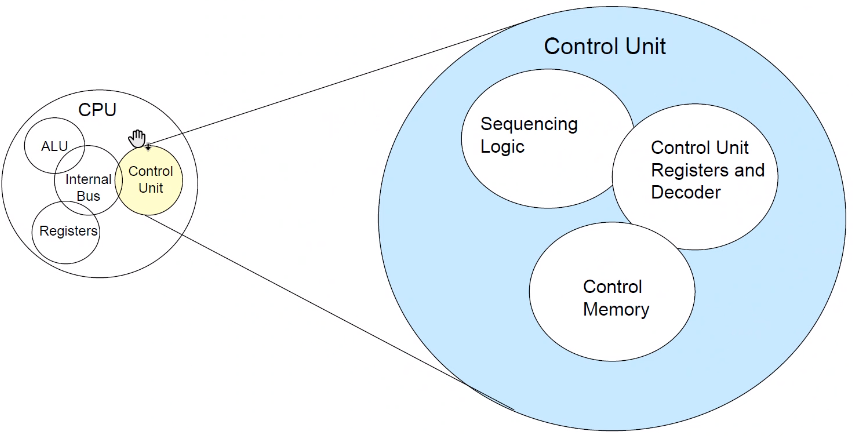

# Arquitetura e Organização de Computadores 1

## Objetivo

- Estudo de um sistema de computação sob dois pontos de vista:
  - **Arquitetural** - se refere aos atributos do sistema visíveis a uma programador de linguagem de máquina e
  - **Organizacional** - as unidades operacionais e sua interconexão que realizam a arquitetura
- Vamos estudar a estrutura e a função de um computador
  - **estrutura** - a forma em que os componentes estão interconectados e
  - **função** - o comportamento de cada componente individualmente
  - Cada componente pode, por sua vez, de forma hierárquica, se decomposto em subcomponentes, descrevendo a sua estrutura e função

## Arquitetura & Organização

- Exemplo:
- É uma questão de projeto arquitetural se o computador deve ter uma instrução de multiplicação. Mas é uma questão organizacional se a instrução deve ser implementada com uma unidade de multiplicação ou através de repetidas somas
  - Muitas fabricantes oferecem uma família de modelos de computadores, todos com a mesma arquitetura, mas com diferenças na parte organizacional. Resultam assim em modelos com preços e desempenhos diferentes, mas podendo executar os mesmos programas escritos
  - Toda a família Intel x86 compartilha a mesma arquitetura básica
  - A família IBM System/370 compartilha a mesma arquitetura básica
    - Isto determina a compatibilidade de código - pelo menos para as versões anteriores
  - A organização difere entre diferentes versões

## Estrutura & Função

- Em cada nível o projetista se preocupa com a estrutura e a função
  - Estrutura: a maneira em que os componentes são interelacionados
  - Função: a operação de cada componente, individualmente

## Visão Funcional

### Operações (1)

- Data movement
  - ex., teclado para vídeo (keyboard to screen)

### Operações (2)

- Storage
  - internet download para unidade de disco

### Operações (3)

- Processamento de/para memória
  - ex., atualizando saldo bancário

### Operações (4)

- Processamento da memória para E/S
  - impressão do saldo bancário

## Estrutura de um Computador - Visão Top-Down

## Estrutura - A Unidade de Processamento

## Estrutura - A Unidade de Controle

