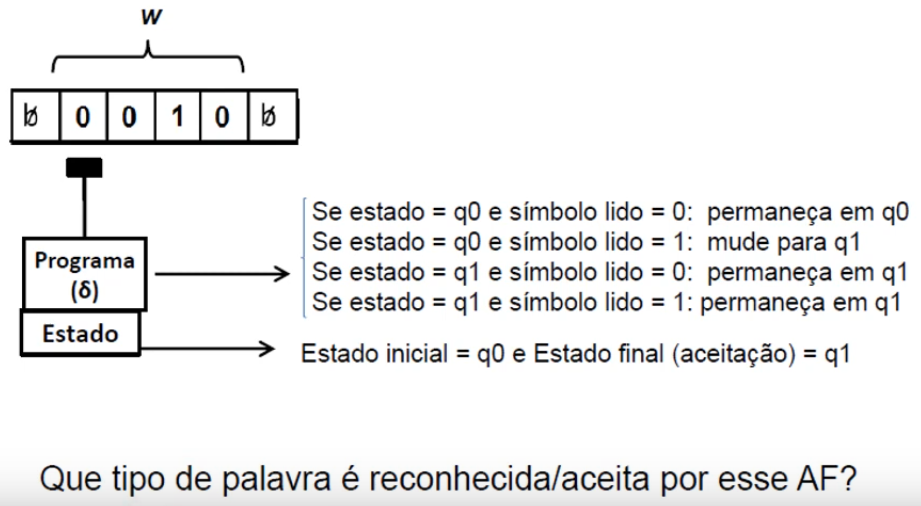
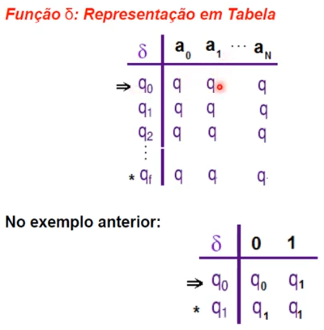
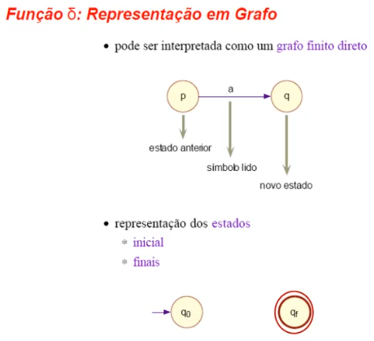
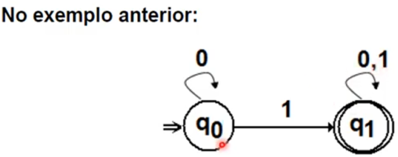
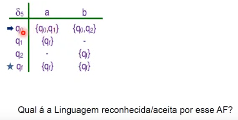
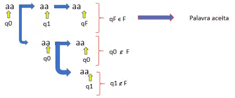
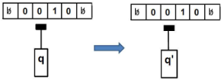
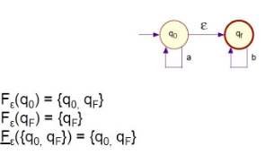

# Linguagens Formais e Autômatos

## __*Teoria da Linguagens Formais*__

- Originada em 1950.

- Objetivo inicial
  - Desenvolver teorias relacionadas com as linguagens naturais (representar idiomas).

- Hoje
  - Importante para lingugagens artificiais.
  - Principalmente, linguagens da Ciência da Computação.

- Tipos de Formalismos usados
  - Operacional
  - Axiomático
  - Denotacional (Extra)

### **_Operacional_**

- Autômato ou máquina abstrata
  - estados
  - instruções primitivas
  - como cada intrução modifica cada estado

- Máquina abstrata
  - suficietemente simples
    - não deve permitir dúvidas sobre o seu funcionamento
  
  - também é dito um **Formalismo Reconhecedor**
    - análise de uma entrada para verificar

  - Exemplos
    - Autômato Finito
    - Autômato com Pilha
    - Máquina de Turing

### _**Axiomático**_

- Associam-se regras às componentes da linguagem

- Regras
  - permitem afirmar o que será verdadeiro
  - após a ocorrência de cada cláusula
  - considerando oq era verdadeiro antes da ocorrência

- Formalismos axiomáticos
  - Gramáticas Regulares
  - Gramáticas Livre do Contexto
  - Gramáticas Sensíveis ao Contexto
  - Gramáticas Irrestritas

- Gramática tabmém é dita um _Formalismo Gerador_
  - permite verificar se um determinado elemento da linguagem é _gerado_

### _**Denotacional**_ (ou _Formalismo Funcional_)

- Domínio (sintático)
  - que permite a caracterização do conjunto de palavras admissíveis na linguagem
  - tratam-se de funções, as quais são, em geral, composicionais (horizontalmente)
    - o valor denotado por uma construção é especificado em termos dos valores denotados por suas subcomponentes

- Formalismo Denotacional
  - Expressões Regulares
    - é simples inferir (gerar) aos elementos da linguagem.
    - asim, frequentemente também é denominado como um Formalismo Gerador.

### _**Hierarquia de Chomsky**_

- classifica as diversas classes de linguagens em uma ordem hierárquica.
- inclusão própria entre as classes.

## **_1. Revisão de Conceitos Básicos_**

- **Conjuntos** - OK
- **Relações** - OK
- **Funções** - OK
- **Lógica** - OK
- **Técnicas de Demonstração** - OK

## _**2. Linguagens, Gramáticas e Reconhecedores**_

### _Símbolo, Caractere_

- entidades abstratas básicas
- não definida formalmente
- Exemplo: Símbolo
  - letras
  - dígitos

### *Alfabeto*

- conjunto finito de símbolos
- Exemplo: Alfabeto
  - $\Sigma_{1}$ = {a, b, c}
  - $\Sigma_{2}$ = {0, 1, ..., 9}
  - $\Sigma_{3}$ = { }

### *Palavra, Cadeia de Caracteres, Sentença*

- sobre um alfabeto (pode ser binário)
- sequência finita de símbolos justapostos (concatenados)
- Exemplo: Palavra
  - **a, abcb** são palavras sobre {a, b, c}
  - $\varepsilon$
    - palavra vazia - sem símbolos
    - é palavra sobre qualquer alfabeto

### *Tamanho, Comprimento de uma palavra*

- número de símbolos que compõem a palavra
- representação
  - | w |
  - w denota uma palavra
- Exemplo
  - | wafda | = 5
  - | $\varepsilon$ | = 0

### *Concatenação*

- operação binária em uma linguagem
- justaposição dos símbolos que representam as palavras componentes
- propriedades:
  - associatividade: w(wt) = (vw)t
  - elemento neutro (palavra vazia): $\varepsilon$**w** = **w** = **w**$\varepsilon$
- Exemplo: concatenação
  - para **v = ab** e **w = cd**
    - vw = abcd

### *Prefixo, Sufixo, Subpalavra*

- prefixo (sufixo)
  - qualquer sequência de símbolos inicial (final) de uma palavra

- subpalavra
  - qualquer sequência de símbolos contígua de uma palavra

- Exemplo: para a palavra abcb
  - prefixos: $\varepsilon$, a, ab, abc, abcb
  - sufixos: $\varepsilon$, b, cb, bcb, abcb
  - prefixos e sufixos são subpalavras

### *Concatenação Sucessiva*

- concatenação sucessiva de uma palavra com ela mesma
- indefinida para $\varepsilon$⁰
- $w^n$: concatenação sucessiva de w, por ela mesma, onde n indica o número de concatenações.
- Exemplo:
  - w³ = www
  - w¹ = w
  - a⁵ = aaaaa
  - $a^n$ = aaa...aa (a repetido n vezes)
  - w⁰ = $\varepsilon$, para w != $\varepsilon$

### *Produto de Conjunto de Palavras*

- Sejam V e W conjuntos de palavras de $\Sigma$.
  - VW = { vw / v $\in$ V e w $\in$ W }
- Exemplo:
  - $\Sigma$ = {0, 1, 2, 3}, V = {00, 11}, W = {222, 333}
  - VW = {00222, 00333, 11222, 11333}
  - VV = V² = {0000, 0011, 1100, 1111}
  - V⁰ = { $\varepsilon$ }, por definição (não é um conjunto vazio)
  - V³ = { 000000, ..., 111111 }
  - V⁴ = { 00000000, ..., 1⁸ }

### *Fechamento de Kleene*

- Seja W um conjunto de palavras sobre $\Sigma$
- W* = $\cup_{i \geq 0 }$($W^i$)
- W* = W⁰ $\cup$ W¹ $\cup$ W² $\cup$ W³ ...
- Conjunto de todas as concateanções possíveis de W, incluindo $\varepsilon$
- Exemplos:
  - V = {00, 11}, V* = { $\varepsilon$, 00, 11, 0000, 0011, 1100, 1111, 000000, ... }
  - $\Sigma$ = {0, 1}, $\Sigma$* = { $\varepsilon$, 0, 1, 00, 01, 10, 11, ... }

### *Fechamento Positivo*

- Seja W um conjunto de palavras sobre $\Sigma$,
- $W^+$ = $\cup_{i \geq 1} W^i \rArr$ igual a $W^*$, exceto $\varepsilon$.
- $W^+$ = W¹ $\cup$ W² $\cup$ W³ ...
- Conjunto de todas as concatenações possíveis de W, excluindo $\varepsilon$
  - _Note que W⁰ = {$\varepsilon$} não está incluso, mas se, $\varepsilon \in W \rArr \varepsilon \in W^+$_
- Exemplos: 
- V = {00, 11}, $V^+$ = {00, 11, 0000, 0011, 1100, 1111, ...}
- $\Sigma$ = {0, 1}, $\Sigma^+$ = {0, 1,00, 11, 01, 10, 0000, ...}
  
### *Linguagem Formal*

- Uma linguagem L é um conjunto de palavras sbore um alfabeto $\Sigma$, ou seja, L $\subset \Sigma^*$
- Exemplo: Ling. Formal sobre $\Sigma$ = {a, b}
  - conjunto vazio
  - conjunto formado pela palavra vazia
    - note-se que {} $\neq$ {$\varepsilon$}
  - conjunto das palíndromos
    - palavras que têm a mesma leitura da esquerda para a direita e vice-versa
    - linguagem infinita
    - $\varepsilon$, a, b, aa, bb, aaa, aba, bab, bbb, aaaa, ... são palíndromos

### **Como representar uma linguagem formal L?**

- Se L é finito, basta listar todas as palavras.
- se L é infinito, existem 2 formalismos principais:
  - _Formalismo Gerador: Gramática_
  - _Formalismo Reconhecedor: Autômato_
  
### *Gramática*

- G = (V, T, P, S):
- V (símbolos **V**ariáveis - não-terminais)
  - conjunto finito de símbolos
  - variáveis ou não-terminais
- T (símbolos **T**erminais)
  - conjunto finito de símbolos
  - terminais
  - disjunto de V
- P
  - conjunto finito de pares ($\alpha$, $\beta$)
  - regra de produção
  - $\alpha$ é a palavra de (V $\cup$ T)$^+$
  - $\beta$ é a **palavra** de (V $\cup$ T)$^*$
- S
  - elemento de V
  - variável inicial
- Notação de ($\alpha$, $\beta$)
  - $\alpha \rArr \beta$
  - notação abreviada para $\alpha \rArr \beta_{1}, ..., \alpha \rArr \beta_{n}$
    - $\alpha \beta_{1} | ... | \beta_{n}$

### *Derivação*

- G = (V, T, P, S) uma gramática
- _Derivação_ é um par da relação denotada por $\rArr$
  - com domínio em (V $\cup$ U)$^+$
  - contra-domínio em (V $\cup$ U)$^*$
  - representação de forma infixada
    - $\alpha \rArr \beta$
- $\rArr$ é indutivamente definida
- para qualquer produção S $\rArr \beta$
  - S é o símbolo inicial 
- para qualquer par $\alpha \rArr \beta$
  - onde $\beta = \beta_{u}\beta_{v}\beta_{w}$
  - se $\beta_{v} \rArr \beta_{t}$ é regra de P então
    - $\beta \rArr \beta_{u}\beta_{t}\beta_{w}$

### *Sucessivos Passos de Derivações*

- $\rArr^*$
  - fecho transitivo e reflexivo da relação $\rArr$
  - zero ou mais passos de derivações sucessivos
- $\rArr^+$
  - fecho transitivo da relação $\rArr$
  - zero ou mais passos de derivações sucessivos
- $\rArr^i$
  - exatos **i** passos de derivações sucessivos
  - **i** é número natural

### *Gramática é um formalismo*

- Axiomático
- de Geração
  - permite derivar ("gerar") todas as palavras da linguagem que representa

### *Linguagem Gerada*

- G = (V, T, P, S) uma gramática
- Linguagem Gerada por G
  - L(G) ou GERA(G)
- todas as palavras de símbolos terminais deriváveis a partir do símbolo inicial S
  - $L(G) = {W \in T^* | S \rArr^+ w}$

### *Exemplo: números naturais*

- G = (V, T, P, S)
  - V = {S, D}
  - T = {0, 1, 2, ..., 9}
  - P = {S $\rArr$ D, S $\rArr$ DS, D $\rArr$ 0|1|...}
- uma derivação do número
  - S => DS => 2S => 2DS => 24S => 24D => 243
- portanto
  - S $\rArr^*$ 243
  - S $\rArr^+$ 243
  - S $\rArr^6$ 243
- logo GERA(G)
  - o conjunto dos números naturais
  
### *Equivalência de Gramáticas*

- $G_{1}$ e $G_{2}$ são equivalentes se
  - GERA($G_{1}$) = GERA($G_{2}$)

### *Convenções:*

- A, B, C, ..., S, T símbolos variáveis
- a, b, c, ..., s, t símbolos terminais
- u, v, w, x, y, z   palavras de símbolos terminais
- $\alpha$, $\beta$, ... palavras de símbolos variáveis e/ou terminais

### *Hierarquia de Chomsky*

- Define 4 tipos de gramática:
  - Gramática tipo 3 (regular)
  - Gramática tipo 2 (livre de contexto)
  - Gramática tipo 1 (sensíveis ao contexto)
  - Gramática tipo 0 (irrestrita)
  
  

### *Gramática tipo 3 (regular)*

- G(V, T, P, S) é do tipo 3, se toda produção em P é da forma:
  - A => wB ou A => Bw ou A => w com A $\in$ V, B $\in$ V e w $\in$ T$^*$, ou seja:
    - Uma variável na esquerda e no máximo uma variável à direita (a variável a direita não pode ser precedida e sucedida ao mesmo tempo por terminais)
- Ex1. Seja G1 = (V, T, P, S) com:
  - V = {S, A, B}
  - T = {a, b}
  - P = {S => aA, A => bB|$\varepsilon$, B => aA}
  - Derivações
    - S => aA => a ou S $\rArr^2$ ou S $\rArr^*$ a ou S $\rArr^+$ a 
    - S => aA => abB => abaA => aba
  - Linguagem Gerada
    - L(G1) = {a, aba, ababa, abababa, ...}
    - L(G1) = {w $\in$ {a, b}$^*$ | w tem prefixo "a" seguido de 0 ou mais ba's}
  - Hierarquia: Tipo 3 ou Regular

- Ex2. Seja G2 = (V, T, P, S) com:
  - V = {S}
  - T = {a, b}
  - P = {S => Sba | a}
  - Derivações
    - S => a
    - S => Sba => Sbaba => Sbababa => abababa
    - S => Sba => aba
  - Linguagem Gerada
    - L(G2) = {a, aba, ababa, abababa, ...}
    - L(G2) = {w $\in$ {a, b}$^*$ | w tem prefixo "a" seguido de 0 ou mais ba's}
  - Portanto, a gramática do ex2 gera a exatamente a mesma linguagem da gramática do ex1 (são linguagens equivalentes pela definição de _Equivalência de Gramáticas_)
  - Hierarquia: Tipo 3 ou Regular

### *Gramática tipo 2 (livre de contexto)*

- G(V, T, P, S) é do tipo 2, se toda produção em P é da forma:
  - A => $\alpha$,  com A $\in$ V e $\alpha$ $\in$ (V $\cup$ T)*, ou seja:
    - basta uma variável na esquerda
- Ex3. Seja G3 = (V, T, P, S) com:
  - V = {S, B}
  - T = {0, 1}
  - P = {S -> 0B | OSB, B -> 1}
  - Derivações
    - S => 0B => 1
    - S => 0SB => 00BB => 001B => 0011
  - Linguagem Gerada
    - L(G3) = {01, 0011, 000111, ..., 0¹⁰⁰1¹⁰⁰}
    - L(G3) = {w $\in$ {0, 1}* | w possui N 0's concatenados com N 1's, para N >= 1}
    - L(G3) = {w $\in$ {0, 1}* | w = $0^n1^n$, N >= 1}
  - Hierarquia: Tipo 2 ou Livre de Contexto
- Ex4. Seja G4 = (V, T, P, S) com:
  - V = {S, V, U}
  - T = {0, 1}
  - P = {S -> $\varepsilon$ | Z | U | 0SZ | 1SU, Z -> 0, U -> 1}
  - Derivações
    - S => $\varepsilon$
    - S => Z => 0
    - S => U => 1
    - S => 0SZ => 01SUZ => 01UUZ => 01110
  - Linguagem Gerada
    - L(G4) = {$\varepsilon$, 0, 1, 00, 11, 000, 010, 101, 111, 0000, 0110, 1001, 1111, ....}
    - L(G4) = {w $\in$ {0, 1}* | w é uma palíndrome}
  - Hierarquia: Tipo 2 ou Livre de Contexto
- Ex5. Seja G5 = (V, T, P, E) com:
  - V = {E}
  - T = {+, *, (,), x}
  - P = {E => E+E | E*E | (E) | x}
  - Derivações
    - E => x
    - E => (E) => (x)
    - E => E + E => x + x
    - E => E * E => x * x
    - E => E + E => (E) + x => (x) + x
  - Linguagem Gerada
    - L(G5) = {x, (x), x + x, x * x, (x) + x, ...}
    - L(G5) = { w $\in$ {+, *, (,), x}⁺ | w é um polinômio de grau n > 0 sem termos constantes, na variável x }
  - Hierarquia:
    - Tipo 2 ou Livre de Contexto (pois nas produções, na esquerda da seta se tem uma variável, e do lado direito se tem combinação de variáveis e terminais)
    - Não é regular, possui mais de uma variável a esquerda de outra na produção

### *Gramática tipo 1 (sensíveis ao contexto)*

- G(V, T, P, S) é do tipo 1, se P é da forma:
  - S -> $\varepsilon$ ou $\alpha$ -> $\beta$, com $|\beta| \geq |\alpha|, \alpha \in (V \cup T)^+$ e $\beta \in (V \cup T)^*$
  - Existe uma forma normal dessa gramática, de onde deriva o nome da mesma, onde P é da forma:
    - S -> $\varepsilon$ ou
    - $\alpha A \phi$ -> $\alpha \beta \phi$, sendo $\alpha \in (V \cup T)^+$, $\phi \in (V \cup T)^*$ e $\beta \in (V \cup T)^*$
    - Dizemos que a variável A é substituida por $\beta$, no contexto $\alpha A \phi$
- Ex6. Seja G6 = (V, T, P, S) com:
  - V = {S, X, Y, A, B, C, D, E, F}
  - T = {a, b}
  - P = {S -> XY | aa | bb | $\varepsilon$, X -> XaA | XbB | aaC | abD | baE | bbF, Aa -> aA, Ab -> bA, AY -> Ya, Ba -> aB, Bb -> bB, BY -> Yb, Ca -> aC, Cb -> bC, CY -> aa, Da -> aD, Db -> bD, DY -> ab, Ea -> aE, Eb -> bE, EY -> ba, Fa -> aF, Fb -> bF, FY -> bb}
  - Derivações
    - S => aa
    - S => bb
    - S => $\varepsilon$
    - S => XY => aaCY => aaaa
    - S => XY => abDY => abab
    - S => XY => XbBY => XbYb => XbBbYb => XbbBYb => XbbYbb => abDbbYbb => abbDbYbb => abbbDYbb => abbbabbb
  - Linguagem Gerada
    - L(G6) = {$\varepsilon$, aa, bb, aaaa, abab, baba, bbbb, aaaaaa, bbbbbb, ...}
    - L(G6) = { w $\in$ {a, b}* | w é uma repetição dela mesma (ww)}
  - Hierarquia: Tipo 1 ou Sensível ao Contexto
    - Não é do tipo 2 e nem do tipo 3, porque possui terminais além de variáveis na esquerda, o que não é permitido

### *Gramática tipo 0 (irrestrita)*

- G(V, T, P, S) é uma gramática sem nenhuma restrição adicional em P, apenas:
  - $\alpha$ -> $\beta$, sendo $\alpha \in (V \cup T)^+$ e $\beta \in (V \cup T)^*$, conforme vimos na definição geral da gramática
- Ex8. Seja G8 = (V, T, P, S) com:
  - V = {S, A, B, C, D, E}
  - T = {a}
  - P = {S -> ACaB, Ca -> aaC, CB -> DB | E, aD -> Da, AD -> AC, aE -> Ea, AE -> $\varepsilon$}
  - Derivações
    - S => ACaB => AaaCB => AaaE => AaEa => AEaa => aa
    - S => ACaB => AaaCB => AaaDB => AaDaB => ADaaB => ACaaB => AaaCaB => AaaaaCB => AaaaaE => AaaaEa => AaaEaa => AaEaaa => AEaaaa => aaaa
    - S => ACaB => AaaCB => AaaDB => AaDaB => ADaaB => ACaaB => AaaCaB => AaaaaCB => AaaaaDB => AaaaDaB => AaaDaaB => AaDaaaB => ADaaaaB => ACaaaaB => AaaCaaaB => AaaaaCaaB => AaaaaaaCaB => AaaaaaaaaCB => AaaaaaaaaE => AaaaaaaaaE =>* aaaaaaaa
    - S => ACaB => AaaCB => AaaDB => AaDaB => ADaaB => ACaaB => AaaCaB => AaaaaCB => AaaaaDB => AaaaDaB => AaaDaaB => AaDaaaB => ADaaaaB => ACaaaaB => AaaCaaaB => AaaaaCaaB => AaaaaaaCaB => AaaaaaaaaCB => AaaaaaaaaDB =>* aaaaaaaaaaaaaaaa
    - S =>* aaaaaaaaaaaaaaaaaaaaaaaaaaaaaaaa
  - Linguagem Gerada
    - L(G8) = {aa, aaaa, aaaaaaaa, aaaaaaaaaaaaaaaa, aaaaaaaaaaaaaaaaaaaaaaaaaaaaaaaa, ...}
    - L(G8) = { w $\in$ {a}$^+$ | w = a$^{2^n}$, n > 0 }
    - Como fazer w = a$^{3^n}$?
      - Seja G9 = (V, T, P, S) com:
      - V = {S, A, B, C, D, E}
      - T = {a}
      - P = {S -> ACaB, Ca -> aaaC, CB -> DB | E, aD -> Da
  - Hierarquia: Tipo 0 ou Irrestrita
    - Não é regular, pois possui duas variáveis na esquerda de uma regras de produção
    - Também não é livre de contexto, pois possui mais de uma variável na regra de produção em sua esquerda

## _**3. Linguagens Regulares, Autômatos Finitos e Gramáticas Regulares**_

### Linguagens Regulares ou Tipo 3

- estudos e aplicações são variados e abrangentes
- exemplos
  - editores de texto
  - processadores de texto em geral
  - pesquisa de dados
  - interface simples homem X máquina
  - protocolos de comunicação
  - lógica
  - ...
- formalismos operacionais ou reconhecedores
  - Autômato Finito Determinístico
  - Autômato Finito Não-Determinístico
  - Autômato Finito com Movimentos Vazio
- formalismo axiomático ou gerador
  - Gramática Regular
- formalismo denotacional
  - Expressão Regular
  - também considerado formalismo gerador

### Sistema de Estados Finitos

- É um modelo matemático de sistema com entradas e saídas discretas
- Pode assumir um número finito e pré definido de estados
- Cada estado resume somente as informações do passado necessárias para determinar as ações da próxima entrada
- Ex: Elevador
  - entrado
    - requisições pendentes
  - estado
    - andar corrente
    - direção de movimento
  - não memoriza as requisições anteriores

### Autômato Finito (Determinístico) - Def.1

- É uma máquina reconhecedora composta de:
  - Fita de Entrada
  - Unidade de Controle
  - Programa ou Função de Transição de Estados
  - Obs: o Autômato Finito não possui memória auxiliar. As informações do passado são armazenadas através dos estados
  
    
  - Fita de Entrada:
    - finita  dividida em células, sendo que cada célula armazana um símbolo. Não é possível gravar.
  - Unidade de Controle
    - armazena o estado corrente (dentre um número finito de estados);
    - possui cabeça de leitura (não grava) que acessa cada célula da fita, lê o símbolo e movimenta-se exclusivamente à DIREITA;
    - no início a cabeça é posicionada no primeiro símbolo
  - Programa ou Função de Transição de Estados
    - função que comanda a leitura e define o estado corrente
    - função parcial que define o novo estado do autômato a partir do estado corrente e do símbolo lido na fita
- Exemplo:

  
  - Reconhece todas as palavras binárias que possuem pelo menos um '1'

### Autômato Finito (Determinístico) - Def.2

- Um Autômato Finito é uma 5-upla:
  - A = (Q, $\Sigma$, $\sigma$, q0, F)
  - Q -> conjunto finito de estados
  - $\Sigma$ -> alfabeto (símbolos da fita): $\Sigma \cap Q = \empty$
  - q0 -> estado inicial
  - $\sigma$ -> função de transição de estado: Q x $\Sigma$ -> Q
  - F -> conjuntos de estados finais (aceitação): F $\subseteq$ Q

- Função de Transição de Estados ou Programa ($\sigma$)
  - Para todos estados possíveis do autômato (q $\in$ q), a função deve definir qual será o próximo estado do autômato (q' $\in$ Q), quando for lido qualquer símbolo na fita (a $\in \Sigma$)
  - A função $\sigma$ é dada por uma lista de transições de tipo:
    - $\sigma$(q, a) = q',
  - ou seja, O autômato finito estando no estado *q* e lendo o símbolo *a* na fita de entrada, move a cabeça para a direita e vai para o estado *q'*
  - Exemplo anterior:
    - A = (Q, $\Sigma$, $\sigma$, q0, F)
    - Q = {q0, q1}
    - $\Sigma$ = {0, 1}
    - F = {q1}
    - $\sigma$: $\sigma$(q0, 0) = q0, $\sigma$(q0, 1) = q1, $\sigma$(q1, 0) = q1, $\sigma$(q1, 1) = q1

    
    
    
- Processamento
  - sucessiva aplicação da função programa
    - para cada símbolo da entrada
    - da esquerda para a direita
    - até parar
  - definição formal do comportamento
    - necessário estender a função programa
  - argumento da função programa estendida
    - um estado
    - uma palavra
- Função de Transição de Estados Estendida ($\underline{\sigma}$)
  - A função $\underline{\sigma}$ é uma função $\underline{\sigma}$: Q x $\Sigma^*$ -> Q
  - É a função $\sigma$ estendida para palavras e é definida por:
    - $\underline{\sigma}$(q, $\varepsilon$) = q
    - $\underline{\sigma}$(q, aw) = $\underline{\sigma}(\sigma(q, a), aw)$, sendo w $\in \Sigma, a \in .\Sigma$ 
  - Para as palavras w $\in \Sigma^*$: $\underline{\sigma}$(q, w) = q'
    - O Autômato Finito no estado *q* após ler todos os símbolos e w (da esquerda para a direita) vai para o estado q'
- Palavra aceita por um Autômato Finito
  - Seja A = (Q, $\Sigma$, $\sigma$, q0, F) e w $\in \Sigma^*$. A palavra w é aceita por A se $\underline{\sigma}$(q0, w) $\in$ F. Se o Autômato Finito A, partindo do estado inicial q0, após ler todos os símbolos de w, for para um estado final q(q $\in$ F), então a palavra w é aceita por A
  - Condição de Parada de um Autômato Finito
    - Uma Autômato Finito sempre para ao processar qualquer entrada, aceitando ou rejeitando w
    - W é aceita: se após procesar o último símbolo, o AF, para em um estado final
    - W é rejeitada: se após processar o último símbolo, o AF para em um estado não final ou a função $\sigma$ é indefinida para o argumento (estado, símbolo)

  
- Linguagem Reconhecida (ou aceita) por um Autômato Finito
  - Seja A = (Q, $\Sigma$, $\sigma$, q0, F) um autômato finito. A linguagem reconhecida por A é dada por:
    - L(A) = {w $\in \Sigma^*$ | $\underline{\sigma}$(q0, w) $\in$ F}
  - L(A) é o conjunto de todas as palavras pertencentes a $\Sigma^*$ e aceitas por A

## _**4. Autômato Finito Não Determinístico**_

### Não Determinismo

- É uma importante generalização dos modelos de máquinas abstratas, na Teoria da Computação
- Numa transição não determinista, partindo-se de um estado q1, lendo-se um símbolo a, e possível ir para um ou mais estados. Por exemplo: $\sigma$(q1, a) = {q1, q2}
- Nem sempre o não-determinismo aumenta o poder de reconhecimento de uma classe de autômatos. Por exemplo, o Autômato Finito Não Determininístico tem poder de reconhecimento equivalente ao Autômato Finito Determinístico

### Autômato Finito Não Determinístico - Def1

- Uma AFND é um Autômato Finito, onde são permitidas transições não determinísticas
- Uma palavra e aceita no AFND se exite alguma sequência de transições, processando a palavra símbolo a símbolo, que leve do estado inicial a um estado final
- Na representação de máquina abstrata de reconhecimento (fita de entrada + unidade de controle finito), o AFND assume um conjunto de estados alternativos, como se houvesse uma multiplicação de unidades de conteol com processamento independente

### Autômato Finito Não Determinístico - Def2

- Um autômato finito é uma 5-upla:
  - A = (Q, $\Sigma$, $\sigma$, q0, F)
  - Q -> conjunto finito de estados
  - $\Sigma$ -> alfabeto (símbolos da fita): $\Sigma \cap Q = \empty$
  - q0 -> estado inicial
  - $\sigma$ -> função de transição de estado: Q x $\Sigma$ -> 2$^q$, onde 2$^q$ é o conjunto potência de Q (todos os subconjuntos)
  - F -> conjuntos de estados finais (aceitação): F $\subseteq$ Q
- Função de Transição de Estados ($\sigma$) (AFND) 
  - Para todos estados possíveis do (AFND) (q $\in$ Q), a função deve definir quais serão os possíveis estados do autômato ({q1, q2, ...} $\subset$ Q), quando for lido qualquer símbolo na fita (a $\in \Sigma$)
  - A função $\sigma$ é dada por uma lista de transições de tipo:
    - $\sigma$(q, a) = {q1, q2, ..., qn},
  - ou seja, O AFND estando no estado *q* e lendo o símbolo *a* na fita de entrada, escolhe um dos estados q*i*(1 <= i <= N) como novo estado

- Exemplo 1
  
  - L = {w $\in$ {a,b}* | "aa" ou "bb" é subpalara de w}
  - Palavras que possuem 'aa' ou 'bb' como subpalavra

- Exemplo 2
- M6 = ({a,b}, {q0,q1,q2,qf}, $\Sigma_{6}$, q0, {qf})
  
  
- Linguagem reconhecida e aceita por esse AF
- L = {w $\in$ {a,b}* | "aaa" é sufixo de w}
- Exemplos

  
  
- Quando a palavra é aceita, basta apresentar o caminho no qual o processamento leva a um estado final
- Caso uma palavra não for aceita, deve-se mostrar todos os caminhos e mostrar que seus estados finais não pertencem a um estado de aceitação
- Processamento
  - uniao dos resultados da funçao programa aplicada a cada estado alternatio
  - definiçao formal do comportamento
    - necessário estender a função programa
    - argumento: um conjunto finito de estados e uma palara
  - w $\in$ ACEITA(M)
    - pelo menos um caminho alternativo aceita w
  - w $\in$ REJEITA(M)
    - todas as alternatias rejeitam w
- Funçao de Transição Estendida (AFND)
  - Seja A = (Q, $\Sigma$, $\sigma$, q0, F) um AFND
  - A funçao $\sigma$ estendida $\underline{\sigma}$: 2$^q$ estendida para palavra é assim definida:
    - $\underline{\sigma}$(q, $\varepsilon$) = {q}
    - $\underline{\sigma}$(q, aw) = $\underline{\sigma}(\sigma(q, a), w)$
    - $\underline{\sigma}$(S, w) = $\cup_{q \in S}$ $\underline{\sigma}(q, w)$
  - sendo:
    - q $\in$ Q (estado)
    - S $\subset$ Q (subconjunto de estados)
    - a $\in \Sigma$ (símbolo)
    - w $\in \Sigma$* (palavra)
- Palavra aceita por um AFND
  - Seja w $\in \Sigma$* e o AFND A = (Q, $\Sigma$, $\sigma$, q0, F)
  - A palavra w é aceita por A se $\underline{\sigma}$(q0, w) $\cap$ != $\empty$,
  - ou seja: se existe algum estado final $\underline{\sigma}$(q0, w)
- Linguagem aceita por um AFND
  - A linguagem aceita por A é definida por:
    - L(A) = {w $\in \Sigma$* | $\underline{\sigma}$(q0, w) $\cap$ != $\empty$}
- Determinismo x Não-Determinismo
  - não-determinismo aparentemente trás um significativo acréscimo ao poder computacional de um AF
  - na realidade não aumenta o poder computacional
  - para cada AFN, é possível construir um AFD equivalente (que realiza o mesmo processamento)
    - o contrário também é verdadeiro
- Equivaência dentre AFD e AFND
  - Seja L(A) a linguagem aceita por um AFND A
  - Existe um AFD A' que também aceita L(A)
  - Seja AFND A = (Q, $\Sigma$, $\sigma$, q0, F)
  - O AFD A' equivalente a A é dado por A' = (Q', $\Sigma$, $\sigma$', q0', F'), sendo:
    - Q' = 2$^Q$. Elementos de Q' do tipo {q1, q2, ..., qk}, sendo qi(i = 1, 2, ..., k) $\in$ Q, representados por \<Q1Q2 ... QK>
    - F' -> estados de Q' que contém pelo menos q estado de F
    - Q0' = {q0}, representado por \<q0>
    - $\sigma'$(\<q1q2...qj>, a) = \<r1r2...ri> se e somente se, $\sigma$({q1, q2, ... qj}, a) = $\sigma(q1, a) \cup \sigma(q2, a) \cup ... \cup \sigma(qj, a) = $ {r1, r2, ..., ri}

- Exemplo de conversão AFND -> AFD

  
- Grafo do AFD

  
- Simplificando e comparando com a solução proposta anteriormente nos AFDs
  
  

## _**5. Autômato Finito Não Determinístico com Movimentos Vazios (AF$\varepsilon$)**_

### Transição Vazia (ou Movimento Vazio)

- É uma transição sem leitura na fita de entrada
- Não aumenta o poder de reconhecimento dos AFs
- Na visão de máquina reconhecedora, é como se o controle finito mudasse de estado sem mover a cabeça de leitura

  

### Autômato Finito Não Determinístico com Movimentos Vazios (AF$\varepsilon$)

- O AFND com transições vazias (AF$\varepsilon$) é uma 5-upla A = (Q, $\Sigma$, $\sigma$, q0, F), com Q, $\Sigma$, q0 e F definidos como no AFND
- A função $\sigma$ é dada por: $\sigma$ Q x ($\Sigma \cup$ {$\varepsilon$}) -> 2$^Q$
- A função $\sigma$ para transições vazias é do tipo: $\sigma$(q, $\varepsilon$) = {q1, q2, ..., qn}
  - o AF$\varepsilon$ no estado q e sem ler nenhum símbolo na fita de entrada, escolhe um dos qi (i =1, 2, ..., 3) para seu próximo estado
  - A função $\sigma$ para outras transições com leitura de símbolo é igual ao AFND: $\sigma$(q, a) = {q1, q2, ..., qn}
- Exemplo

  
  
- Processamento (semântica)
  - análogo ao de um AFN
  - processamento de uma transição vazia
    - também é não-determinista
    - assume simultaneamente os estados destino e origem
    - origem de uma transição vazia sempre é um caminho alternativo
- Processamento (formal)
  - função programa estendida
    - conjunto de estados
    - palavra
    - baseado na noção de fecho vazio

### Função Fecho Vazio ($F_{\varepsilon}$)

- Seja AF$\varepsilon$ A = (Q, $\Sigma$, $\sigma$, q0, F). A função F$\varepsilon$ Q -> 2$^Q$ é definida indutivamente:
  - $F_{\varepsilon}$(q) = {q}, se $\sigma$(q, $\varepsilon$) = { }
  - $F_{\varepsilon}$(q) = {q} $\cup (\cup_{p \in \sigma(q, \varepsilon)} F_{\varepsilon}(p))$, se $\sigma$(q, $\varepsilon$), caso contrário
- Informalmente:
  - Se q é um estado de Q, $F_{\varepsilon}$(P) é o conjunto de estados que se pode atingir a partir de q, utilizando apenas transições $\varepsilon$, incluindo-se o próprio estado q

### Função Fecho Vazio Estendida ($F_{\varepsilon}$)

- Seja o AF$\varepsilon$ A = (Q, $Sigma$, $\sigma$, q0, F), a função $\underline{F}_{\varepsilon}$: 2$^Q$ -> 2$^Q$ é assim definida:
  - $\forall P \subset Q \underline{F}_{\varepsilon}(P) = \cup_{q \in P} F_{\varepsilon}(q)$
  - Ou seja, se P = {q1, q2, ...}:
    - $\underline{F}_{\varepsilon}(P) = F_{\varepsilon}(q_{1}) \cup F_{\varepsilon}(q_{2}) \cup ...$
- Exemplo
  
  

### Função Programa Estendida de um $AF_{\varepsilon} (\underline{\sigma})$

- Seja o $AF_{\varepsilon}$ A = (Q, $\Sigma$, $\sigma$, q0, F). A função $\sigma$ estendida para um conjunto de estados e uma palvra e é dada por:
  - $\underline{\sigma}$(P, $\varepsilon$) = $\underline{F}_{\varepsilon}$(P)
  - $\underline{\sigma}$(P, wa) = $\underline{F}_{\varepsilon}$(R), onde R = {r | r $\in \sigma$(s, a) e s $\in \underline{\sigma}$(P, w)}
- Exemplo:

  

### Equivalência entre AFND e $AF_{\varepsilon}$

- uma linguagem é regular se é aceita por um $AF_{\varepsilon}$
- a capacidade de reconhecimento dos $AF_{\varepsilon}$ é a mesma de AFD e dos AFN
- seja M = ($\Sigma$, Q, $\sigma$, q0, F) um $AF_{\varepsilon}$ qualquer
- seja M' = ($\Sigma$, Q, $\sigma$', q0, F') um AFN
- $\sigma$'
  - $\sigma$': Q x $\Sigma$ -> 2$^Q$
  - $\sigma$'(q, a) = $\underline{\sigma}$({q}, a)
- F'
  - conjunto de todos q $\in$ Q tq
  - algum elemento do $F_{\varepsilon}$(q) pertence a F

- Exemplo:

  