# Sistemas de Bancos de Dados

## **_Motivação_**

- SBD é essencial para qualquer organização

- O conteúdo da disciplina é fundamental. para a Formação Tecnológica na área de Computação e Informática.

- As técnicas e fomalismos apresentados são importantes no desenvolvimento profissional e na atuação do egresso.

## _**Serve para?**_

- Capacitar o aluno a utilizar princípios e ferramentas teóricas para modelar a semântica de uma aplicação com abordagem de banco de dados.

- Capacitar o aluno a implementar sistemas de informação utilizando uma **Sistema Gerenciador de Banco de Dados - SGBD**.

## _**Objetivos**_

1. Interagir com um SGBD instalado em um servidor, aplicando os conceitos de arquitetura de SGBD.

2. Projetar um esquema de banco de dados e implantar um banco de dados em um servidor.

3. Usar uma linguagem de manipulação de dados para inserção, consultas e atualizaçã ode banco de dados.

4. Implementar visões lógicas do banco de dados.

5. Usar uma linguagem de dados embutida em uma linguagens de desenvolvimento de aplicações.

6. Usar uma linguagem procedural que executa no servidor por meio de funções.

7. Usar uma linguagem procedural no servidor para implementar regras ativas (gatilhos).

8. Implementar controles de segurança e acesso aos dados do banco de dados.

9. Implementar objetos complexos armazenados em um SGBD e a definir estratégias e recursos necessários para implementação de banco de dados distribuídos.

## _**Introdução**_

- **Banco de Dados** é uma coleção de itens de dados relacionandos.

- Propriedades implícitas:
  - Representam uma realidade, significado e são projetados com objetivos definidos.

- > O conceito é aplicado quando há necessidade de armazenar grande volumes de dados.

- **Esquema**, **Instância** e **Estado** de um BD
  - O esquema de um bd é uma descrição dele.
  - Instância é uma ocorrência de um dado, ex: registro de um empregado.
  - Estado é o conjunto de instâncias em um determinado momento de um BD.
  - > Empregado (nome, endereço, ...) <- Esquema
  - > ('Guilherme Alves C', 'Av. Aspirante Mega') <- Instância
  - > Conjunto de instâncias diferentes do banco de dados ao longo do tempo <- Estado

- _Exemplos de BD_
  - Banco de dados de uma empresa, contendo dados de clientes, funcionários, e produtos.
  - Bancos de dados de uma universidade, contando dados de cursos, alunos, professores e técnicos-administrativos.

- Definição SGBD (Sistema Gerenciador de Banco de Dados)
  - Software que gerencia um ou mais bancos de dados.
  - Oracle, PostgreeSql, MySql, Sybase, MS Sql Server, MS Access, Firebird.

- Definição SBD (Sistema de Banco de Dados)
  - SBD = BD + SGBD + Aplicação.

- Alternativa à abordagem de BD
  - Uso de arquivos com gerenciamento por programas própios.
  - **Problemas**
    - Inconsistências ou redundâncias
      - Formatos distintos, linguagens, atributos, alto custo, alterações parciais (arquivos separados não são alterados igualmente).
    - Acesso aos dados
      - Fazer uma nova funcionalidade requer escrever um novo programa.
    - Isolamento de dados
      - Não há isolamento de dados e programas
      - O formato dos dados depende dos programas específicos.
    - Integridade
      - As restrições são implementadas por códigos prórios.
      - Dificil implementar restrições
    - Atomicidade (Impossibilidade de fazer tarefas imcompletas)
      - Atomicidade significa que um conjunto de operações devem ser executadas por completo, ou nenhuma deve ser executada, se ocorrer um erro.
      - Isso é difícil de se manter em programas próprios.
    - Acesso concorrente
      - Vários sistemas exigem acesso simultâneo (concorrente).
      - É difícil garantir a consistência dos dados nesse tipo de acesso.
    - Escalabilidade
      - Acesso a um volume grande de dados pode ser ineficiente
      - Crescimento de funcionalidades pode se difícil de implementar.
    - Segurança
      - Grandes sistemas têm vários usuários que possuem acessos restritos
      - É difícil controlar acesso em Arquivo Convencionais.

- Componentes de um SBD

  

- Capacidades de um SGBD
  - controlar transações, acessos, redundâncias
  - garantir restrições de integridade
  - backup e recuperação
  
- Características e Viabilidade
  - CARACTERÍSTICAS DA ABORDAGEM BASEADA EM BD
    - repositório para diversas aplicações
    - dados e metadados
  - VIABILIDADE
    - investimento em HW E SW
    - porte de aplicações
    - necessidade de concorrência (transações)

- Níveis de Abstração

  

- Independência de Dados
  - Independência Lógica: alterações no nível lógico não afetam os programas
    - Exemplo: inserção de uma nova tabela
  - Independência Física: alterações na estrutura de arquivos e índices não afetam o nível lógico
    - Exemplo: criação de um índice para melhoria de desempenho

- Profissionais envolvidos
  - Implementadores de DB
  - Projetistas de DB Lógico
  - Projetistas de DB Físico
  - Administradores de banco de dados (DBA)
  - Programadores de aplicativos
  - Usuários finais

- Histórico de SBD e Arquitetura de DB
  - Sistemas monolíticos centralizados
  - Arquitetura cliente/servidor em duas camadas
  - Arquitetura cliente/servidor em três camadas
    - Cliente => GUI/Apresentação
    - Servidor Web => Aplicação/Lógica
    - Servidor de DB => SGBD/Serviços DB
  - DB e mobilidade => devido à possibilidade de desconexão, o conceito de trabalho offline seguido de sincronização é importante
  
- Linguagens de Definição e Manipulação
  - DDL define:
    - esquema conceitual
    - esquema interno
    - esquema externo
  - DML manipula:
    - busca
    - inserção
    - modificação
    - remoção

- Outras Linguagens
  - API
    - ODBC
    - JDBC
    - Outros Drivers
  - INTERFACE:
    - menus
    - formulários
    - gráficas
    - administração
  - UTILITÁRIOS:
    - carga
    - backup
    - recuperação
    - monitoração

- Arquitetura de um SGBD Relacional

  

- Modelo de Dados
  - É um conjunto de ferramentas para descrever dados, incluindo relacionamentos e restrições de integridade
  - Exemplos
    - Modelo de Entidade-Relacionamento - ER/MER
    - Modelo Orientado a objetos
    - Modelo Semântico de Dados
    - Modelo Hierárquico
    - Modelo de Redes
    - Modelo Relacional
    - Modelo Relacional - Orientado a objeto

## _**Modelo de Entidade-Relacionamento (ER / MER / DER)**_

- Também chamado de Modelo de Entidade-Relacionamento ou Diagrama de Entidade-Relacionamento
- Uma visão panorâmica

  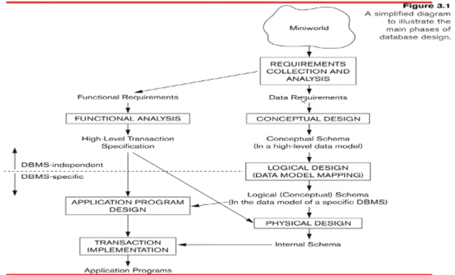

- É uma modelagem de dados em alto nível com foco do domínio do problema e não na solução
- Elemetos básicos
  - Modelar conceitos do mundo real
  - Modelar as características dos conceitos
  - Modelar os relacionamentos entre conceitos
- O MER, ou ER, tem como objetivo facilitar o projeto de BD por meio de um modelo indendente da implementação de fácil compreensão por parte do usuário
- A partir dos requisitos, consegue-se modelar um DER
- Conceitos básicos
  - Entidade, Tipo Entidade e Conjunto de Entidades
  - Relacionamento e Conjunto de Relacionamentos
  - Atributos
- Def: O Diagrama ER-DER é uma representação gráfica de Entidades, Atributos, e Relacionamentos que modelam o Esquema de um Banco de Dados
- **DER Exemplo - Company Database**

  

***

- Definições
  - **Entidade:** é um conceito do mundo real com existência independente
    - Ex: empregado (conceito físico), projeto, curso (conceito abstrato)
  
    
    - o retângulo representa uma **Entidade**
    - o tipo _Empregado_ representa um Conjunto de Entidades, ou seja, todas as instâncias do BD
  - **Atributo:** é uma propriedade da entidade (campo de um objeto)
    - Ex: código, nome, créditos

      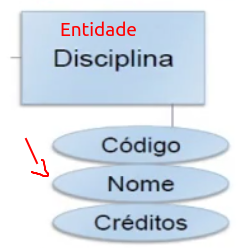
    - Um atributo no DER é representado por uma elipse ligada à entidade
    - **Existem vários tipos de atributos:**
    - Simples: atributo que não possui divisão (sexo, cpf - não podem ser subdivididos)
    - Composto: atributo que pode ser dividido em partes com significados diferentes
    
      - Uma atributo composto pode formar uma hierarquia
      
    - Monovalorado: atributo possui um único valor (nome - uma pessoa só pode ter um nome)
    - Multivalorado: atributo que possui um conjunto de valores para uma mesma entidade (telefone - uma pessoa pode ter mais de um telefone)
      - No DER, um atributo multivalorado é representado por uma elipse com contorno em linha dupla
      
    - Chave (Primary Key): é um atributo cujos valores são distintos para instâncias distintas de um Conjunto de Entidades (código de uma disciplina/sigla ou código de uma turma - são valores únicos para instâncias diferentes)
    
      - Obs: uma entidade pode ter mais de um atributo chave
    - Derivado: é um atributo que não está definido, mas pode ser obtido a partir de outros atributos através de algum procedimento (não precisa ser armazenado)
      - idade (se houver a data de nascimento, podemos calcular a idade) 
      - numero de empregados de um departamento (se houver uma tabela de empregados relacionados a uma tabela de departamentos, podemos contar quantos empregados estão relacionados à aquele departamento específico)
      
        - Obs: No DER uma atributo derivado é representado por uma elipse com contorno em linha tracejada (este atributo não será armazenado fisicamente no BD)
  - **Relacionamento:** é uma associação entre entidades que é definido quando uma entidade se refere a outra. Ex: lotação de um empregado em um departamento

    
    - Um relacionamento no DER é representado por um losango às entidades (existem vários tipos de relacionamentos)
    - Papeis em relacionamentos:  papel em um relacionamento define como a entidade participa do mesmo
      - Ex: empregado está lotado em departamento e departamento tem lotação de empregados
      - Muitas vezes o papel está implícito e não é representado no ER
    - Auto-relacionamento: associam instâncias de uma mesma entidade
      - Ex: supervisão de empregados (um empregado pode ser supervisor de outros empregados), papéis: empregado é supervisor de empregado, e empregado é supervisionado por empregado
      - É necessário indicar os papéis que são denotados por rótulos nas linhas que modelam o relacionamento
      
    - Cardinalidade em Relacionamentos: é uma restrição na quantidade máxima de instâncias de uma entidade que podem estar associadas a uma instância de outra entidade
      
      - No DER definimos a cardinalidade de N ou 1, neste caso, indicando que uma instância de funcionário pode estar associadas a, no máximo, uma instância de departamento (um funcionário só trabalha para um departamento, mas um departamento tem vários funcionários)
    - Participação em Relacionamentos:
      - Participação Total: é uma restrição que indica a necessidade de que qualquer instância da entidade, estar associada a, no mínimo, uma instância no relacionamento
        - Ex: toda instância de PROJECT necessariamente está associada a um departamento no relacionamento CONTROLS (_Não pode existir um projeto no Conjunto de Entidades que não esteja relacionado a um departamento_)
        
        - No DER um relacionamento com participação total é indicado por meio de uma linha dupla . Quando não é total, chamamos de ***Participação Parcial***
        - Participação Parcial: no caso do exemplo acima, um departamento pode não ter um projeto relacionado a ele
    - Entidade Fraca: é aquela que não possui um atributo chave e é identificada por meio de um relaciomento total com pelo menos um tipo Entidade Forte
      - Ex: Dependente/Entidade Fraca, Funcionário/Entidade Forte
  
      
      - No DER, um Tipo Entidade Fraca é representado por meio de retângulo com contorno em linha dupla. O relacionamento total com pelo menos uma entidade forte é denotado por um losângulo com contorno em linha dupla. A "chave local" é denotada por sublinhado pontilhado. A Chave de uma instância de uma entidade fraca é um atributo composto pela chave da entidade forta mais a sua "chave local"
    - Grau de Tipo-Relacionamento: é o número de entidades que participam
      - Ex: relacionamentos de grau 3 (ternário) ligam 3 entidades, por exemplo: relacionamento entre agencia, cliente e conta
      
      - Um tipo-relacionamento de grau n tem n arocs no diagrama
    - Relacionamentos binário/ternário: diferença entre um relacionamento ternário e três relacionamentos binários 
  
      
      

## _**Modelo de Entidade-Relacionamento-Estendido (EER / MEER / DEER)**_

- Intriduz semântica adicional ao ER  
- Entidades do ER podem representar
  - CLASSE
  - SUBCLASSE
  - SUPERCLASSE
- HERANÇA
  - subclasses herdam atributos da superclasse

- ERR - Especilização/ Generalização
  - ESPECIALIZAÇÃO: definir sub-classes à partir da super-classe
  - GERERALIZAÇÃO: definir super-classe à partir de sub-classes

    
  
  - Exemplo

    
    - Cada entidade do Conjunto de Entidades das subclasses também é um empregado
  
- EER - Herança de Relacionamentos
  - Além dos atributos, as subclasses herdam os relacionamentos das superclasses
  - Uma instância da superclasse pode ser instânciada de zero, ou mais suclasses, dependendo do ***critério de especialização/generalização***

- EER - Especialização/Generalização (Notação)

  

- EER - Subclasses mutuamente esclusivas
  - Critério de Especialização/Generalização
    - Disjunto: este critério modela uma restrição tal que as subclasses são mutuamente exclusivas, ou seja, uma instância da superclasse pode ser, no máximo, a instância de uma das subclasses

      

      - No DER, o critério disjunto é indicado pela letra "d" no relacionamento de superclasse/subclasse 
      - Uma instância de disciplina não pode ser de graduação e pós-graduação

        
    - Sobreposto: subclasses se sobrepõem, ou seja, uma instância de superclasse pode ser instância de mais de uma subclasse

      
      - No DER, o critério sobreposto é o *default* ou pode ser explicitado pela letra "o"
      - Uma instância de pessoa pode praticar mais de um tipo de esporte

        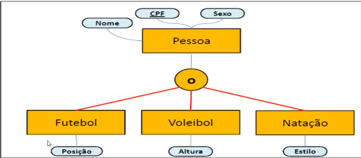

- EER - Exemplo de Especialização

  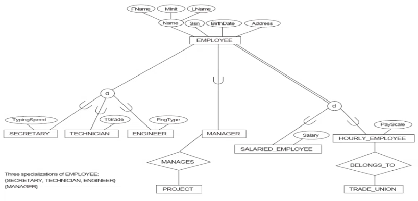
  - Notação de união, significa que herda (extends)

- EER - Exemplo de Generalização

  
  - As entidades "car" e "truck" foram generalizadas na "vehicle"

- EER - Exemplo definida como atributo

  
  - Especialização é vista como um "job type"

- EER - Herança múltipla em subclasses

  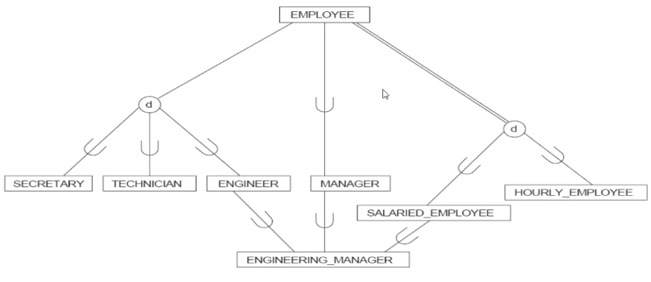

- EER - Categoria (_UNION TYPE_ ou _CATEGORIA_)
  - União de entidades(superclasses) formando categorias (ou clusters), onde a instância de uma subclasse da categoria tem que ser instância d epelo menos uma das superclasses
  - A categoria é modelada por meio de um relacionamento (União) da subclasse com mais de uma superclasse, e a subclasse representa um subconjunto da união de todas as superclasses

    

- EER - Agregação
  - É um conceito de abstração para a criação de objetos compostos com base em componentes (três casos)
    1. Entidade agrega atributos de objetos para representar um objeto mais complexo (ex: COMPA agrega CNa e Caddr)
    2. Relacionamento que agrega atributos (ex: INTERVIE agrega ContactNa e ContactPho)
    3. Entidade que representa objeto agregado a partir do relacionamento de outros objetos (não é natural no ER. Como resolver isso?)

        

  - O problema: como relacionar Entrevista a outra entidade chamada Oferta de emprego?
    - Resolução: Abordagem com Entidade_Fraca
  
      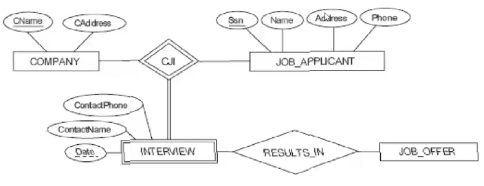

  - Exemplo de EER

    

- Projeto Conceitual - UML
  - Diagramas de classes da UML como alternativa de modelagem conceitual

    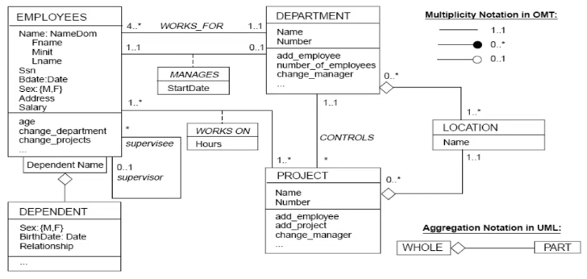

  - UML - Especialização/Generalização

    

## _*Modelo Relacional - MR**_

- O modelo relacional representa um banco de dados como uma correlação de valores. Uma relação é uma tabela de valores, onde cada linha é um conjunto de valores relacionados e cada coluna um conjunto de valores de mesmo tipo e significado

  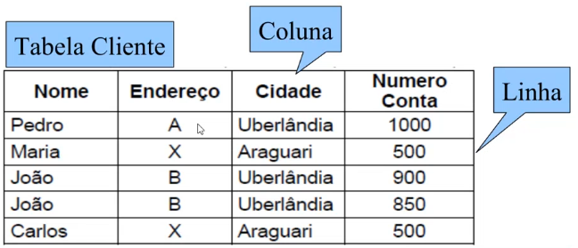
- foi proposto por Ted Codd em 1970
- versões comerciais disponibilizadas no início da década de 80 (SQL/DS; ORACLE)
- seu formalismo usa teoria de conjuntos de lógic a de primeira ordem;
- é um método declarativo de especificar dados e consultas
- Conceitos informais
  - Relação é uma tabela de valores
  - Cada linha da tabela representa fatos do mundo real, chamada tupla no modelo formal
  - Cada coluna da tabela tem um cabeçalho que indica o significado do item de dado na coluna, chamado atributo
  - Cada linha tem pelo menos uma chave que é um subconjunto de valores que identifica unicamente a linha
- Exemplo de Relação

  

- Definições formais
  - Domínio e Cardinalidade: um **domínio D** é um conjunto de valores atômicos e a **cardinalidade de D**, denotada por |D|, é o número de valores em D
    - Exemplo:
      - D1 = Domínio(sexo) = {F, M}; |D1| = 2
      - D2 = Dom(funcionario.idade) = [15, 80]; |D1| = 66
    - Um domínio pode ser definido por um tipo ou formato
      - funcionario.idade: inteiro
      - fone: (dd)dddd.dddd, onde cada "d" representa uma digito númerico decimal, sendo os dois primeiros um código de área
  - Esquema de relação e atributo: o esquema de relação descreve a relação e é definido por R(A1, A2, ..., AN), onde R é o nome da relação e cada Ai é o nome de um atributo
    - O atributo é o nome do papel desempenahdo por algum domínio na relação
    - Exemplo: EMPREGADO(cpf, nome, endereco, sexo)
      - Dom(cpf) = ddd.ddd.ddd-dd
      - Dom(nome) = cadeia de caracteres que representam nomes de pessoas
      - Dom(endereco) = cadeia de caracteres que representam endereços
      - Dom(sexo) = {F, M}
  - Tupla, valor de atributo e NULL: uma tupla t é um conjunto ordenado de valores denotado por t = <v1, v2, v3, v4>, onde cada vi é derivado do domínio apropriado de Ai ou é um valor nulo
    - o valor nulo, denotado por NULL, é um valor especial para reprentar valores desconhecidos ou que não se aplicam
    - Se t = <v1, v2, ..., vn> então t[Ai] = vi
    - Exemplo:
      - EMPREGADO(cpf, nome, enderco, sexo)
      - empregado=<114719143637, 'John Smith', '101 Main St. Atlanta, Ga 303332', 'M'>
      - empregado.sexo = 'M'
  - Relação, estado, grau e cardinalidade: uma relação r de uma esquema R(A1, A2, ..., An), denotado por r(R), é um conjunto de tuplas (r = {t1, t2, ..., tm}).
    - Obs
      - O estado da relação r reflete as tuplas válidas que representam um estado particular do mundo real
      - O esquema R é relativamente estático, mas em geral, o estado da relação r é dinâmico
      - n é o grau do esquema da relação
      - m é a cardinalidade da relação
  - Características das relações
    - as tuplas em uma relação não possuem ordem
    - os atributos em uma tupla estão ordenados de acordo com o esquema da relação
    - não há atributos compostos ou multivalorados no modelo relacional normalizado, pois todos os atributos são atômicos (não são divisíveis)
    - NULL é um valor especial para representar valores desconhecidos ou qeue não se aplicam
    - um esquema de relação pode ser interpretado como uma afirmação ou asserção sobre a estrutura da relação
    - uma tupla pode ser interpretada como um fato ou instância da afirmação
    - uma relação pode representar uma entidade ou um relacionamento no modelo ER
  - Restrições e suas categorias: são condições que devem ser mantidas por todos os estados válidos (tuplas) das relações
    - Categorias
      - Inerentes: são características do modelo de dados, por exemplo, não há atributo composto no modelo R
      - Baseadas em esquema: podem ser expressas no modelo de dados, por exemplo, restrição de domínio
      - Baseadas na aplicação: não podem ser expressas no modelo de dados, portanto devem ser implementadas por meio de programas de aplicação
  - Superchave: é um subconjunto de atributos SCh do esquema de relação R, tal que em qualquer estado válido r de R não existem duas tuplas com a mesma combinação de valores para atributos de SCh
    - Ex: Sejam tuplas ti, ij com i != j, então ti[SCH] != tj[SCH]
    - Obs: para qualquer R, SCh = R é uma superchave, pois a relação r é um conjunto
  - Chave: é uma superchave de R tal que a remoção de qualquer atributo de Ch gera uma subconjunto Ch' que não é superchave de R
    - Obs: uma relação pode ter mais de uma chave, cada uma é chamada chave candidata, e uma delas é chamada chave primária PK;
    - a *Integridade de Entidade* é uma restrição inerente ao Modelo R e define que a chave primária não pode ser nula
    - Ex
      - DEPENDENTE(cpf_pai, nome, relacionamento)
      - SCh1(SuperChave) = DEPENDENTE - não é chave
      - SCh2(SuperChave) = (cpf_pai, nome) - é chave
  - Chave estrangeira e integridade referencial
    - uma FK de uma relação R que referencia a relação S é um conjunto de atributos FK é um conjunto de atributos FK de R com o mesmo domínio da chave primária PK de S tal que para qualquer tupla r de R r[FK] é unulo ou existe s[PK] tal que r[FK] = s[PK]
    - Seja FK*i*(r) = PK(S), então para toda tupla r em R, existe s em S | r[FK*i*] = s[PK] ou r[FK*i*] = NULL
    - Uma chave estrangeira FK(R) = PK(S) define uma INTEGRIDADE REFERENCIAL de R para S
  - Esquema de BD: é um conjunto de esquemas de relações que pertencem ao BD
    - S = {R*1*, R*2*, ..., R*n*}
    - Exemplo de Esquema de BD Company

      
    - Integridade referancial em esquema de Db

      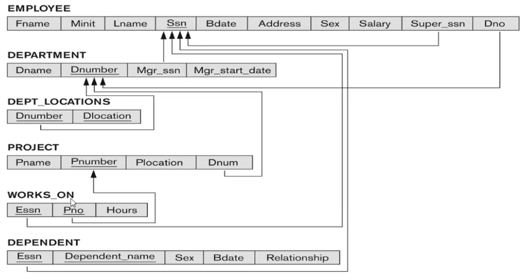
    - Esquema de DB formal
      - relações e suas chaves

         
      - Chave Primária

        
      - Integridade referencial/Chave estrangeira

        
      - Restrições de domínio

        
  - Operações no DB e violação de restrições
    - inserir - INSERT
    - excluir - DELETE
    - alterar - UPDATE
    - obs: a manutenção da consistência de DB, ou seja, execução das operações sem violar as restrições modeladas
  - Instância db

    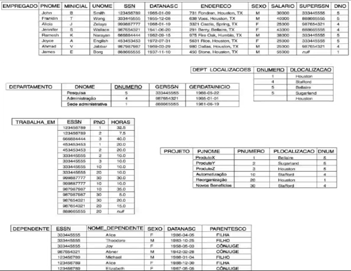
  - Violação de restrições em INSERIR
    - EMPREGADO(fname, minit, lname, ~~ssn~~, bdate, address, sex, salary, superssn, dno)
    - Inserir empregado<'cecília', 'F', 'Ribeiro', NULL, '05-04,-1960', 'Rua Esmeralda, 35, Uberlândia, MG', F, 28000, NULL, 4> (não pode ser inserido pois a chave primária esta nula)
    - Inserir empregado<'cecília', 'F', 'Ribeiro', ***123456789***, '05-04,-1960', 'Rua Esmeralda, 35, Uberlândia, MG', F, 28000, NULL, 4> (não pode ser inserido, pois já existe uma chave primária ***123456789***)
    - Inserir empregado<'cecília', 'F', 'Ribeiro', 677678989, '05-04,-1960', 'Rua Esmeralda, 35, Uberlândia, MG', F, 28000, NULL, ***7***> (não pode ser inserido, pois não existe um dno-FK 7 no PK da relação DEPARTAMENTO)
  - Violação de restrição em EXCLUIR
    - EMPREGADO(fname, minit, lname, ~~ssn~~, bdate, address, sex, salary, superssn, dno)
    - DEPARTAMENTO(~~dname~~, ~~dnumber~~, mgrssn, mgrstartdate)
    - FK*dno*(empregado) = PK(departamento)
    - Excluir tuplas em DEPARTAMENTO com dnumber = 5
      - viola restrição de integriadade referencial FK*dno*(empregado), fazendo que ela referencia algo que não existe, pois foi excluído
    - Opções de tratamento de violação de restrições em exclusão:
      - restrict: rejeita a exclusão
      - cascade: propaga a exclusão (exclui todos as linhas com o FK relacionado que foi violado na exclusão da PK)
      - set null: modifica valores de atributos que referenciam a causa das violações
  - Violação de restrição em ALTERAR
    - A operação de ALTERAR pode ser interpretada como uma operação de EXCLUIR e INSERIR em sequida, portanto está sujeita às mesmas violações, inclusive às opções de tratamento de violações mostradas anteriormente, a saber, restrict, cascade e set null

## _*Mapeamento ER, EER para o Relacional**_

- Projeto Lógico
  - é a especificação detalhada da estrutura do banco de dados em um modelo que possa ser implementado por um gerenciado de banco de dados
  - Uma estratégia de projeto lógico é o mapeamento de um modelo conceitual para o modelo relacional
  - Modelo Conceitual = ER ou EER ==> Modelo Implementável = R
### Roteiro

- Mapeamento de tipo entidade regular
  - cada entidade regular é mapeada em uma relação
  - EMPREGADO(**CPF_empregado**, nome_empregado)

    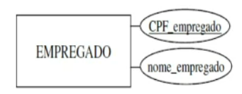
  - OBS
    - defina a chave primária: PK(EMPREGADO) = CPF_empregado
    - mantenha informações de chave secundária, se houver
- Mapeamento de tipo entidade fraca
  - cada entidade fraca é mapeada em uma relação que inclui em seus atributos a chave primária de sua entidade forte

      
  - DEPENDENTE(~~CPF_empregado, nome_dependente~~, sexo_dependente)
  - OBS
    - defina uma chave estrangeira na relação relacionada à chave primária de sua entidade forte
      - FK*cpf_empregado*(DEPENDENTE) = PK(EMPREGADO)
    - a chave primária da relação será composta de sua chave local e da chave primária de sua entidade forte
      - PK(DEPENDENTE) = (CPF_empregado, nome_dependente)
- Relacionamentos 1:1 com chaves iguais e relacionamento total em E1 e E2
  - agrupa-se todos os atributos em uma relação

    

    - ClienteCarregamento(Codigo_Cliente, Nome, Endereço)
- Relacionamentos 1:1 com chaves diferentes e relacionamento total/parcial
  - cria-se duas relações e agrupa-se os atributos da entidade com participação total com a chave da entidade com participação

    
    - Cliente(Nome, Codigo_Cliente)
    - Cartao_Credito(Nro_Cartao, Limite, Codigo_Cliente)
    - FK*codigo_cliente*(Cartao_Credito)=PK(Cliente)
    - OBS: opcionalmente pode-se omitir o Codigo_Cliente em Cartao_Credito e criar uma terceira relação com a duas chaves, principalmente quando não houver participação total
- Relacionamentos 1:1 com chaves diferentes e relacionamento parcial/parcial
  - sem participação total, agrupa-se os atributos do relacionamento com as chaves das entidades em uma terceira relação

    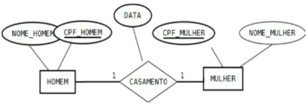
    - HOMEM(CPF_HOMEM, NOME_HOMEM)
    - MULHER(CPF_MULHER, NOME_MULHER)
    - CASAMENTO(CPF_HOMEM, CPF_MULHER, DATA)
    - FK*cpf_homem*(CASAMENTO)=PK(HOMEM)
    - FK*cpf_mulher*(CASAMENTO)=PK(MULHER)

- Relacionamentos 1:N
  - agrupa-se a chave da entidade com cardinalidade 1 aos atribuos da entidade com cardinalidade N

    
    - ESTADO(**SIGLA**, NOME)
    - CIDADE(**CODIGO**, NOME, POPULAÇÃO, SIGLA_ESTADO)
    - FK*sigla_estado*(CIDADE)=PK(ESTADO)
- Relacionamentos M:N
  - agrupa-se os atributos do relacionamento com as chaves das entidades participantes

    
    - ALUNO(**MATRICULA**, NOME)
    - DISCIPLINA(**CODIGO**, NOME)
    - CURRICULO(**MATRICULA, CODIGO_DISCIPLINA,** ANO, SEMESTRE, NOTA)
    - FK*matricula*(CURRICULO)=PK(ALUNO)
    - FK*codigo_disciplina*(CURRICULO)=PK(DISCIPLINA)
- Atributos multivalorados e entidades
  - cria-se uma nova relação com o atributo multivalorado e a chave da entidade original

    
    - DEPARTAMENTO(**NUMERO**, NOME)
    - LOCALIZAÇÕES(**NUMERO_DEPTO, LOCALIZACAO**)
    - FK*numero_depto*(LOCALIZAÇÕES) = PK (DEPARTAMENTO)
- Eliminação de atributos compostos
  - duas alternativas com perda mostradas abaixo ou uma terceira, criando uma nova relação "pessoa_endereco"

    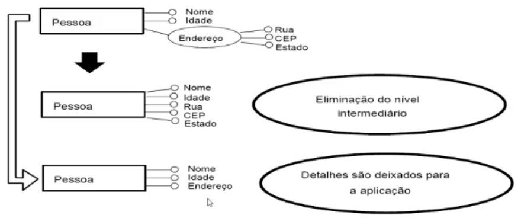
    - Observe a mudança de notação no ER em relação aos slides anteriores
- Relacionamentos de grau maior que 2
  - agrupa-se a os atributos do relacionamento com as chaves das entidades participantes

    
    - PEÇA(**COD_PEÇA**, DESCRIÇÃO)
    - FORNECEDOR(**COD_FORN**, NOME, ENDEREÇO, TELEFONE)
    - PROJETO(**COD_PROJETO**, NOME, DATA_ABERT)
    - FORNECIMENTO(**COD_PEÇA, COD_FORNECEDOR, COD_PROJETO,** QTDE)
- Autorelacionamento
  - Se for M:N cria-se uma nova relação, caso contrário agrupa-se mais uma chave na relação

    
    - EMPREGADO(**REG_EMP**, NOME, DATA_NASC)
    - GERENCIA(**REG_SUB, REG_COORDENADOR**)
    - E se o relacionamento 1:n?
    - EMPREGADO(**REG_EMP**, NOME, DATA_NASC, REG_SP)
    - FK*reg_sp*(EMPREGADO)=PK(EMPREGADO)
- Generalização/Especialização: Opções
  - especialização de uma superclasse C={k, a1, a2, ..., an} com m subclasses {S1, S2, ..., Sm} pode ser mapeada de quatro formas, aqui chamada de:
    - Opção A: uma tabela para cada entidade, inclusive C
      - a partir de C={k, a1, a2, ..., an} e {S1, S2, ..., Sm} gerar as seguintes relações
      - L = {**K**, a1, a2, ..., an} e Li = {**K**} U {atributos específicos de Si} | 1 <= i <= m
      - obs: aplicável a qualquer tipo de especialização (total ou parcial, disjunto ou sobreposta)

        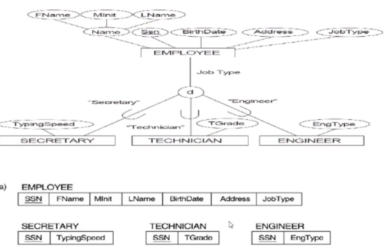
    - Opção B: uma tabela para cada entidade Si fundida com C
      - a partir de C={k, a1, a2, ..., an} e {S1, S2, ..., Sm} gerar as seguintes relações
      - Li = {**K**, a1, a2, ..., an} U {atributos específicos de Si} | 1 <= i <= m
      - obs: aplicável para especializações totais e disjuntas

        
    - Opção C: fusão de todas as entidades com um atributo tipo
      - a partir de C={k, a1, a2, ..., an} e {S1, S2, ..., Sm} gerar as seguintes relações
      - L = {**K**, a1, a2, ..., an} U {atributos específicos de S1} U {atributos específicos de S2} U ... U { atributos específicos de Sm} U {t}
      - obs: t é chamado atributo discriminador e é utilizado para especializações disjuntas

        
    - Opção D: fusão de todas as entidades com m atributos tipo
      - a partir de C={k, a1, a2, ..., an} e {S1, S2, ..., Sm} gerar as seguintes relações
      - L = {**K**, a1, a2, ..., an} U {atributos específicos de S1} U {atributos específicos de S2} U ... U { atributos específicos de Sm} U {t1, t2, ..., tn}, onde ti é um valor booleano correspondente a cada subclasse

        
- Herança Múltipla - Exemplo de EER
  
  