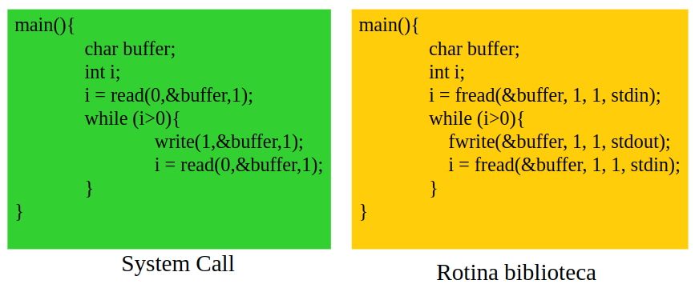
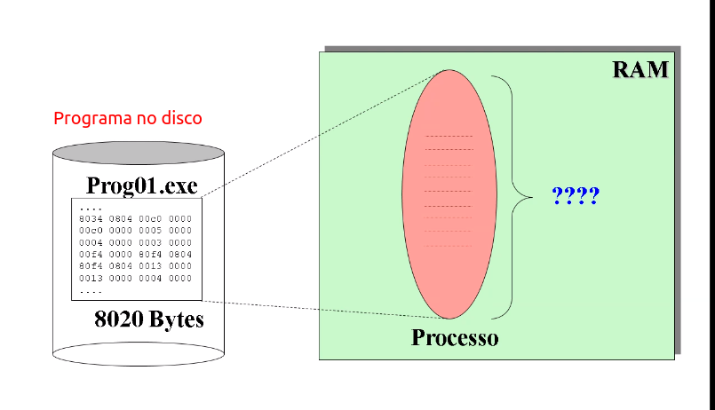

# Sistemas Operacionais

## _Contextualização_

- SO é um software que faz contato direto com o hardware e serve para auxiliar o uso do computador
- Exemplos: Linux, Windows, Solaris, etc..
- Estuda a arquitetura de sistemas operacionais
- Como que os sistemas operacionais funcionam por dentro
- O SO é o elemento central que controla todo o computador
- Todas as informações passam pelo SO
- Importância:
  - Ajuda a resolver problemas mais complexos
  
## **Introdução**

_**Conceitos básicos:**_

- **Sistema computacional**: hardware + software (SO && Software).

- **Ambiente computacional**: sistema computacional + peopleware (usuários).

- **Sistema operacional**: é uma interface entre as aplicações e o hardware, gerenciando recursos de hardware e software (processador, memória ram, rom, secundária, processos/entidades de execução, gerenciamento de rede).
  - Todas aplicações que utilizam o hardware, solicitam para o SO, o qual faz o precedimento diretamente no hardware.
  - Todas aplicações que comunicam entre si são subordinadas ao SO.
  - Um chamada de uma aplicação para o SO é chamada de _System Call_.

- **Núcleo/Kernel**: conjunto de rotinas que são inicializadas quando o computador é ligado, sendo carregadas para a memória.
  - Esperam ser acionadas pelo _System Call_ ou por interrupções do hardware.

- **Distribuição**: Kernel + Programas auxiliares do kernel + Aplicações para o usuário.
  - Windows, Ubuntu, Mac, IOS, Android, etc...

## **Conceitos de introdução**

- Conceitos de Hardware e Software
  - Unidades Funcionais (ULA, UC, Registradores, Dispositivos de I/O, Memória Principal)
  - Registradores
  - Dispositivo de Clock
  - Memórias: Principal, Secundária, Cache

## **Processo de Ativação de SO (boot)**

- >***Firmwares: Softwares que vem gravado do fabricante (POST, SETUP Rotinas do BIOS)***
- >***As vezes a BIOS (Basic Input Output System) é mencionada como POST + SETUP + Rotinas do BIOS***

- **POST** (Power On System Test) - _É um programa_
  - Processador do computador, ao ser energizado ao ligar, o PC (Program Counter) aponta para o endereço do primeiro software a ser executado na ROM (POST)
  - POST é um Software/Firmware escrito em C/Assembly que é embarcado(armazenado) na ROM (Read Only Memory - ***Memória persistente diferente da RAM***)
  - Testa todos componentes básicos do computador para ver se é possível inicializa-lo (Memória, CPU, HD, dispositivos de saída, etc...)
  - Se tiver problema em um componente crítico do computador, sinaliza o erro e para a ativação do computador
  - Se não tiver algum problema, passa para próxima etapa de ativação do SO
- **SETUP** (Sofware/firmware opcional) - _"Pressione ESC"_
  - Firmware embarcado pelo fabricante que permite alterar configurações básicas do computador
  - Ferramentas de diagnóstico (Testar Hardware)
- **Rotinas do BIOS** (Software/firmware com rotinas genéricas gravadas pelo fabricante)
  - Rotinas com operações básicas (Leitura/Escrita no disco, Leitura do teclado, Escrita no dispositivo de saída padrão)
- **Carga de Boot Manager** (Caso exista)
  - Inicializado antes do SO, pois escolhe qual SO inicializar
  - Programa armazenado no disco na MBR(Master Boot Record), utilizado em sistemas computacionais que possuem mais de uma instalação de SO para inicializar
  - Responsável por carregar os Boot Loader's dos SOs no disco
- **Carga do Boot Loader do SO** (normalmente residente no primeiro setor de dados da partição do SO instalado)
  - Feito pelo fabricante do SO
  - Programa que fica no setor de boot numa partição do disco que está instalado o respectivo SO
  - O Boot Loader carrega o kernel do SO
- **Carga do Kernel do SO**
  - Inicializa suas rotinas, drivers, programas
  - Inicialização do SO em questão

## **Tipos de Sistemas Operacionais**

- Monoprogramáveis/Monotarefa
  - Somente um programa pode ser executado **por vez**
- Multiprogramáveis/Multitarefa
  - Vários programas podem ser executados **simultaneamente**
  - Permite multiusuários (usuários conectados de forma remota)
  - Batch (Conjunto/Lote)
    - Eram preparados lotes de programas para serem executados para o sistema operacional
  - Time-sharing (Tempo compartilhado)
    - Mainframe(CPU, Disco, Memória, etc...) compartilhado entre vários terminais(usuários com teclado e tela)
    - Todos usuários tem acesso simultâneo a uma mesma máquina
    - Muito mais complexo que o modelo em lote(batch)
    - Maioria das distribuições comerciais (Linux, Windows, etc...)
  - Tempo Real
    - Específico para sistemas que precisam operar em ambiente real em tempo real (Sistemas Críticos)
    - Sistema de mísseis, aviões, radares, etc...
- Múltiplos Processadores (possui vários processadores)
  - Fortamente Acoplados
    - Os processadores, memória principal, I/O,  estão no mesmo back-plane (placa do sistema)
    - Sistemas Simétricos (SMP)
      - Todos os processadores são iguais e funcionam da mesma forma
      - O suporte físico do back-plane (placa) limita o crescimento da quantidade de processadores
      - São comuns em computadores comerciais
    - Sistemas Assimétricos
      - Processadores são diferentes entre si em funções (especializado em parte gráfica, I/O de rede, cálculo, criptografia) e em especificações (4GHz, 2GHz)
      - São comuns em alguns minicomputadores e em sistemas específicos (alguns smartphones, consoles de videogames)
  - Fracamente Acoplados
    - Processadores não estão no mesmo back-plane, portanto não é limitada a quantidade de processadores
    - Um rack com várias placas mães
    - Necessidade de um SO que monitore essas várias back-planes
    - Sistema Operacional de Rede (NOS)
      - Permite que computadores se comuniquem entre si através de syscalls oferecidas pelo SO
    - Sistema Operacional Distribuído (DOS)
      - O SO gerencia o armazenamento de dados, execução de programas nos computadores que estão conectados entre si
      - O sistema de comunicação entre os computadores precisa ser muito eficiente e rápido
      - atualmente existe um gargalo que impede de ter um DOS em escala comercial
  
## Estruturas e Componentes

- Chamada de Sistema(system call)
- Grupos Funcionais
  - Gerência de Processador
  - Gerência de Memória
  - Gerência de E/S
  - Gerência de Arquivos
  - Comunicação em Rede
- Organização do Kernel
  - Monolítico
    - Primeiros modelos de kernels criados
    - As rotinas do kernel estão organizadas de forma muito coesas entre si, permitindo que as rotinas compartilhem estruturas e dados entre si
    - A manutenção em cima desse código é difícil devido a coesão das rotinas entre si
    - As rotinas estão tão coesas em um nível que ao carregar o kernel, todas as rotinas são levadas para a memória, podendo haver rotinas que nem sequer serão utilizadas
    - Porém é mais rápido, pois os dados são compartilhados e não é necessária criação de rotinas passando paramêtros copiados
  - Em camadas
    - Permite uma melhor manutenção do código
    - As rotinas estão bem separadas uma das outras, permitindo com que as rotinas possam ser executadas em diferentes modos de operação do processador(kernel/user mode)
    - Possui uma performance pior comparado ao monolítico, pois as interfaces não permitem que as funções compartilhem dados
    - Existe interfaces entre as rotinas para se ter uma integração coesa
    - Ainda não é possível previnir o carregamento de todas as rotinas para a memória
  - Microkernel
    - Neste as rotinas podem ser selecionadas para carregamento
    - As rotinas do kernel são carregadas para a user level, deixando apenas as rotinas mais baixo nível no kernel
    - As rotinas que estão no user level precisam acessar o kernel através de system calls que consomem tempo (desempenho menor comparado aos outros tipos de kernel)
    - Falhas em subsistemas(rotinas) não comprometem a execução do sistema, pois estão bem isoladas
    - Em sistemas multiprocessados, módulos podem ser executados em diferentes processadores mais facilmente, aproveitando o processamento dos processadores
    - As rotinas do kernel são separadas em vários programas, diferente dos outros kernels, na qual uma aplicação realiza uma syscall para o kernel

  
- Interface de System Calls

  
  - Um programa em C invoca o printf(), o qual por sua vez chama a system call write()
  
  - System Calls: Padronização
    - A marioria das syscalls usadas em sistemas UNIX (ou UNIX-like) estão definidas no padrão POSIX (Portable Operating System Interface for Unix)
      - A família de padrões POSIX é formalmente conhecida como IEEE 1003
      - Equivale ao padrão internacional ISO/IEC 9945
    - No Linux podemos ver as system calls na seção 2 do manual online (man pages)
      - man 2 system_call
        - ex # man 2 exit
      - man syscalls - apresenta todas as chamadas de sistema
  - System Calls vs. Rotinas de Biblioteca
    - No UNIX muitras system calls são encapsuladas por rotinas de biblioteca
      - C library (libc, glibc, ...)
    - Exemplo:
      - void _exit(int status) - system call
      - void exit(int status) - rotina da biblioteca
    - Algumas diferenças:
      - _exit não chama qualquer função registrada com atexit() ou on_exit().
      - _exit não fecha descritores de arquivos abertos
      - entre outras
    - O que é melhor? System Calls ou Rotinas de Biblioteca?
      
    - Ao realizar teste utilizando os comandos
      
    - percemos que a syscall perdeu drasticamente em quesito de performance comparado com a rotina de biblioteca, isso se deve pelo fato da rotina em C realizar um procedimento de bufferização internamente, evitando o chaveamento entre modo kernel e usuário de forma repetida no código System Call
  - Métodos de Entrada no Kernel
    - Na arquitetura x86, a entrada do Kernel via system call é implementada por meio de uma interrupção de software
      - No MSDOS: int 0x21
      - Windows NT/2000: int 0x2E
      - Linux (Kernel < 2.6): int 0x80
      - Solaris 2 (x86): SYSENTER/SYSEXIT
      - Linux (Kernel 2.6): SYSENTER/SYSEXIT
      - Windows XP/Vista: SYSENTER/SYSEXIT
    - Além das chamadas de sistema outras duas formas de entrada no Kernel são:
      - Interrupções de hardware
      - Hardware trap (específicas do processo)
        - Ex: divisão por zero
  - Exemplo de Estrutura de Kernel (Modelo Unix SVR4)
    

## **Modelo de Processos/Threads**

### Modelo de Processo

- Processo: é uma instância de um programa em execução

  
  - Programa é o executável, quando acionado, solicita para o SO criar um processo do programa na memória (instância), o qual vai ser executado pelo processador
  - Programa é estátic, e processos são dinâmicos
  - O que roda na memória principal é o processo, não o programa
- Programa vs. Processo
  
  
  

  - Normalmente o processo tem espaço maior do que o programa executável, pelo fato do programa poder alocar memória, ocupando mais espaço do que o tamanho desse ao ser transformado em processo, mas pode ser menor ou igual também.
  
  
  - Na pilha de execução que são armazenadas as execução de funções, criação de variáveis locais, retornos de função e endereços de retorno após termino de execução de uma função
  - Se a stack cresce até a Heap, ocorre "stack overflow", se a Heap cresce até a stack, ocorre a "stack overrun"
  - Entry point sinaliza aonde é o início do da rotina principal do código (main)

### Implementação Interna

- PCB
- Contextos (Hardware/Software)

### Modelo de Threads

- Conceito
- Vantagens e Desvantagens
- Paralelismo
