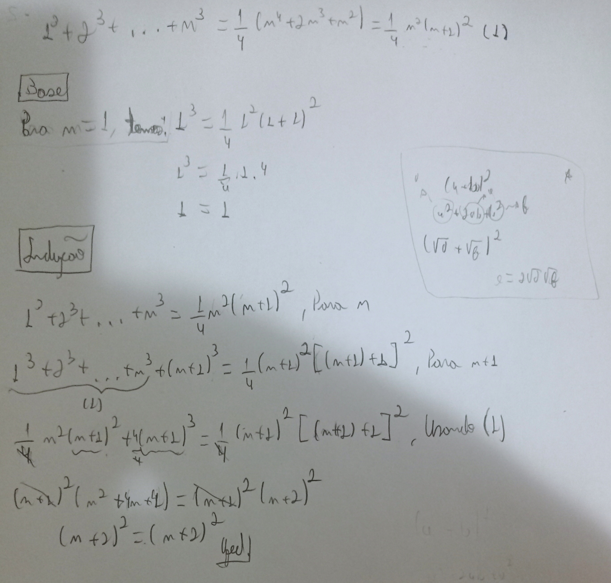
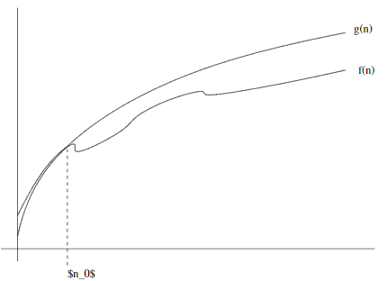

# Análise de Algoritmos

- Analisar eficiência computacional de algoritmos utilizando formalismo apropriado
- Aplicar técnicas de projeto de algoritmos
- Projetar algoritmos eficientes de acordo com a técnica mais adequada ao problema

> "Quanto tempo gasta??"

- memória, comunicação

> "Estou fazendo direito??"

- Depois:
  - "É possível resolver isso na prática??"
  - "É possível resolver isso??"

## Leibniz e os dados (Aula 1)

- Aquecimento e off topic
- Dado um lance de um par de dados, qual é soma mais provável 11 ou 12??
- (Se vc errou, esta em boa compania: Leibniz)

### Indução Matemática

- Se, ser verdade para n implica em ser verdade para n + 1
- Verdade para um n0
- É verdade (para n grande)
- Efeito Dominó
- Provas e Projeto de algoritmo

### Exercícios

1. Prove por indução
  
2. Hanói
  
3. Pseudo-Algoritmo

- avaliaP(V, x):
  - R = 0
  - Q = 1
  - P / é de 1 a |V|:
    - R = R + Q * Vi
    - Q = Q * x
  - Retorna R

## Eficiência do algoritmo (Aula 2)

- Compilo e testo ... OK?
- Não!
- Linguagem?? Compilador?? Arquitetura??
- for x while
- c = c + 1 x c++
- Ir até a metade do vetor
- Operador ternário ou mesmo de uma multiplicação
- Evitar recomputação da metade (|V|/2) de acesso ao V[i]
- "Escovação de Bits!!"

---

- Vou abandonar a idéia do tempo em "segundos"
- Vou criar um modelo...uma fórmula matemática
- Representar o tempo de execução do algoritmo
- Complexidade do Algoritmo
- (=/= dificuldade em desenvolver, aprender, ...)

---

- Vou contar quantas vezes eu executo cada linha
- Em função do tamanho da entrada:n
  - No nosso caso, o tamanho do vetor
- **No pior caso**
- somar tudo
- isso vai "caminhar" para um modelo do tempo gasto

---

- Vou considerar o crescimetno da função
- "a cara do gráfico"
- Quanto n é grande!

---

- Para n grande
- n e n + 1 são "iguais"
- n/2, n e 2n são "iguais"
- ...
- Ok??

---

### Definição (O)

- Para uma dada função g(n) definimos O(g(n)) da sequinte form:
- O(g(n)) = {f(n): existem constantes positivas c e n0 tal que 0 <= f(n) <= cg(n) para todo n >= n0}

---

- f(n) = O(g(n))
- "f de n é ózão de g de n
- é -> pertence
- g limita o crescimento de f

---

#### Exemplo

---

- 100n + 5 = O(n) ?
- 400n = O(n^2) ?
- n^2 = O(5000000n)

---

- Jogue fora as constantes aditivas
- Se livre das constantes multiplicativas
- n linear
- n^2 quadrática
- n^3 cúbico

---

- O(1): constantes
  - Qual?? Qual não estupido??
- O(ln n): logarítmico ou "log"
- O(2^n)
- Existem outros...

---

- Achar o maior(menor) elemento de um vetor
- Procurar alguma coisa em um vetor
- Remover um item de uma lista ligada, Cuidado com a pergunta!!
- Remover um item de um vetor
- Saber se existe um par de elementos em V tal que Vi + Vj = K

---

---

### Exercícios (Eficiência)

- Exercício 1
  - 1 /// 1^n
  - log10 n
  - lg lg n
  - lg n
  - n /// lg (2^n) /// n + 5
  - n lg n
  - n^2
  - 2^n
  - n!

- Exercício 2