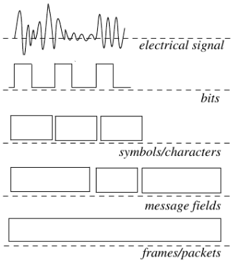
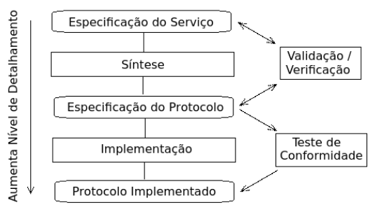

# Arquitetura de Redes e Computadores

## Introdução

### 1. Primórdios da Redes e Computadores

- Falta de eficiência e ambiguidades nos protocolos de comunicação, causando erros de interpretação entre as mensagens trocadas.

- Primeiros protocolos, eram qualquer coisa a longa distância que geravam mensagens.

- Os cidadãos desafiam a comunicação, pois são estes que interpretam a mensagem, contrariando talvez, a originalidade da mensagem.

- _"Polybius"_ propôs um método que impedia o erro de interpretação de uma mensagem durante seu envio
  - Tochas eram utilizadas para passsar mensagens (similar a uma sequência de bits), e uma combinação dessas permite a composição de caracteres.
- _"Robert Hooke (1684)"_ desenvolveu um sistema óptico que sinalizava caracteres e eram observados a distância por um telescópio.

- É iniciado um sistema de controle de mensagens (sinalizar se está pronto ou não).
- O sentido óptico para de ser utilizado e é iniciado o envio de sinais elétricos.
  - _"Cooke e Wheatstone (1837)"_ desenvolveram um telégrafo de uma bússola que sinalizava códigos de controle (angulação da agulha apontava para símbolos e geravam mensagens.

> Os sistemas de redes abdicaram da interferência de pessoas para previnir os erros durante o transporte.

- **Estudo de Caso**: _Acidente de 1861_
  - Dois trens se colidem dentro de um túnel, pelo fato do erro de comunicação da situação de ocupação do túnel.
  - Os protocolos de troca de mensagens entre os operadores são o interesse deste exemplo. ("trem no tunel", "trem fora do tunel", "trem no tunel?").
  - Duplicação de mensagens trouxe um erro de interpretação que levou o acidente.

- _"Código Morse"_ que utilizava inicialmente três sinais, posteriormente foram utilizados pontos e traços espaçados entre eles, enviando mensagens.

- Ao decorrer do tempo, surgiram novas tecnologias que possibilitaram a troca mais facilitada de mensagens (tele-typer, telefone, ENIAC - primeiros computadores,  etc...).

### 2. As Primeiras Redes de Computadores

- 1º Protocolo: _"Mestre-Escravo"_
  - Uma parte envolvida está no controle, e outra responde as requisições.
  - Mestre: responsável pelas tarefas de transferência de dados.

- Surge mainframes (Sistema Computacional) conectados por redes (máquinas distintas conectadas em rede).
  - Problema de estabelecer um acordo sobre os recursos compartilhados na rede.
  - Projetistas aprenderam da forma mais difícil que as sequências de eventos ocorrem e podem arruinar o projeto de protocolo.

- "Peer Protocols" (Substitui o modelo mestre-escravo) - governa a troca de elementos pares entre os mainframes
  - Envolve o envio de um pedido (request) a todos os pares, onde o pedido é recebido e processado, possivelmente há uma resposta (response).
  - Computação de pares ou computação de rede, arquitetura de aplicação distribuída que distribui as tarefas entre pares.
  - Não há um elemento central, portanto se ocorrer uma falha, só uma parte da rede entra em parada.
  - Na rede de protocolo de pares, não há uma elemento central para desenvolver acordos entre recursos compartilhados nesta rede.
  - Colisão de 2 fluxos de dados pode causar tanto dano quado a de dois trens (Acidente do Túnel de Clayton).

### 3. Protocolos e Linguagens

- _"ideia"_ - espécie de acordo sobre a troca de informações entre elementos pares e que formam um sistema distribuído.

- _"protocolo"_ - define uma formato preciso para as mensagens (acordo sobre a troca de informações).
  - _"gramática"_ - regras para a troca de dados.
  - _"sintáxe"_ - formato preciso para mensagens válidas.
  - _"vocabulário"_ - conjunto de mensagens válidas.
  - _"semântica"_ - significado das mensagens
  - _"regras procedimentais"_ - remetente e destinatário devem conhecer o protocolo e implementá-lo corretamente.

- Portanto um protocolo se parece com a definição de uma linguagem.
- Interpretações diferentes de um conjunto de regras podem gerar implementações diferentes e cheias de inconsistências, por isso se vê a necessidade de padronizar os protocolos.

### 4. Padronização de Protocolos

- Instituição ISO que contempla o organismo de padronização ANSI propôs a padronização a tabela ASCII e inteface RS-232.
  - ASCII é formalmente conhecido como ISO 646.
- Organismos de padronização: CCITT, ITU, IFIP, NIST, FTSC, FCC, IEEE, etc...
- A padronização é importante, mas não garante a resolução de todos os problemas.
- ESTELLE, utilizado para testar os protocolos submetidos às entidades.

## Estruturas de Protocolos

### 1. Introdução

- "premissa" - sem conhecer o meio de transmissão, não há como especificar as regras e procedimentos que governam as trocas de informações entre elementos pares.
  - Isto é verdadeiro? "_conhecendo o meio ou não, é necessário definir as regras que governam as interações_"
- O protocolo independe do meio utilizado, utilizando um conjunto de regras para defini-lo:
  - como as mensagens são codificadas?
  - como é iniciada e finalizada a transmissão?
  - são várias as dúvidas quanto as ações!
- "erros difíceis de evitar" - são 2 erros comuns nos projetos de protocolos:
  - conjunto incompleto de regras e procedimentos
  - regras/procedimentos que são contraditórias
- "objetivo" - garantir que as regras que governam um protocolo sejam consistentes e completas
  - precisão na especificação
  - modularização das regras
  - estruturação do protocolo

#### **Exemplo - Servidor de arquivo e servidor de impressão**

- Problemas físicos
  - cabeamento
  - codificação
  - transmissão
  - velocidade de transmissão
  - etc...

- Problemas de controle
  - impressora está disponível?
  - taxa de trasmissão aceitável?
  - tem papel?
  - está suspensa?
  - comunicação no sentido A -> B é suficiente?
  - etc...
  


- O protocolo é definido pelo conjunto de formatos, regras e procedimentos acordados (combinado) entre os pares.
  - _Protocolo formaliza a trasmissão no canal de comunicação._
- Protocolo tem acordos e métodos para:
  - inicialização e finalização da troca de dados
  - sincronização do transmissor e receptor
  - detecção e correção de erros de transmissão
  - formatação e codificação dos dados

- Obs: todas essas fases podem ter mais níveis de abstração

- Níveis básicos de Abstração - Formatação
  

### 2. Elementos do Protocolo

- A especificação de um protocolo consiste em 5 elementos distintos:
  - serviço a ser oferecido pelo mesmo
  - definição do ambitente no qual o protocolo será executado
  - vocabulário das primitivas usadas para implementar o protocolo
  - codificação (formato) de cada primitiva no vocabulário
  - regras procedimentais -> consistência na troca de primitivas

- Obs: último elemento da especificação do protocolo é o mais difícil de projetar e verificar
  - as razões são problemas de temporização, condições de corrida, deadlocks, problema de concorrência entre pares

- "Uma síntese do protocolo" - geração da especificação a partir da especificação do serviço do protocolo


### 3. Exemplo de um Protocolo
- W. C. Lynch (1968) - Especificação do **Serviço**
- O objetivo consiste transferir arquivos de texto como uma sequência de caracteres através de uma linha telefônica sem erros de transmissão (erros podem ser detectados)
- "Premissa"
  - canal de transferência de mensagens é "full-duplex" (ocorre em ambos sentidos)
  - Acks e Nacks são enviados pelo canal (B -> A), para reconhecer a mensagem enviada de A -> B, e vice-versa
  - possui 2 tipos de mensagens, a própria informação e a mensagem de controle no sentido inverso

- **Ambiente**
  - consisite minimamente de 2 usuários do serviço de transferência de um arquivo em um canal de transmissão
  - usuários submetem uma requisição para transferirem um arquivo e esperam até a conclusão
  - podem ocorrer distorções nas primitivas, mas não perde, duplica, insere e nem reorganiza estas primitivas (mensagens)
  - um nível inferior é responsável por corrigir distorções e gerar mensagens de erros

- **Vocabuário**
  - Ack - mensagem positivas
  - Nack - mensagem negativa
  - Err - mensagem com erro na primitiva
  - V = {Ack, Nack, Err}
  - cada tipo de primitiva pode ser refinada em várias mensagens de níveis inferiores

- **Sintáxe (formato) da Primitiva**
  - campo de controle - identifica o tipo da primitiva
  - campo de dados - conjunto de códigos de caracteres
  - Representação "C-like" para uma primitiva:
    ```c
    enum control { Ack, Nack, Err };
    struct primitiva {
      enum control tag;
      unsigned char data;
    }
    ```

- **Regras Procedimentais (escritas)**
  - Se a recepção anterior foi livre de erro, a próxima mensagem no sentido contrário levará um ACK; caso contrário a próxima mensagem contrária levará um NACK
  - Se a recepção anterior foi um NACK ou ERR, retransmite a primitiva antiga, qualquer outro caso, enviou uma nova primitiva para transmissão
- Para Formalizar estas regras, podemos usar diagramas de estado, expressões algébricas, etc...
  - "receive" - representa o estado de recepção de uma nova mensagem no canal está sendo aguardada
  - "dented box" - representa o reconhecimento de uma mensagem que está associada - "match" com o rótulo - "label" da caixa
  - "pointed box" - indica a transmissão de uma mensagem cujo tipo é indicado pelo rótulo - "label" da caixa
  - "square/retangle box" - indica uma ação interna para obter um próximo item de dado, por exemplo, caracter a ser transferido
  
  

  

  

- Falhas do Projeto de Protocolo:
  - Transmissão só começa se ocorrer uma transmissão de dados em um sentido contrário
  - "dúvida" - qual ods pares decide como o canal vai ser iniciado ou encerrado?!
- Maior deficiência:
  - Dados duplicados são recebidos corretamente - ocorreu devido a sequência de eventos
  - Receptor, deve decidir se um dado foi recebido ou não corretamente