# Modelagem de Software

> What is sofware engineering?

- Sofware engineering is an engineering discipline that is concerned with all aspects of software production
- Software engineers should adopt a systematic and organised approach to their work and use appropriate tools and techniques depending on the problem to be solved, the development constraints and the resource available.

> What is software process?

- A set of activities whose goal is the development or evolution of software
- Generic activities in tall software processes are:
  - Specification - what the system should do and its development constraints
  - Development - production of the software system
  - Validation
  - Evaluation

> What is software process model?

- A simplified representation of a software process, presented from a specific perspective
- Examples of process perspectives are
  - Workflow perspective - sequence of activities
  - Data-flow perspective - information flow
  - Role/action perspective - who does what
- Generic process models
  - Waterfall
  - Iterative development
  - Component-based software engineering

> What are software engineering methods?

- Structured approaches to software development which include system models, notations, rules, design advice and process guidance
- Models descriptions (MSW)
  - Descriptions of graphical models which should be produced
- Rules (MSW)
  - Constraints applied to system models
- Recommendations (MSW)
  - Advice on good design practice
- Process guidance (ESW)
  - What activities to follow

## Diagramas UML (Unified Modeling Language)

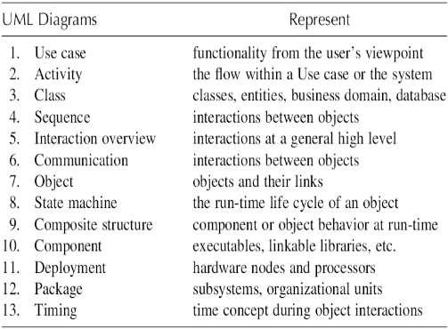

### Importância relativa dos diagramas

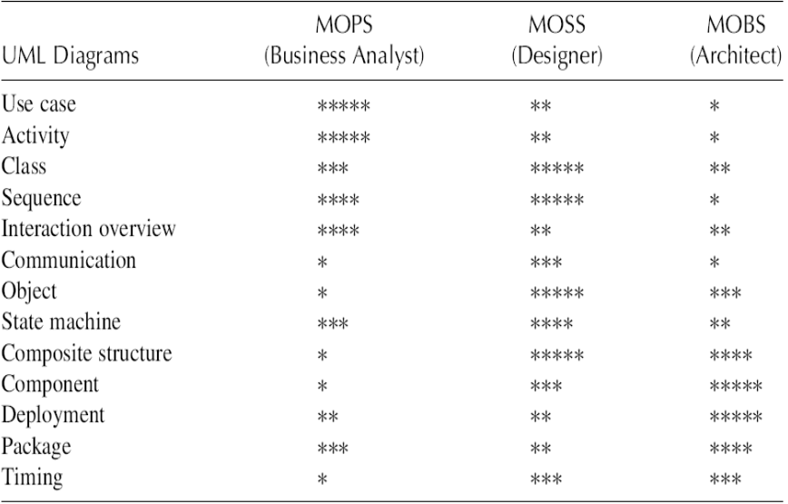

### Requisitos de Software

### Documento de Requisito de Software

- O documento de requisitos de software é a declaração final do que é demandado dos desenvolvedores do sistema
- Deve incluir ambas, uma definição de requisitos do usuário e a uma especificação de requisitos do sistema
- NÃO é um documento de projeto. Na medida do possível, deve definir O QUE o sistema deve fazer ao ínves de COMO deve fazê-lo

### Documento de Requisitos

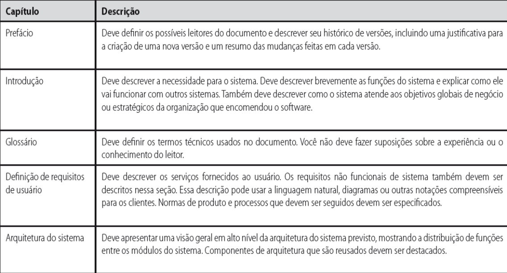
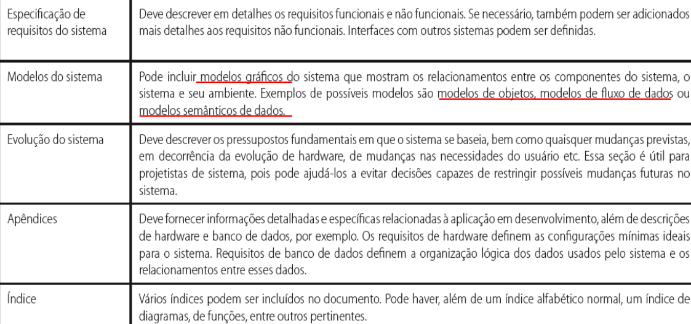

### Possibilidades de Notações

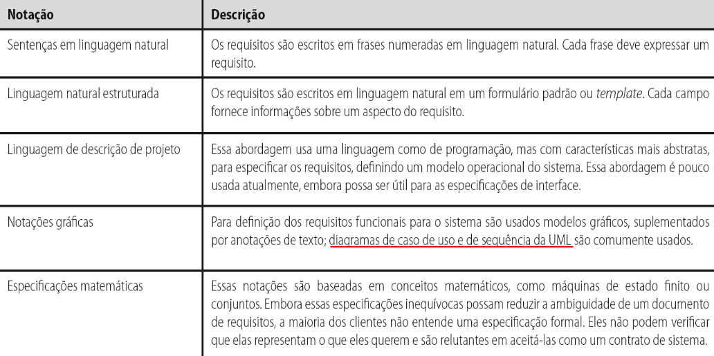

### Casos de Usos

- Capturam requisitos funcionais
  - E requisitos não-funcionais
- Descreve interação entre "usuários" e o sistema
- Provêem uma narrativa de como o sistema é usado

### Como criar um diagrama de caso de uso?

- Roteiros:
  1. The customer browses the catalog and adds desired items to the shopping basket
  2. When the cusomter wishes to pay, the customer describes the shipping and credit card information on the credit card information and confirms the sale
  3. The system checks the authorization on the credit card and confirms the sale both immediately and with a follow-up e-mail
- E se:
  1. A autorização de crédito falhar?
  2. Se o cliente já tem informações de envio e de cartão já cadastrados

### O que tem de comum nos diversos roteiros?

- Comprar produtos!!!

> Um caso de uso é um conjunto de roteiros ligados conjutamente por um objetivo comum do usuário

### Atores

- Atores são os papéis representados por elementos que interagem em um sistema
- Um ator pode interagir através de vários casos de usos
- Um caso de uso pode ser executado por vários atores
- Ator é algo externo ao sistema
- Um ator pode ser um sistema externo

### Descrição de um caso de uso

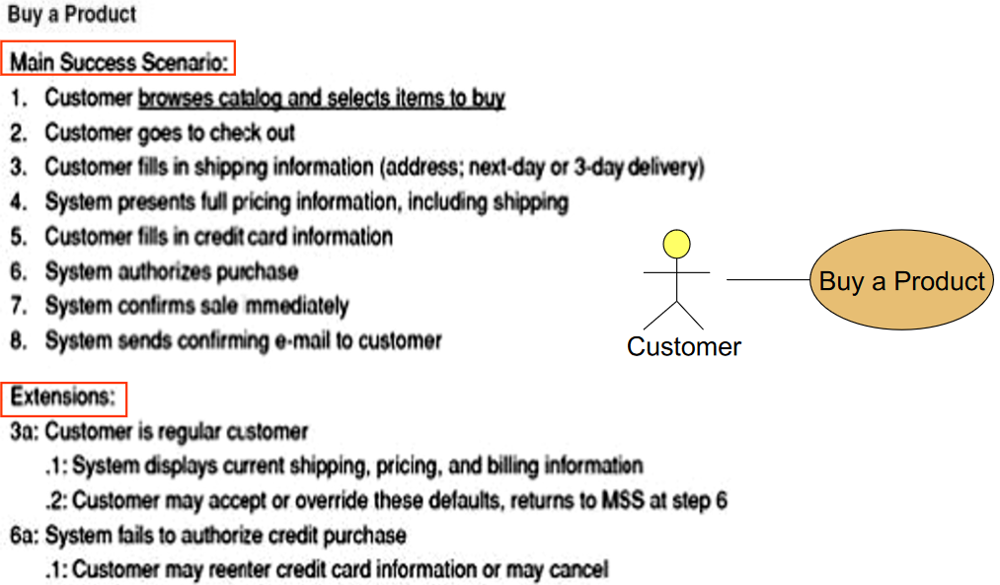

### Outra possíveis informações

- A pre-condition describes what the system should ensure before the system allows the use case to begin
  - This is useful for telling the programmers what coditions they don't have to check for in their code
- A guarantee describes what the system will ensure at the end of the use case
  - Success guarantees hold after a successful scenario; minimal guarantees hold after any scenario
- A trigger specifices the event that gets the use case started

### Outro exemplo: Seja um CMS (Blog, Wiki, ...)

- Requisito 1: The content management system shall allow an administrator to create a new blog account, provided the personal details of the new blogger are verified using the author credentials
- Requisito 2: The content management system shall allow an administrator to create a new personal Wiki, provided the personal of the applying author are verified using the Author Credentials

### Seja um caso de uso: Create a New Blog Account

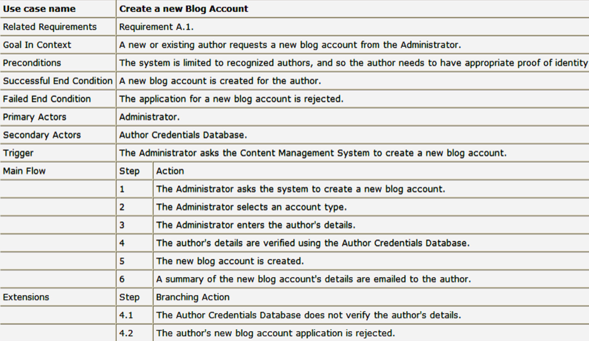

### O diagrama de casos de usos

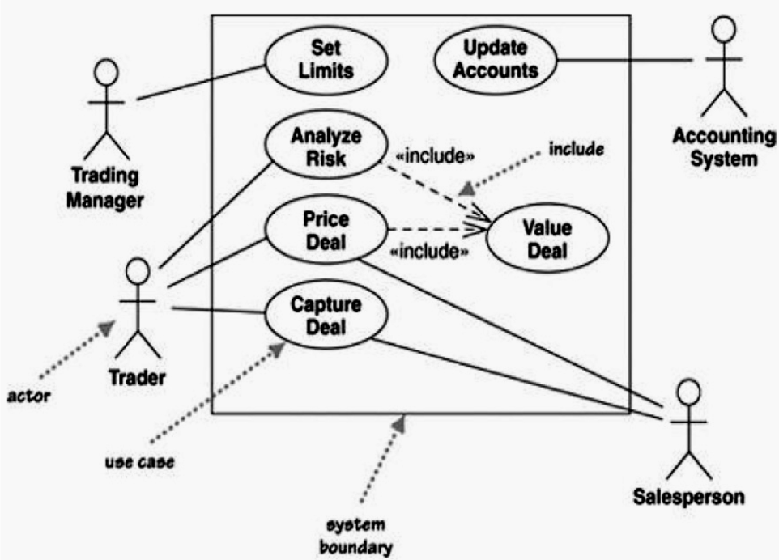

### Níveis de abstração para os casos de usos

- Usual
  - System use cases
  - Business Use Cases

### Extends

- Citando Martin Fowler:
  - "Evite usar!"
- As pessoas tendem a confundir a semântica
  

### Features and Use Cases

- Features (User stories in XP)
  - Propósito: agrupar requisitos que serão entregues em determinados pontos de um projeto iterativo
- A feature may be:
  - a whole use case
  - a scenario (roteiro) in a use case
  - a step in a use case
  - or some variant behavior, that doesn't show up in a use case narrative
- Usually, features are more fine grained than use cases

### Diagrama de Visão Geral dos Casos de Uso

- The CMS's context as shown on a Use Case Overview diagram

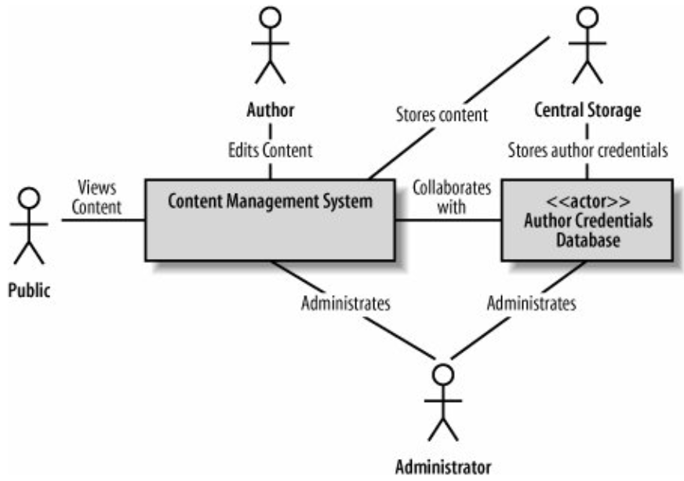

### Dicas (Fowler)

- Use cases represent an external view of the system.
  - As such, don't expect any correlations between use cases and the classes inside the system
- The more I see of use cases, the less valuable the use case diagram seems to be
  - With use cases, concentrate your enery on their text rather than on the diagram
  - Despite the fact that the UML has nothing to say about the use case text, it is the text that contains all the value in the technique
- A big danger os use cases is the that people make them too complicated and get stuck
  - Usually, you'll get less hurt by doing too litte than by doing too much. A couple of pages per use case is just fine for most cases
  - If you have too little, at least you'll have a short, readable document that's a starting point for questions
  - If you have too much, hardly anyone will read and understand it

### Vantagens

- One of the important strengths of a use case diagram is it's ability to model of the actor (role, as per Fowler, 2003)
  - The actor demostrates clearly to the user
    - who is involved in specifying requirements
    - where he existis in the context of the software system
  - The actor also play a crucial role in enabling the business analyst to undestand and document the use's requirements
  - The actor helps users to express their requirements in greater details because the users see themselves represented on the use case
- Use case diagrams facilitate discussions among various parties involved in requirements modeling
  - The business analysts
  - users
  - designers
- Use cases and use case diagrams help to organize the requirements
  - The notation for a use case represents a cohesive set of interactions between the user and the system
  - By simply referring to a use case, a complex set of interactions can be accessed easily, thereby simplifying the discussions
- Use cases document complete functional requirements
  - no separate functional requirements document is needed
  - although additional operational and interface requirements or additional details may be placed in a separate document
- Relationships of include and extend between use cases provide means to extend and reuse requirements
  - Actors can also be generalized in use case diagrams
  - The ability to show pictorially an abstract actor that deals with the most common users of the system is a major strength of use case diagrams
- Use cases facilitate tracing of requirements
  - By providing well-organized documentation of the requirements, a use case creates a trace for a particular requirement throughout the system
- Document the context of the system
  - by creating a system boundary
- Use case diagrams form the basis for creation and documentation of use cases

### Desvantagens

- Use cases themselves have no formal documentation standard
  - this creates ans opportunity for modelers and project managers to develop their own standards, as well as their own interpretation of what needs to be documented
- Use cases are not intrinsically object-oriented
  - They are not an ideal mechanism to model design-level constructs in the solution space (where object orientation plays an important role)
- The meaning behind the association or communication relationship between the actor and the corresponding use case is not clear
  - If the actor initiating the use case is a human actor, then the convention is to show an arrowhead pointing to the use case
  - However, if the use case represents a series of interactions between the actor and the system, the arrowhead on the association between the actor and the use case does not make sense
- Use case-to-use case relationships are also not precise, leading to confusion
  - generalization/extend between use cases will be imprecise, as there are no well defined attributes and operations in a use case
- While use cases themselves document business processes, use case diagrams do not exhibit any sequential flow and don ot depict any dependency
  - Thus use case diagrams are not an ideal mechanism to show the flow between different entities within the system
- Use cases descriptions and use case diagrams do not have a granularity standard

## Processos

> Processo
> Define quem irá fazer o que, quando, e como a fim de alcançar um objetivo

### Detalhamento de Processos

- Objetivos
  - Prover um guia para as atividades
  - Especificar que artefatos e quando devem ser desenvolvidos
  - Direcionar as tarefas dos grupos e indivíduos
  - Oferecer um critério para monitorar e medir o processo

### Melhores Práticas

- Desenvolver software iterativamente
- Gerenciar requisitos
- Usar arquiteturas baseadas em componentes
- Modelar o software visualmente
- Verificar continuamente a qualidade do software
- Controlar as alterações no software

### RUP

- Um processo de engenharia de software
- Um framework para outros processos
- Utiliza as melhores práticas de desenvolvimento de software

### RUP x Casos de Uso

- RUP é dirigido por caso de uso (use-case driven)
- Casos de uso dirigem inumerosas atividades
  - Criação e validação dos modelos de projeto
  - Definição dos casos de teste no modelo de teste
  - Planejamento de iterações
  - Criação do manual do usuário

### RUP x Arquitetura

- RUP é centrado na arquitetura
- A arquitetura é central em relação aos esforços
  - Os requisitos são analisados para montar uma arquitetura
  - A arquitetura orienta a implementação e mudanças

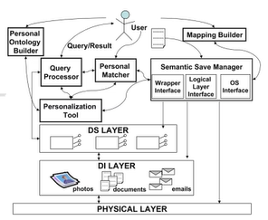

---

---

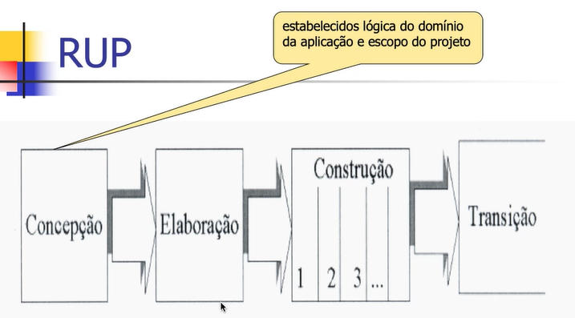

---

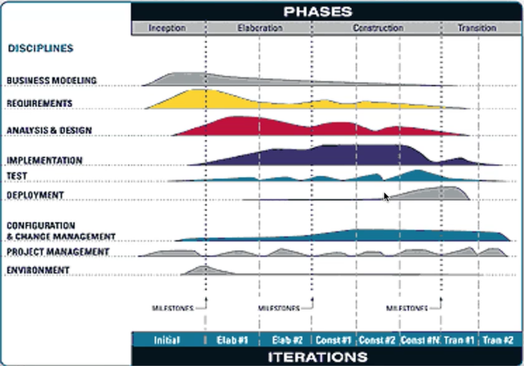

### Desenvolvimento Iterativo

- Análise do Risco

---

---

- Vantagens
  - Os riscos são atacados mais cedo
  - Mudanças nos requisitos são absorvidas mais rapidamente
  - Refinamento de arquitetura
  - Aprendizado e apriomoramento
  - Aumento do reuso

### Gerência de Requisitos

- Dificuldades
  - Requisitos não são óbvios
  - Requisitos não são sempre facilmente expresso em palavras
  - Existem vários tipos de requisitos em diferentes níveis de detalhes
  - O número de requisitos pode explodir
  - Requisitos estão interligados
  - Existem várias pessoas interessadas nos requisitos
  - Requisitos mudam
- Atacando
  - Analisando o problema
  - Entendendo as necessidades dos "stakeholders"
  - Definindo o sistema
  - Gerenciando o escopo do projeto
  - Refinando a definição do sistema
  - Gerenciando mudança de requisitos

### Arquitetura Baseada em Componentes

- Suporte ao Desenvolvimento Baseado em Componentes
  - Com o processo iterativo
  - Baseado na arquitetura
  - Através da UML - com pacotes, camadas e subsistemas
  - Testes graduais

### Gerência de Mudanças

### Conceitos Chave

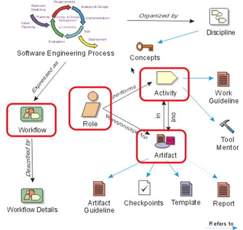

### Elementos do RUP

- Workflow
- Workers ou papel
- Atividades
- Artefatos

---

### Disciplinas

- Workflow de atividades correlatas
- Alguns elementos, como risco e testes, são introduzidos em diferentes disciplinas
- Relação entre disciplina e modelos

---

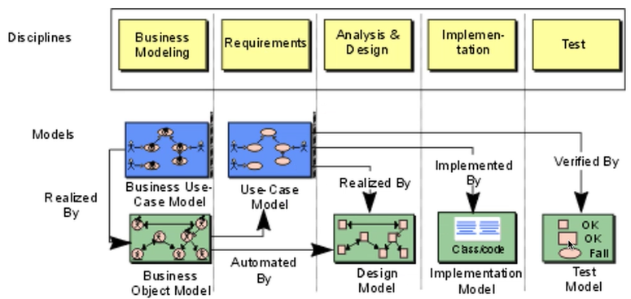

### Workflow

- Sequência de atividades que produzem um resultado de valor observável
- Geralmente expresso em um diagrama de atividade
- Organização
  - Cada disciplina tem seu Workflow

### Detalhes de Workflow

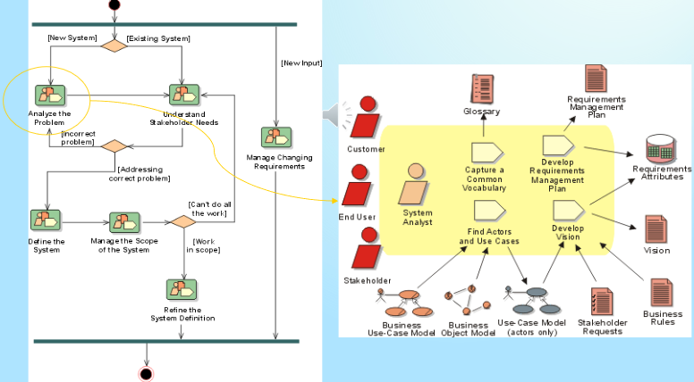

---

- As atividades não são feitas em sequência
- Mostra os artefatos necessários e os gerados
- Agrupa atividades relacionadas de outras disciplinas

### Workers - Papel

### Workers - Aparecem em Detalhes de Workflow

### Atividade

- Unidade de trabalho com um propósito claro
- Associadas a atores
- Utilizado para planejamento e verficação de progresso

---

- A atividade 'Find use case and actors' se decompõe nos passos:
  - Identificar os atores
  - Identificar os casos de uso
  - Descrever a interação entre os atores e uc
  - Organizar em pacotes
  - Apresentar o modelo em um diagrama de casos de uso
  - Avaliar os resultados

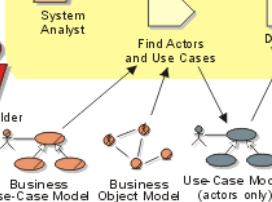

### Artefatos

- Unidade produzida por uma atividade
- Pode assumir as formas
  - Modelo (UML Model)
  - Documento (Visão)
  - Código (Componente)
  - Templates (MSWord)
  - Executáveis
  - Guias e checkpoints
- Mantidos por controle de versão

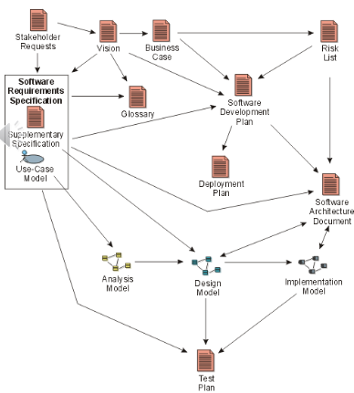

### Visão

- Formular a expressão do problema
  - O problema "descrição do problema"
  - Afeta "os stakeholders afetados"
  - O impacto deste é "qual é o impacto do problema"
  - Uma solução adequada poderia "lista de benefícios"

### Planejamento

- Plano de desenvolvimentos de software
  - Bom entendimento do que vai ser criado
  - Plano de Fase: granularidade alta
  - Plano de Itreação: granularidade baixa

> The product is only as good as the plan for the product
> Charles Fishman

> The plan is nothing; the planning is everything
> Dwight D. Eisenhowe

### Riscos

- Investigando e avaliando riscos
  - Identificar os riscos
  - Analisar e priorizar os riscos
  - Definir estratégias de evasão
  - Definir estratégias de ataque
  - Definir estratégias de contingência
    - Indicadores
    - "Plano B"
  - Rever os riscos durante a iteração
  - Rever os riscos no final da iteração

### Arquitetura

- Artefato: Software Architecture Document
- Quais são os componentes
- Como os componentes se encaixam
- Existe algum framework
- Visões arquiteturais

### Mudanças

- Artefato: Change Request
  - Provê um histórico das mudanças e das decisões tomadas
  - Gerenciar o escopo do projeto
  - Avaliar o impacto das decisões
  - Ferramentas comuns: Issue Trackers (Bug trackers)
    - Bugzilla
    - Jira
    - GitHub

### Conclusões

- Sem visão?
  - O projeto pode perder escopo ou desviar do propósito
- Sem processo?
  - A equipe pode perder a visão de quem está fazendo o que e quando
- Sem planejamento?
  - Você perde a capacidade de rastrear o progresso
- Sem controle de riscos?
  - Você pode focar no ponto errado e pisar em "minas"
- Sem arquitetura?
  - Podem ocorrer problemas com escalabilidade, falso reuso e performance
- Sem avaliação?
  - Tenha coragem e enfrente a verdade!
- Sem Change Request?
  - Como rastrear, priorizar os pedidos do cliente

### Estrutura do processo: Duas Dimensões

- A primeira dimensão representa o aspecto dinâmico do processo como é ordenado, e é expresso em termos de ciclo, fases, iterações e marcos
- A segunda dimensão representa o aspecto estático do processo: sua descrição em termos de componentes de processo, atividades, fluxos, artefatos e trabalhadores

### Fases e Iterações

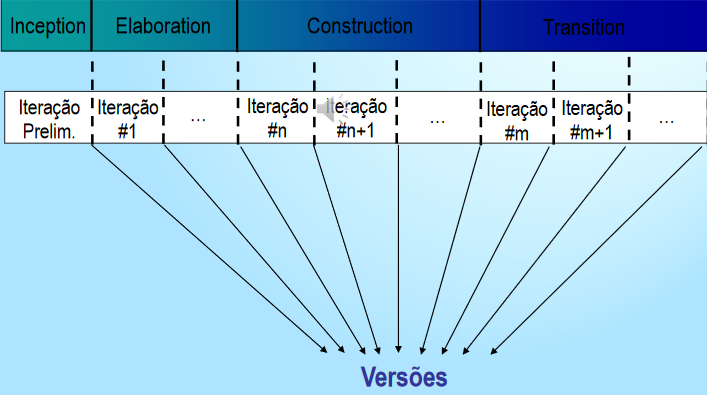

### Estrutura dinâmica

- Desenvolvimento Iterativo

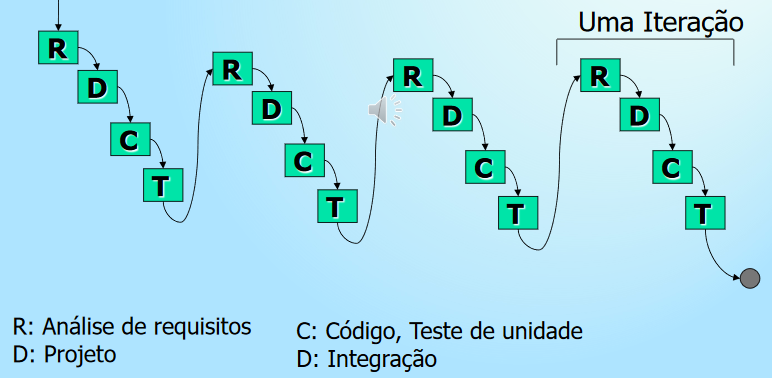

### Milestone

- Cada fase deve ser concluída com um Milestone (Major Milestone)

### Concepção

- Estabelecer o escopo e os limites, com critérios de aceitação bem definidos
- Discriminar os casos de usos críticos
- Exibir uma arquitetura candidata
- "Adivinhar" o custo e os calendário
- Preparar o ambiente do projeto
- Estudo de viabilidade

### Elaboração

- Assegurar que os requisitos e planos estão estáveis
- Estabelecer uma arquitetura
- Provar que a arquitetura funciona
- Produzir um protótipo evolucionário
- Estabelecer um ambiente
- Deve terminar em torno de um quinto tempo do projeto
- Desenvolvedores já sentem a vontade para dar estimativas de tempo
- Todos os riscos significativos foram identificados

### Construção

- Atingir qualidade o mais breve possível
- Desenvolver incrementalmente e lançar as versões de teste (alpha, beta)
- Completar o desenvolvimento de todos os Casos de Uso
- Estabelecer(detalhar) as iterações e definir que funcionalidades entregar em cada uma delas
- Casos de Uso com maior prioridade e/ou risco de desenvolvimento primeiro
- Cada iteração é um mini-projeto: Análise, projeto, codificação, teste e integração
- As iterações são incrementais na função
- Integração contínua

### Transição

- Teste de validação
- Conversão do ambiente para produção
- Treinamento de usuários e manutenção
- Otimização
- Alcançando auto-suporte do usuário

### RUP - Detalhando os Workflows

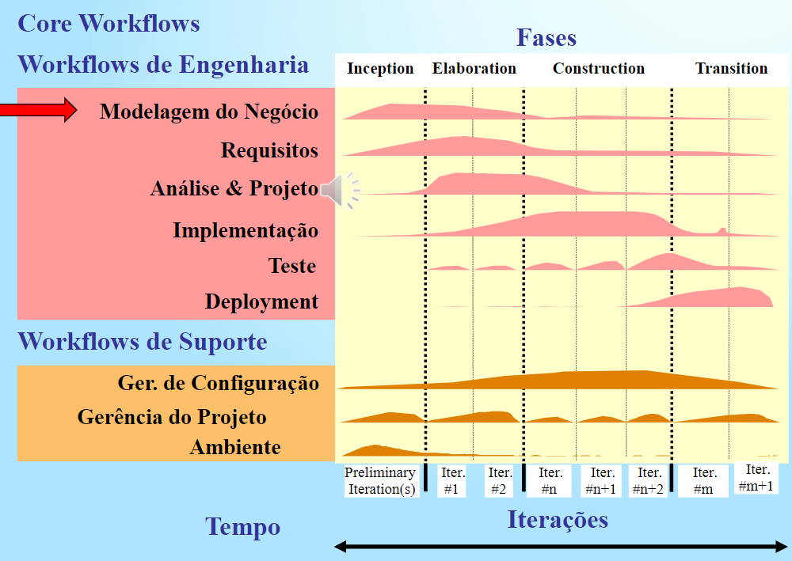

#### O fluxo de Modelagem de Negócios

Proposta

- Entender a estrutura dinâmica da organização na qual um sistema será distribuído
- Entender os problemas atuais na organização alvo e identificar potenciais melhorias
- Derivar exigências de sistema necessárias para o suporte da organização alvo

---

Notação para a modelagem do negócio

- Usuários empresariais
- Os processos empresariais são representados pro casos de uso de negócio e realizações de caso de uso empresarial
- O papel que as pessoas exercem numa organização é representado por trabalhadores empresariais
- As "coisas" que uma organização administra ou produz são representadas através de entidades empresariais

---

##### Cenários de Modelagem de Negócios

- Organograma
- Modelagem de domínio
- Um negócio, muitos sistemas
- Modelo de negócio genérico
- Negócio novo

---

##### Trabalhadores

- Analista de Processo de Negócio
- Projetista de negócio

##### Artefatos (Negócios)

- O documento de visão empresarial
- Um modelo de casos de uso empresarial
- Um modelo de objeto empresarial

#### O Fluxo de Requisitos

Proposta

- Estabelecer e manter acordo com os clientes e outros interessados no que o sistema deveria fazer
- Definir os limites do sistema
- Fornecer base para cálculo do custo e tempo para desenvolver o sistema

---

##### Requisitos

- Funcionais

- Não-funcionais
  - Utilidade
  - Robustez
  - Desempenho
  - Suporte

---

##### Trabalhadores em Requisitos

- Analista de Sistema
- Especificador do Caso de Uso

#### O Fluxo de Análise e Projeto

##### Trabalhadores (análise e projeto)

- Arquiteto
- Projetista

##### Artefatos (análise e projeto)

- O modelo de Projeto

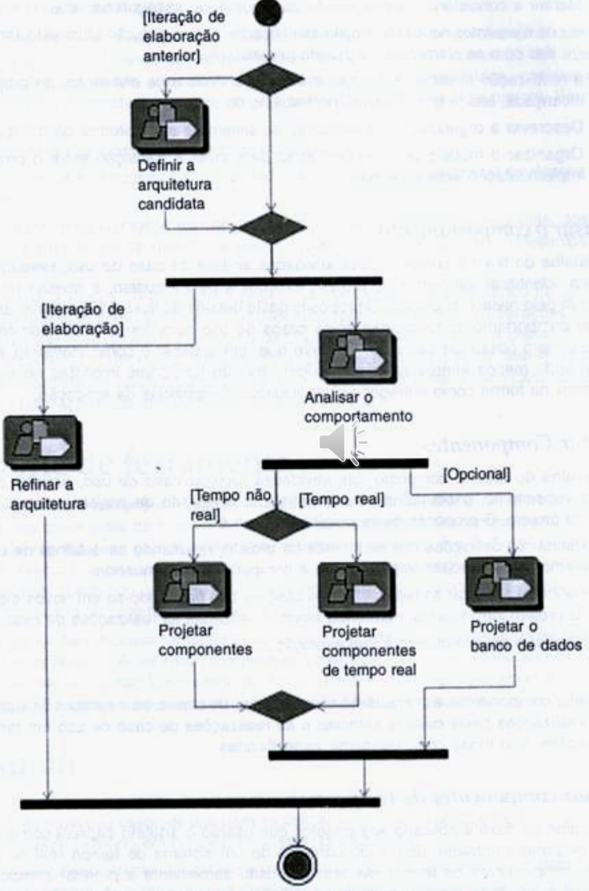

#### Fluxo de Implementação

Proposta

- Implementar classes e objetos em termos de componentes
- Testar os componentes dsenvolvidos como unidades
- Integrar em sistema executável os resultados produzidos por implementadores individuais ou equipes

---

- Tipos de protótipos:
  - Comportamental
  - Estrutural

---

- Trabalhadores
  - Implementador
  - Integrador do sistema
  - Arquiteto
  - Revisor de código

---

- Artefatos
  - Subsistema de implementação
  - Componente
  - Plano de construção de integração

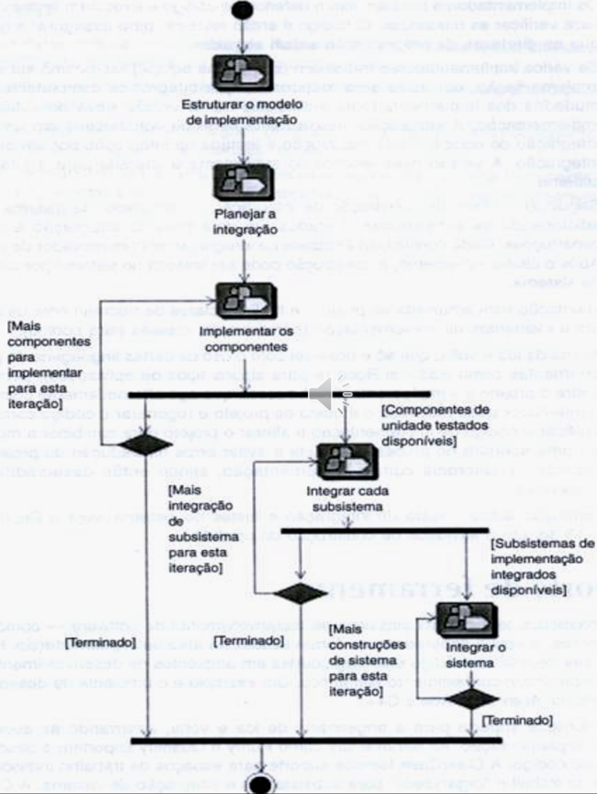

#### Fluxo de Teste

Proposta

- Verificar as interações de componentes
- Verificar a própria integração de componentes
- Verificar que todos os requisitos tenham sido implementados corretamente
- Identificar e assegurar que todos os defeitos descobertos estejam descobertos estejam corrigidos antes do softare ser distribuído

---

- Tipos de testes
  - Padrão
  - Configurações
  - Função
  - Instalação
  - Integridade
  - Carregamento
  - Desempenho
  - Stress

---

- Trabalhadores
  - Projetista de teste
  - Testador

---

- Artefatos
  - Plano de teste
  - Resultado de testes

#### Fluxo de distribuição

Proposta

- Testar o software em seu ambiente operacional final
- Empacotar os software para entrega
- Distribuir o software
- Instalar o software
- Treinar os usuários finais

---

Modos de distribuição

- Software em sistemas feitos sobre encomenda
- Software pronto
- Software descarregável pela internet

---

Trabalhadores

- Gerente de distribuição
- Gerente de projeto
- Escritor técnico
- Desenvolvedor de curso
- Provador
- Implementador

---

Artefatos fundamentais

- Software executável
- Artefatos de instalação
- Material de suporte
- Material de treinamento

