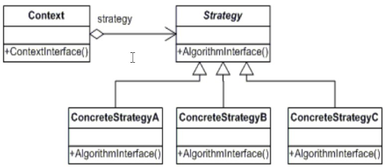
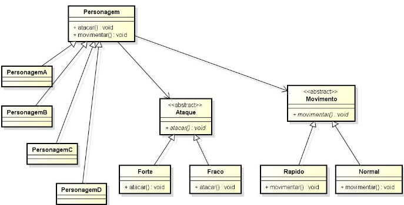
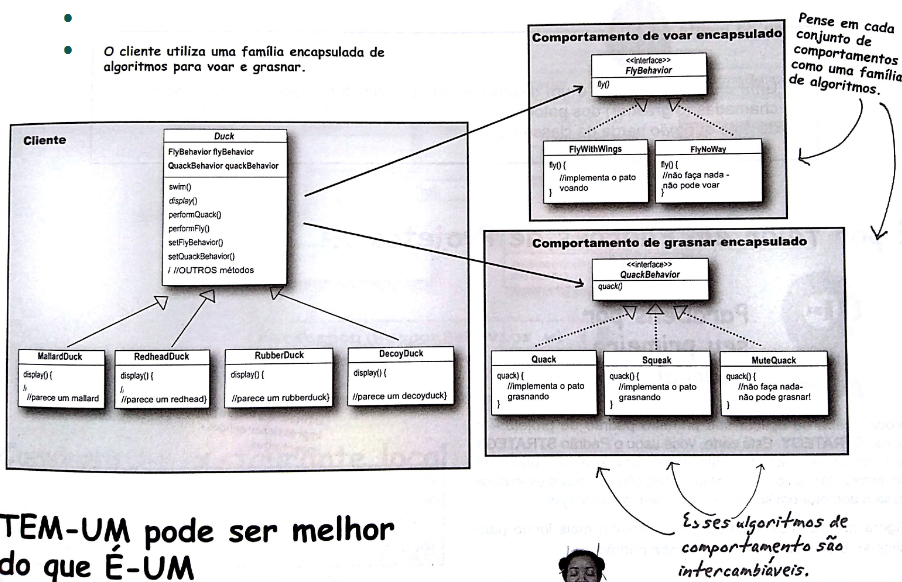
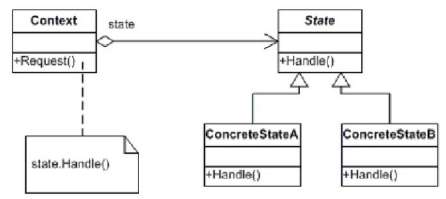
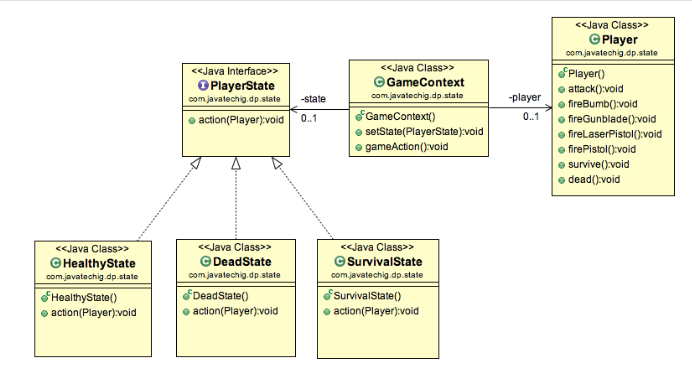
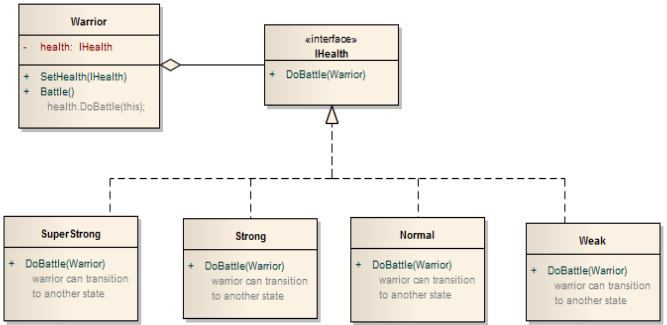
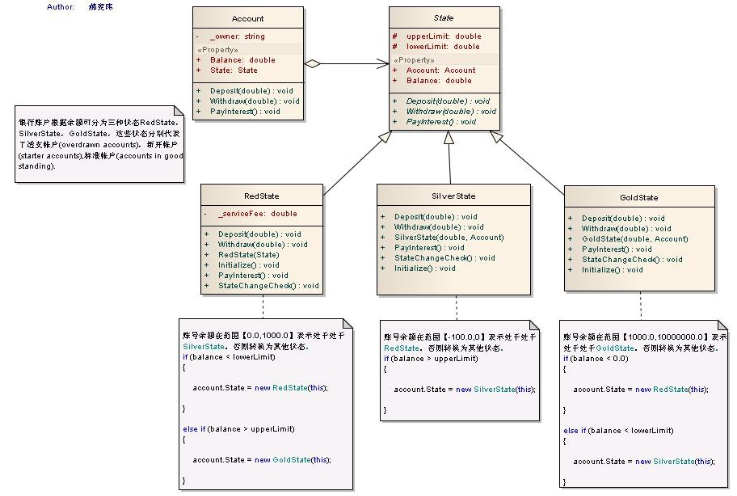
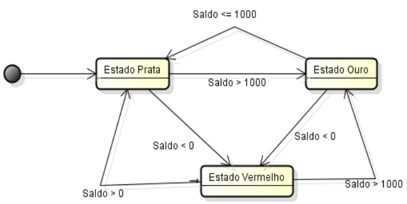

# Programação Orientada a Objetos 2

## Introdução (Padrões de projeto)

- Um padrão de projeto (design pattern)
  - é uma solução geral reutilizável para um problema que ocorre com frequência dentro de um determinado contexto no projeto de software

- Padrões são boas práticas formalizadas que o programador pode usra para resolver problemas comuns qunado projetar uma aplicação ou sistema
- Desta forma reutiliza-se a experiência de outros desenvolvedores que enfrentaram problemas semelhantes
  - Alto nível de reuso

- Os padrões de projeto:
  - facilitam a reutilização de soluções de desenho - isto é, soluções na fase de projeto de software - e
  - estabelecem um vocabulário comum de desenho, facilitando comunicação, documentação e aprendizado dos sistemas de software

## Padrões de Projeto

### Padrão Strategy

- As vezes, apenas heração não resolve, criando soluções inflexíveis e difíceis de manter
- Exemplo:
  - Uma classe A implementa dois métodos, m1(a1) e m2(a2)
  - As seguinte sub-classes de A implementam os métodos:
    - B [m1(a1) e m2(a2)]
    - C [m1(a1) e m2(a3)]
    - D [m1(a4) e m2(a2)]
    - E [m1(a4) e m2(a3)]

---

- Neste caso, é importante identificar os aspectos que variam e separá-los do que é comum à todas as sub-classes
- E usar composição ao invés da herança
  - Qual o aspecto que varia? Quantas variações temos?

---

O padrão strategy...

- Permite definir famílias de comportamentos, que podem ser (re)utilizados de forma intercambiável
- Permite que o algoritmo varie independentemente dos clientes que o usam
- Cada comportamento é encapsulado em uma classe
  - Encapsulamento + Modularização = Manutenibilidade + Reusabilidade

---

- É útil quando se tem-se operações comuns a uma série de sub-classes, mas não é possível o uso de herança de forma eficiente
  - Desta forma, o padrão strategy permite configurar em tempo de execução cada subclasse com os comportamentos adequados

---

O padrão Strategy nos conduz a seguinte orientação:

1. Programe sempre para interfaces (abstrações)
2. Dê preferência a composição ao invés de herança

- Desta forma consegue-se o reuso e intercâmbio de comportamentos entre diversas classes, facilitando a expansão, manutenção e reuso.

---

- Benefícios
  - Alto nível de reuso
  - Facilidade de expansão sem modificar o que está pronto (aberto para extensão, fechado para modificação)
  - Alto nível de Flexibilidade

---

Formalizando o padrão...

Esse padrão tem como elementos participantes

- **Context**, que tem seu "comportamento" ou parte dele definido pelo algoritmo implementado por uma Strategy
- **Strategy**, que define a interface comum para todos os comportamentos
- **ConcreteStrategy**, que implementa o comportamento definido pela interface Strategy

---

- Diagrama de Classes



---

#### Exemplo

- Diferentes personagens de um jogo que exibem diferentes ações e comportamentos
- Os personagens A e B implementam o mesmo ataque (forte). Mas os personagens C e D implementam outro tipo de ataque (fraco)
- Além disto, os personagens A e C implementam o mesmo tipo de movimentação (rápido), e os personagens B e D possuem movimentação normal
- Neste caso, só herança não resolve, pois seria necessário replicar a mesma forma de ataque/ movimentação

---

Solução tradicional com uso de herança

``` java
public abstract class Personagem {
  public void atacar() {
    // implementa ataque forte
  }

  public void movimentar() {
    // implementa movimentação normal
  }
}
```

``` java
public class PersonagemA extends Personagem {
  public void movimentar() {
    // implementa movimentação rápida
  }
}

public class PersonagemB extends Personagem {
  // ...
}

public class PersonagemC extends Personagem {
  public void atacar() {
    // implementa ataque fraco
  }

  public void movimentar() {
    // implementa movimentação rápida
  }
}

public class PersonagemD extends Personagem {
  public void atacar() {
    // implementa ataque fraco
  }
}
```

---


---

- Aplicando o Padrão Strategy para resolver o problema

``` java
// Strategy (estratégias abstratos)

public abstract class Ataque {
  public abstract void atacar();
}

public abstract class Movimento {
  public abstract void movimentar();
}
```

---

``` java
// ConcreteStrategies

public class Forte extends Ataque {
  public void atacar() {
    // implementa ataque forte
  };
}

public class Fraco extends Ataque {
  public void ataque() {
    // implementa ataque fraco
  };
}

public class Rapido extends Movimento {
  public void movimentar() {
    // implementa movimentação rápido
  }
}

public class Normal extends Movimento {
  public void movimentar() {
    // implementa movimentação normal
  }
}
```

---

``` java
// Context

public abstract class Personagem {
  private Ataque a;
  private Movimento m;

  public void setAtaque(Ataque a) {
    this.a = a;
  }

  public void setMovimento(Movimento m) {
    this.m = m;
  }

  public void atacar() {
    a.atacar();
  }

  public void movimentar() {
    m.movimentar();
  }
}
```

---

``` java
// ConcreteContext

public class PersonagemA extends Personagem {
  public PersonagemA() {
    setAtaque(new Forte());
    setMovimento(new Rapido());
  }
}

public class PersonagemB extends Personagem {
  public PersonagemB() {
    setAtaque(new Forte());
    setMovimento(new Normal());
  }
}

public class PersonagemC extends Personagem {
  public PersonagemC(){
    setAtaque(new Fraco());
    setMovimento(new Rapido());
  }
}

public class PersonagemD extends Personagem {
  public PersonagemC() {
    setAtaque(new Fraco());
    setMovimento(new Normal());
  }
}

```

- Neste caso, o construtor do personagem concreto é responsável por definir na instanciação seus comportamentos

---

- Testando...

``` java
public static void main() {
  PersonagemA p = new PersonagemA();
  p.atacar();
  p.movimentar();
  // ...
  p.setMovimento(new Normal());
  p.movimentar();
  // ...
  p.setAtaque(new Fraco());
  p.atacar();
  //...
  // o comportamento do objeto é alterado em tempo de execução, como se ele tivesse mudado de classe
}
```

---



---

- Alto nível de reuso:
  - É fácil implementar novos personagens utilizando os comportamentos disponíveis, e é fácil implementar e utilizar novos comportamentos
- Facilidade de expansão sem modificar o que está pronto:
  - Implementar novos personagens que utilizam novos tipo de ataque
  - Note que o código pronto não é mexido na expansão
- Alto nível de Flexibilidade:
  - Implementar um novo personagem que inicia com determinado tipo de comportamento, mas em determinado momento pode ter seu comportamento alterado em tempo de execução
- Aberto para extensão, fechado para modificação

---

- Deve-se produzir uma família de classes para cada comportamento que varia
- Deve-se ter uma estrutura de herança em que cada subclasse implementa uma variação do algoritmo
- Possibilita que um algoritmo seja substituído por outro em tempo de execução
- Possibilita alto nível de reuso (vários contexts utilizando a mesma família de estratégias)

---

#### Exemplo (Freeman, Use a cabeça - Padrões de Projeto)



---

#### Exercício Padrão Strategy

- A seguir é apresentado um conjunto de classes e interfaces para um jogo de aventura
- Existem classes que implementam comportamento das armas que podem ser utilizadas pro estes personagens
- Cada personagem pode utilizar uma arma de cada vez, mas pode alterar as armas a qualquer momento durante o jogo

- Pede-se
  - Utilizando estas classes e a interface disponibilizada, utilize o padrão strategy para projetar o jogo
  - Implemente em java (obs. Simule a implementação dos comportamentos utilizando saídas de texto)


---

#### Resumindo

- Deve-ser perceber o que varia nas subclasses e encapsular à parte (famílias de comportamentos reutilizáveis).
- Princípios de projeto:
  - Identifique os aspectos quer variam e separe-os do que permanece igual
  - Programe para um supertipo
  - Dar prioridade a composição

### State

- A intenção do padrão:
  - "Permite a um objeto alterar seu comportamentoi quando seu estado interno muda. O objeto permanecerá ter mudado de classe"

---

- Atualização automática do estado de um projeto
- Alteração de comportamento quando o estado interno muda
- Torna o comportamento dependente do estado

---

- Especificar
  - os diferentes estados que um objeto pode assumir
  - transições de estado
  - definição de uma máquina de estados orientada a objetos

---

- Adição de novos estados e comportamentos, através da edição de novas classes
- Cria-se uma objeto para cada estado possível

---

- O Objetivo do padrão:
  - Permitir que um objeto tenha seu comportamento alterado de acordo com o estado interno que se encontra em um momento dado

---

- Participantes:
  - Context
    - Define uma interface com o cliente
    - Mantém uma instância de um ConcreteState que define o seu estado atual
  - State
    - Define uma interface para a criação de estados concretos
  - Concrete State
    - Implementa o comportamento associado a uma estado particular de Context

---

- Diagrama de classes



---

- Exemplo






---

Exemplo de implementação:

Controle de estado de contas bancárias:

- Se a conta estiver com saldo entre 0 e 1000 = estado prata. Neste caso, o cliente deve pagar uma taxa por cada saque que realizar
- Se a conta estiver com saldo maior que 1000 = estado ouro. Neste caso, o cliente não paga taxa de saque e ainda ganha um rendimento imediado em cada depósito que realizar
- Se a conta estiver com saldo negativo = estado vermelho. Neste caso, não é permitido a realização de saques. Apenas depósitos.



---

#### Implementação

``` java
// "context"
class Conta {
  private Estado estado;
  private String numero;
  private double saldo;

  // Construtor
  public Conta(String numero) {
    // As novas contas são por default 'Prata'
    this.numero = numero;
    this.estado = new EstadoPrata(this);
    this.saldo = 0.0;
  }

  // getters & setters
  public void depositar(double quantia) {
    estado.depositar(quantia);
    System.out.println("Depósito---" + quantia);
    System.out.println("Saldo = " + this.getSaldo());
    System.out.println("Estado = " + this.estado.getClass().getName());
  }

  public void sacar(double quantia) {
    estado.sacar(quantia);
    System.out.println("Saque---" + quantia);
    System.out.println("Saldo = " + this.getSaldo());
    System.out.println("Estado = " + this.estado.getClass().getName());
  }
} // fim da classe conta
```

```java
//state
public abstract class Estado {
  private Conta conta;
  private double limiteInferior;
  private double limiteSuperior;

  public Estado(Conta conta) {
    this.conta = conta;
    setLimites();
  }

  protected abstract void setLimites();

  //getters & setters
  public void depositar(double quantia) {
    this.conta.setSaldo(this.conta.getSaldo() + quantia);
    this.verificarAlteracaoEstado();

  }

  public void sacar(double quantia) {
    this.conta.setSaldo(this.conta.getSaldo() - quantia);
    this.verificarAlteracaoEstado();
  }

  protected abstract void verificarAlteracaoEstado();
} // fim da classe estado
```

```java
// "ConcreteState"
class EstadoPrata extends Estado {
  public EstadoPrato(Conta conta) {
    super(conta);
  }

  // comportamento particular deste estado
  public void setLimites() {
    this.setLimiteInferior(0.0);
    this.setLimiteSuperior(1000.0);
  }

  // comportamento particular deste estado: cliente paga taxa a cada saque realizado

  public void sacar(double quantia) {
    this.getConta().setSaldo(this.getConta().getSaldo() - quantia - 5.00);
    this.verificarAlteracaoEstado();
  }

  // comportamento particular deste estado: cliente paga taxa a cada saque realizado
  public void verificarAlteracaoEstado() {
    if(this.getConta().getSaldo() < this.getLimiteInferior())
      this.getConta().setEstado(new EstadoVermelho(this.getConta()));
    else if(this.getConta().getSaldo() > this.getLimiteSuperior()) 
      this.getConta().setEstado(new EstadoOuro(this.getConta()));
  }
}
```

```java
// "concrete state"
class EstadoVermelho extends Estado {
  public EstadoVermelho(Conta conta) {
    super(conta);
  }

  //comportamento particular deste estado
  public void setLimites() {
    setLimiteInferior(-100.0);
    setLimiteSuperior(0.0);
  }

  // comportamento particular deste estado: não permite saque.
  public void sacar(double quantia) {
    System.out.println("Não existem fundos disponíveis para saque!");
  } 

  public void verificarAlteracaoEstado() {
    if(this.getConta().getSaldo() > this.getLimiteSuperior()) {
      this.getConta().setEstado(new EstadoPrata(this.getConta()));
      this.getConta().getEstado().verificarAlteracaoEstado();
    }
  }
} // fim da classe Estado Vermelho
```

```java
// "concrete state"
class EstadoOuro extends Estado {
  public EstadoVermelho(Conta conta) {
    super(conta);
  }

  //comportamento particular deste estado
  public void setLimites() {
    setLimiteInferior(1000.0);
    setLimiteSuperior(10000000.0);
  }

  // comportamento particular deste estado: não permite saque.
  public void sacar(double quantia) {
    System.out.println("Não existem fundos disponíveis para saque!");
  } 

  public void verificarAlteracaoEstado() {
    if(this.getConta().getSaldo() > this.getLimiteSuperior()) {
      this.getConta().setEstado(new EstadoPrata(this.getConta()));
      this.getConta().getEstado().verificarAlteracaoEstado();
    }
  }
} // fim da classe Estado Ouro
```

```java
// aplicação cliente
public class Client {
  public static void main(String[] args) {
    // abri nova conta
    Conta conta = new Conta("2923903");

    // Efetuar transações financeiras
    conta.depositar(500.0);
    conta.depositar(300.0);
    conta.depositar(550.0);
    conta.depositar(550.0);
    conta.sacar(2000.00);
    conta.sacar(1100.00);
  }
}
```


- [Exemplo mário](https://brizeno.wordpress.com/category/padroes-de-projeto/state/)
  
#### Observações

- Isola o comportamento de um objeto, que depende de seu estado interno
- A classe Context transfere aos estados uma responsabilidade
- A lógica de transição de estados é implementada pelos próprios estados, desobrigando o contexto de conhecê-la
- Esta lógica é dividida entre vários estados
- Cada estado encapsula parte dessa lógica
- Elimina código complicado e extenso de decisão
- Com isto fica simples a inserção de novos estados e transições

---

- O padrão elimina a necessidade de condicionais complexos e que frequentemente serão repetidos.
- Com o padrão cada "ramo" do condicional acaba se tornando um objeto
- Trata-se cada estado como se fosse um objeto de verdade, distribuindo a complexidade dos condicionais
- Desta forma, pode-se implementar facilmente qualquer tipo de máquina de estados, como os autômatos

### Padrão Chain Responsability

Objetivo: Evitar o acoplamento do remetente de uma solicitação ao receptor fornecendo uma cadeia de objetos para tratar uma solicitação

- O objeto que fez a solicitação não tem conhecimento explícito de quem a tratará - essa solicitação é dita ter um receptor implícito
- Representa um encadeamento de objetos receptores para o processamento de uma série de solicitações diferentes
- Esses objetos receptores passam a solicitação ao longo da cadeia até que um ou vários objetos a traem

---

- Cada objeto receptor possui uma lógica descrevendo os tipos de solicitação que é capaz de processar e como passar adiante aquelas que requeiram processamento por outros receptores

---

- Dessa forma, fornece um aclopamento mais fraco por evitar a associação explícita  do remetente da um receptor concreto, permitindo a mais de um objeto a oportunidade de tratar a solicitação

---

- É montada uma lista simplesmente encadeada de objetos que podem servir um determinado pedido
- Em vez de acoplar o cliente a um objeto específico para a execução de um de um determinado método, o pedido é enviado à cadeia.
- O pedido vai passando pelos objetos até encontrar o mais adequado para satizfazê-lo
- Cada objeto pode realizar uma parte do serviço e passar o pedido ao objeto seguinte na cadeia (soluções distribuídas)


---

#### Quando usar estre padrão de projeto ??

- quando mais de um objeto puder lidar com uma solicitação
- quando o manipulador (handler) não é conhecido antecipamente
- quando o grupo de objetos que podem lidar com a solicitação deve ser especificado e modificado de forma dinâmico, em tempo de execução
- quando se deseja evitar o acoplamento do remetende de uma solicitação ao seu destinatário

---

#### Vantagens

- Permite determinar quem será o objeto que irá tratar a requisição dinamicamente, durante a execução
- A cadeia pode ser configurado em tempo de execução
- Evita o uso de estruturas condicionais para decidir qual objeto deve tratar a requisição
- O acoplamento é reduzido, dando ainda flexibilidade adicional na atribuição de responsabilidades a objetos

#### Participantes

As classes que participam do padrão são:

Handler

- Define uma interface para tratar os pedidos
- Implementa a ligação ao sucessor

ConcreteHandler

- Trata os pedidos pelos quais é responsável
- Se o ConcreteHandler pode tratar o pedido, trata-o; caso contrário envia-o ao seu sucessor

### Padrão Decorator