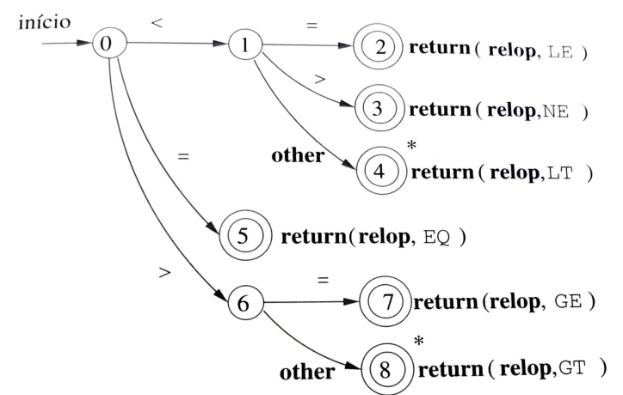
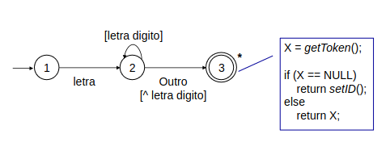
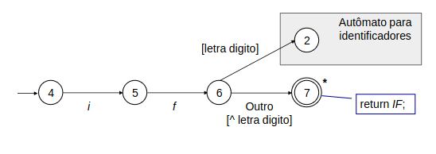
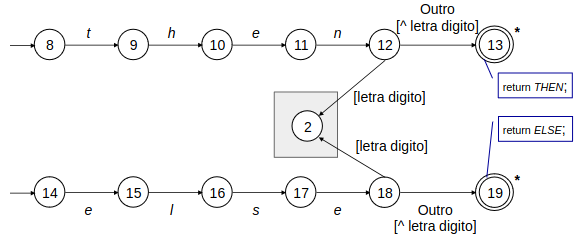
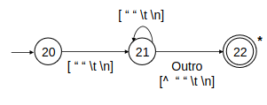
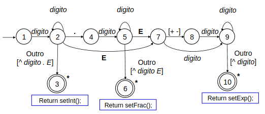
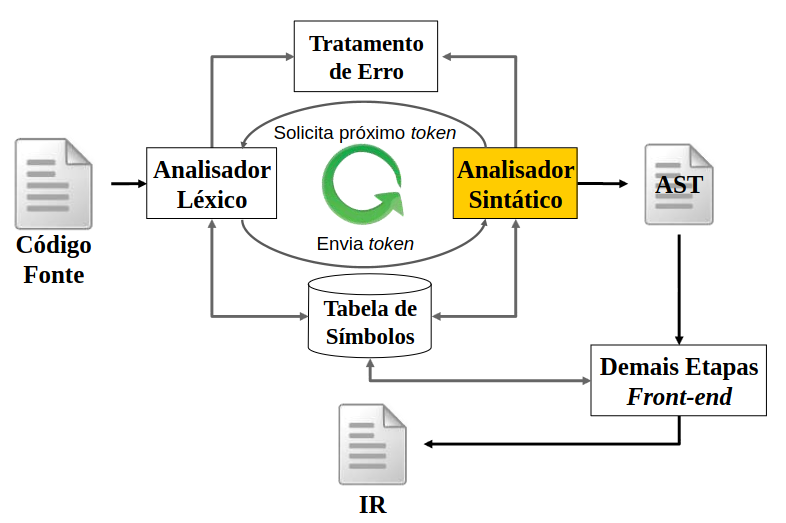

# Construção de Compiladores

## Estrutura básica de um compilador

- Back-end: responsável pela geração do código objeto.
- Front-end: responsável pela análise léxica, sintática e semântica do código fonte.

- Para realizar a comunicação entre as partes citadas acima, é necesária uma representação intermediária (IR) que seja independente de plataforma e linguagem.
  - isso permite que o back-end seja reutilizado para diferentes linguagens e plataformas (compiladores multilinguagens).

### Front-end

- valida a estrutura do código fonte quanto a sua forma (sintática) e significado (semântica).
  - sintaxe: conjunto de regras que determinam uma linguagem de programação (construções corretas)
  - semântica: como as regras devem ser interpretadas/entendidas/intrepretadas (entendimento das instruções), ou seja, o significado das construções.

#### Etapas (Front-end)

- Entrada:
  - Código fonte
- Processos:
  - Análise léxica
  - Análise sintática
  - Análise semântica
  - geração do código intermediário
- saída:
  - Representação intermediária (IR)
  - Mensagens de erros (se houver)

#### Etapa de análise

- Quebra o código em tokens (análise léxica)
  - tokens: menor unidade léxica (palavras reservadas, identificadores, operadores, etc)
- Valida se a estrutura sintática está correta (análise sintática)
  - Reconhece programas aceitos (ou não) pela linguagem
- Verifica a consistência semântica do programa (análise semântica)
  - Verificação de tipos, compatibilidade de operandos, etc.
- Gera a IR do código analisado anteriormente (geração do código intermediário)
  - IR é moldada para interfacear com o back-end
- Gera informações sobre o código e as armazena em uma estrutura de dados chamada de tabela de símbolos
  - Tabela manipulada em diferentes etapas do front-end
- Reporta erros de forma útil
- Boa parte do front-end pode ser automatizada

### Back-end

#### Etapas (Back-end)

- Entrada: IR
- Processos:
  - Geração do código
  - Otimização dependente da máquina
- Saída
  - Código objeto específico para a arquitetura alvo
  - Mensagens de erros (se houver)

#### Etapa de síntese

- Gera o código objeto para uma arquitetura alvo
  - Seleciona as instruções ISA para implementar as operações da IR
  - Define quais valores manter nos registradores (alocação)
  - Define a distribuição das instruções entre os recursos disponíveis para o escalonamento (escalonamento)
- Otimização de baixo nível (local)
  - Focada no hardware
  - Busca melhorar o desempenho do código gerado, considerando os recursos disponíveis na arquitetura alvo
- Garante a conformidade com as interfaces do sistema
- Automação mais complexa e difícil
  - Costuma houver heurísticas (não determinísticas)

### Compiladores multi-plataforma

- Ambientes atuais admitem diferentes front e back-ends


- Dificuldades dos projetos multi-plataforma
  - Todo conhecimento específico da linguagem deve estar no front-end
  - Deve codificar todas as características em uma única representação intermediária (IR)
  - Todo conhecimento específico da plataforma deve estar no back-end
- Sucesso limitado em ambientes com IRs de baixo nível
- Área de pesquisa ativa (Graal e Truffle)

### Compiladores Otimizantes

- Adotam uma terceira etapa (middle-end)


### Middle-end

#### Etapas (middle-end)

- Entrada: IR (original gerada pelo front-end)
- Processos:
  - Análise da IR atual
    - Gera conhecimento contextual do código
  - Aplicação de transformações
    - Forma monolítica (programa) ou estrutura (funções)
- Saída:
  - Representação intermediária (IR) otimizada

#### Etapa de otimização

- Otimização de alto nível (global)
  - Realiza modificações sintáticas no IR
    - Possibilitar ao back-end gerar um código melhor
  - Independente da arquitetura alvo
    - Otimização "especulativa" baseada em ações pré-definidas (passos de otimização)
  - Garantir a solução ótima é um problema indecidível
- Envolve a aplicação de uma sequência de passos de otimização sobre o código intermediário
  - Existem passos de anaĺise e de transformação
  - Quantidade de passos disponíveis varia entre os compiladores
  - Número e tipo dos passos aplicados afetam o tempo gasto no processo
  - Efetividade de um passo depende de condições específicas do código
  - Ordem de aplicação interfere no código gerado
    - Passos de otimização interagem entre si
    - Sequências distintas -> diferentes códigos e desempenho
  
### Estrutura do compilador


### Análise léxica

- Transforma sequência de caracteres em uma sequência de símbolos básicos da linguagem (tokens)
  - Reconhecer os tokens do programa
    - Reconhecimento de sequências elementares completas (padrões)
    - Identificação e classificação das palavras (átomos ou lexemas)
  - Eliminação de delimitadores e comentários
  - Preenchimento inicial da tabela de símbolos
  - Relatar ou recuperar erros léxicos
    - Ex: fim inesperado de arquivo, mal formação de lexemas, etc.
- Analisador léxico pode ser gerado de forma automática
  - A partir da especificação dos padrões por expressões regulares
  - Ex: Flex

---

- Lê o fluxo de caracteres do código fonte (scanning) e os agrupa em (lexemas)
  - Leitura é feita da esquerda (início) para a direita (fim)
- Cada lexema retorna um token no formato:
  - <tipo, atributo>
  - tipo: identificador do tipo do token
  - atributo: dados referentes ao lexema
    - Ex: localização na tabela de símbolos (chave), valor de uma constante, etc.

### Análise sintática

- Validar a estrutura gramatical da sequência de tokens
  - Agrupa os tokens em estruturas sintáticas da linguagem
    - Sequência válida de tokens e hierarquias de estruturas
  - Estruturas são especificadas em uma gramática livre de contexto (GLC)
- Gerar a IR que representa a estrutura do código
  - Concreta: codifica toda a estrutura sintática do programa
    - Árvore de derivação
  - Abstrata: codifica apenas as partes essenciais do código
    - Árvore Sintática Abstrata (AST)
- Reportar erros sintáticos
  - Ex: "; esperado", "parêntese desbalanceado", etc
- Também é possível usar geradores automáticos
  - Utilização de GLC
  - Ex: Yacc

### Gramática livre de contexto (CFG)


### Árvore de deviração


### Árvore sintática abstrata (AST)


- sumariza a estrutura gramatical
  - não inclui informações da derivação
- mais utilizada pelos compiladores
- é uma forma de IR

### Análise semântica (contexto)

- Verifica a consistência semântica do programa fonte a partir da definição da linguagem
  - Envolve a análise de contexto
  - Usa a AST (Árvore semântica abstrata) e as informações da tabela de símbolos no processo
- Relata erros de contexto e de tipos
  - Ex: variável não declarada, número de parâmetros inconsistente, incompatibilidade de tipos, etc.

### Geração de código intermediário

- Gera a IR usada internamente pelo compilador
  - IR explícita de baixa nível (ex: código de 3 endereços)
  - Independe da linguagem e da máquina (na teoria)
  - Programa para uma máquina abstrata
- IR deve ter 2 propriedades importantes em relação ao desempenho:
  - Ser facilmente produzida
  - Ser facilmente traduzida para máquina alvo
- Geralmente é realizada em conjunto com as análises sintática e semântica

### Código de 3 endereços

- É uma da IR mais utilizadas
- Conjunto de instruções com 3 operandos:
  - Atribuições possui no máximo um operador no lado direito
  - Compilador precisa gerar um nome temporário para guardar o resultado das instruções (registrador)
  - Algumas instruções possuem menos de 3 operandos
- Ex: dado que as variáveis são do tipo float, a instrução "x = y+z*10;" gera o seguinte código de 3 endereços
  
  ```IR
  t1 = inttofloat(10)
  t2 = id3 * t1
  t3 = id2 + t2
  id1 = t3
  ```

### Otimização

- Modifição para melhorar desempenho no código
  - podendo diminuir tempo de execução,
  - espaço de memória, tamanho de código,
  - consumo energético,
  - etc...

- Otimizador deve atender aos seguinte requisitos
  - preservar a semântica do programa (estar correto)
    - produz o efeito esperado com as entradas fornecidas
    - precisa de verificação formal
  - ser eficiente
    - obviamente, como é uma otimização, deve ter mais eficiente o uso desse processo do que não usá-lo
  - tempo de compilação aceitável
    - após a otimização podem ocorrer alterações na estrutura do código que podem aumentar o tempo de compilação
  - esforços de projeto precisam ser administráveis
    - não pode ser muito complexo de ser implementado

#### Tipos

- Global
  - analisa o programa como um todo ou independente da arquitetura da máquina, ou seja, em alto nível
  - otimiza o IR
  - desempenho depende da qualidade do projeticsta
    - quais e como são implementados os passos de otimização


- Local
  - analisa o programa em um nível mais baixo, ou seja, depende da arquitetura da máquina
  - otimiza o código objeto
  - desempenho depende do conhecimento da arquitetura alvo
    - descições se baseiam nas restrições impostas pelos recursos disponíveis

### Geração de código objeto

- Gera o código objeto a partir da IR
  - Código objeto é o código de máquina
  - Depende da arquitetura alvo
- Mapeia cada nó da AST (Árvore Semântica Abstrata) ou instrução de 3 endereços em instruções na linguagem objeto (seleção de instruções)
  - Gerar código de máquina (relocável ou absoluto) ou de montagem (assembly)
  - Busca produzir código rápico e compacto
  - Aproveita as características arquiteturais
    - Ex: modos de enderçamento disponíveis
  - Pode ser visto como um problema de alocação de registradores (pattern matching)
    - Métodos ad hoc, pattern matching, programação dinâmica

---

- Alocação de registradores é um aspecto crítico dessa etapa
  - Assegura que os dados estejam disponíveis quando forem usados
  - Gerecimanto de um quantidade limitada de registradores
  - Pode mudar as intruções e/ou incluir instruições de load/store
  - Alocação ótima é um problema NP-completo
    - Problema de coloração de grafos
    - Compiladores adotam soluções aproximadas
- Alocação de memória para os identificadores (variáveis)
  - Decisões sobre alocação doe espaço podem ser durante a geração do código intermediário ou do código objeto

---

- Escalonamento de instruções
  - Busca evitar paradas de hardware devido a dependências de dados (stall e interlock)
  - Tentar usar todas as unidade funcionais de forma eficiente (paralela)
  - Pode aumentar o tempo de vida das variáveis
    - Mudança na alocação
  - Escalonamento ótimo é um problema NP-completo
    - Métodos heurísticos


### Formas de organização

- Fases de um compilador podem ser executadas separadamente (em sequência) ou combinada em passos

- Compilação em etapas (sequencial):
  - A execução de uma faset termina antes de iniciar a próxima
  - Vantagem: possibilidade de otimizações no código
  - Desvantagem: aumento no tempo de compilação

- Compilação em um passo:
  - Programa-Objeto é produzido à medida que o programa-fonte é lido
  - Vantagem: eficiência na compilação
  - Desvantagem: dificuldade em otimizar o código

- Ambientes de compilação modernos adotam um meio termo
  - Fases agrupadas em front-end (análise), middle-end (otimização) e back-end (geração de código/síntese)

## Análise Léxica

> Etapa de Análise do Compilador


- Processo iterativo e reativo

### Projeto da Etapa de Análise

- Por que dividir análise léxica e sintática?
  - Permite simplificar uma das fases (projeto mais simples)
    - Ex: análise sintática e sem tratamento para comentários
  - Permite a adoção de técnicas especializadas/otimizadas para certas tarefas (melhor eficiência do compilador)
    - Ex: técnicas de buferização especializadas para a leitura de caracteres e o processamento de tokens
  - Facilita a portabilidade do compilador (manutenção)
    - Peculiaridades da linguagem ou dos dispositivos podem ser restringidas ao analisador léxico facilitando modificações
    - Ex: Tratamento de símbolos especiais (^ em Pascal) ou fora do padrão (ex: letras do alfabeto grego)

### A Análise Léxica

- Análise léxica é a 1º fase da etapa de análise
  - Envolve varredura (scanner) e análise propriamente dita (lexer)
  - Implementada como uma sub-rotina do analisador sintático
- Tarefa principal: agrupar os caracteres do código fonte em tokens
  - Ler os caracteres de um buffer de entrada do programa fonte
  - Agrupá-los em lexemas
  - Produzir uma sequência de tokens como saída
    - Usada pelo analisador sintático para validar as regras da gramática
- Pode realizar outras tarefas secundárias
  - Remover símbolos desnecessários
    - Comentários e separadores (espaço em branco, tabulação e quebra de linha)
  - Correlacionar as mensagens de erro com o código fonte
  - Processar diretivas de controle (ex: expansão de macros)

### Token

- Classe de elementos aceitos em uma linguagem de programação
  - Unidade básica da sintaxe
  - Ex: identificadores, operadores, palavras-chave, etc.
- Elo de ligação entre as análises léxica e sintática
  - Representa os lexemas do código fonte
    - Palavras aceitas pela linguagem
  - Corresponde a um nó folha da árvore sintática
    - Símbolo terminal de uma gramática livre de contexto

---

- Representado por um par <Nome, Atributo>
  - Nome: símbolo abstrato que indica o tipo de token
    - Símbolos de entrada do analisador sintático
  - Atributo: guarda informações adicionais necessárias (opcional)
    - Atributo pode ser um tipo estruturado que guarda informações
    - Ex: lexema encontrado, valor de dado, localização na entrada, etc.
- Classe de tokens presentes em uma linguagem:
  - Palavras-chave
  - Operadores (organizados individualmente ou em classes)
  - Identificadores (ID)
  - Constantes (ex: número ou cadeia de literais)
  - Símbolos de pontuação (ex: parênteses, ponto-e-vírgula, etc.)

### Padrão de um Token

- Regra que define o conjunto de palavras associado a um token
  - Descreve a forma (cadeia de caracteres) que os lexemas de um token podem assumir
  - Ex: Qualquer ID é formado por uma letra seguida por letras, números e " "
- Expressões regulares são uma importante notação para especificar os padrões de lexemas
  - Ex: letra (letra | digito | _)*
- Os padrões são usados na construção dos reconhecedores das cadeias do conjunto

### Lexema

- Sequência de caracteres no programa fonte que casa com o padrão de um token
- Palavra reconhecida pelo analisador léxico como uma instância do token
  


### Atributo dos Tokens

- Usado quando mais de um lexema casa com o padrão do token
  - Ex: identificador, operador relacional, etc.

- Fornece informações adicionais para as fases seguintes do compilador
  - Descreve o lexema representado pelo token
  - Nome do token influencia nas decisões durante a análise sintática
  - Valor do atributo influencia na tradução do token após o reconhecimento sintático

### Erros Léxicos

- Identificar um erro no código fonte durante a análise léxica é difícil sem o auxílio de outros componentes
  - Ex: fi é um identificador ou o if escrito errado?
- Erros léxicos ocorrem quando nenhum dos padrões de token casa com a entrada restante
  - Ex: símbolo desconhecido, lexemas mal formadas, identificadores muito grandes e fim de arquivo inesperado
- Erros associados ao tratamento de constantes:
  - Exceder o limite de casas decimais e do expoente de números reais (tatno no tamanho quando no valor)
  - Exceder o limite máximo de cadeia de caracteres
  - Exceder o limite do número de dígitos e do valor de um inteiro

---

- Estratégias de recuperação podem ser usadas
  - Envolve transformações na entrada restante:
    - Remover um caractere
    - Inserir um caractere que falta
    - Substituir um caractere por outro
    - Transpor dois caracteres adjacentes
  - "Modo pânico": remove caracteres até reconhecer o lexema
  - Estratégia mais simples aplica uma única transformação
  - Estretégia mais geral busca encontrar o menor número de transformaçoes necessárias para obter um lexema válido
    - Na prática, é uma estratégia muito dispendiosa
    - Não garante efetividade dos resultados

### Buffering da Entrada

Consiste na leitura da entrada (código fonte) para a identificação dos lexemas (casamento de um padrão)

- Consome caractere a caractere da esquerda para direita

Identificação correta de um lexema pode exigir a leitura de 1 ou + caracteres a frente (lookahead)

- Ex: na linguagem Fortran, as palavras-chave não são reservadas e os espaços são desconsiderados
  - DOI=1.25  =>  lexema: DOI - token: ID
  - DOI=1,25  =>  lexema: DO - token: DO

Técnicas especializadas de buffering são empregadas para reduzir o custo da operação

- Exemplo:
  - 2 buffers para tratar lookaheads grandes com segurança
  - Uso de "sentinelas" para evitar verificação de fim do buffer

### Pares de Buffer

Adota 2 buffers de entrada de mesmo tamanho

- Relacionado com o tamanho do bloco do disco (ex: 4096 bytes)

Comando de leitura do sistema carrega todo o buffer ao invés de um único caractere

- Buffers são recarregados alternadamente
- Caracete especial EOF define fim do arquivo

Abordagem adota 2 ponteiros:

- ini: marca o início do lexema atual
- prox: indica o próximo caractere a ser lido
  - implementa o lookahead até que haja um casamento de padrão
  - Provoca a operação de recarga sempre que extrapola o tamanho do buffer

### Sentinelas

Envolve incluir um caractere extra (sentinela) no fim de cada buffer

- Geralmente é usado o caractere especial EOF
- Exige uma posição a mais na estrutura de armazenamento

Visa reduzir a quantidade de testes a cada caractere lido

- Original: fim de buffer e qual caractere lido
- Sentinela: qual caractere lido

Posição do EOF indica o cenário a ser tratado

- Final do buffer: EOF na última posição
- Final do arquivo de entrada: EOF nas demais posições

### Expressões Regulares (ER)

Notação formal usada para especificar a estrutura (padrões) dos tokens

- Possibilita um analisador léxico sem erros (estrutura precisa)
- Ex: string definida como uma cadeia de caracteres entre aspas
  - Não são todos os caracteres que são permitidos (ex: '\n')
- Ex: números reais em notação de ponto fixo (ex: 3.0 e 0.12)
  - 3. e .12 são aceitos em Fortran, mas não em Pascal

Descreve as linguagens a partir de 3 operações sobre os símbolos de algum alfabeto:

- União: L U M = $\{ s | s \in  \text{L ou s} \in M \}$
- Concatenação: LM = $\{ st | s \in \text{L e t} \in M \}$
- Fecho Kleene: $L* = \cup^{i=0..\infin}L$

### Processo Indutivo

ER podem ser definidas a partir de expressões menores

- Cada expressão r denota uma linguagem L(r)

Regras que formam a base das expressões regulares:

- $\epsilon$ é uma expressão regular e L$(\epsilon) = \{ \epsilon \}$
- Se a é um símbolo de $\Sigma$, então a é uma expressão regular e L(a) = {a}

Regras que formam a parte indutiva das expressões regulares

- (r)|(s) é uma expressão regular denotando L(r) U L(s)
- (r)(s) é uma expressão regular denotando L(r)L(s)
- (r)* é uma expressão regular denotando L(r)*
- Se r é uma expressão regular, (r) também é e denota a mesma linguagem

### Precedência dos Operadores

1. Fecho
2. Concatenação
3. União

Todos com associatividade a esquerda

### Definições Regulares

Especifica expressões regulares a partir de outras expressões previamente definidas

- Expressões mais simples são nomeadas e seus nomes usados em expressões mais complexas

Não são usadas definições recursivas

- Nova definição baseia-se aepnas nas anteriores

Permite gerar expressões regulares apenas com os símbolos dos $\Sigma$

- Aplicação de substituições consecutivas das definições mais simples nas mais complexas

---

Seja $\Sigma$ o alfabeto. Uma definição regular é uma sequência de definições da forma:

- $d_1 \rarr r_1$
- $d_2 \rarr r_2$
- ...
- $d_n \rarr r_n$

- Cada $d_i$ é um novo símbolo $\notin \Sigma \cup {d_1, d_2, ..., d_{n-1}}$
- Cada $r_i$ é uma expressão regular sobre $\Sigma \cup {d_1, d_2, ..., d_{i-1}}$

### Notação Estendida

Extensões são adicionadas para melhorar a capacidade de especificar padrões de cadeia

- Não fazem parte da notação convencional de expressões regulares
- Usadas na especificação de analisadores léxicos (ex: Lex)
  
Extensões importantes:

- Operador +: representa o fecho positivo (uma ou mais instâncias)
  - (r) denota a linguagem L(r)
  - r$^+$ = r | $\epsilon$ e r = rr\*
- Operador ?: representa a opção (0 ou 1 instância)
  - r? = r | $\epsilon$
- Operador []: representa classes de caracteres
  - [abc] é equivalente a (a|b|c)
  - Útil para representar sequências lógicas
    - [a-z] é equivalente a (a|b|c|...|z)

### Reconhecimento de Tokens

Considere o fragmento de gramática:

- stmt $\rarr$ if expr then stmt else stmt |
- if expr then stmt |
- expr $\rarr$ term relop term | term
- term $\rarr$ id | num
- Tokens são símbolos terminais da gramática livre de context
- Devem ser reconhecidos e retornados pelo analisador léxico
  - Palavras-chave associadas a if, then, e else
  - Lexemas que casam com os padrões de relop, id e numero
- Separadores (ws) devem ser removidos (tratamento especial)
  - Não retorna token ao analisador sintático
  - Provoca a reinicialização da análise léxica a partir do caractere seguinte
  
### Diagramas de Transição

Fluxogramas usados no reconhecimento dos tokens

- Muito parecido com os autômatos finitos
- Gerados a partir dos padrões dos tokens
  - Estados: nós que representam as condições que podem ocorrer durante a procura de lexemas que casem com um padrão
    - Possui um estado inical e um ou mais estado finais ou de de aceitação
  - Transições: arestas direcionadas associadas à leitura de um ou + símbolos do alfabeto
    - Provoca mudança de estado e avanço do prox
  - Estados de aceitação indicam um lexema aceito
    - Não possuem transição de saída
    - Estão associados ás ações que devem ser realizadas pelo analisador léxico
    - Símbolo * indica recuo do prox (tratamento do lookahead)

---

Exemplo
~


### Palavras-Chave vs. Identificadores

Diferenciar palavras-chave e identificadores pode ser um problema

- Palavras-chave casam com o padrão dos identificadores
- Considerar as palavras-chave como reservadas ajuda no reconhecimento

Existem 2 formas de lidar com palavras reservadas:

- Tratar palavras reservadas como identificador
- Criar diagramas separados para cada palavra-chave

---

Tratar palavras reservadas como identifiacor

- Inicia tabela de símbolos com as palavras reservadas
- Consulta a tabela antes de incluir um novo lexema
  - Se encontrar registro, retora o nome do token
  - Senão inclui o novo lexema e retorna o ID



---

Criar diagramas separados para cada palavra-chave:

- Verifica se a cadeia terminou antes de associar o lexema ao token
  - Para evitar erros prioriza o maior prefixo aceito
  - Ex: ifan é um identificador e não a palavra chave if
- Se lexema casar com 2 padrões, deve priorizar a palavra chave



---

Variação que UNIFICA os diagramas do IF e do ID:

- Unificação é uma das estratégias para lidar com vários diagramas durante o processo de reconhecimento

### Diagramas de Transição (Continuação)

Como seriam os diagrama de transição para os demais tokens do nosso estudo de caso?

- then, else, ws e número

---

then e else

- Já está sendo coberto pelo autômato da 1 estratégia (palavras reservadas como identificadores)
- 2 estratégia



---

ws (separadores)

- Espaços em branco, tabulações e quebras de linha



---

Constante numérica

- numero -> digitos(.digitos)? (E[+-]?digitos)?



### Formas de Implementação

#### Tabeça de Símbolos

Forma de implementação da estrutura de represetnação dos tokens afeta a memória usada pela tabela de símbolos

- Operadores podem ser representados por 2 caracteres
- Palavras reservadas geralemnte naão são grandes
  - Também podem ser represetnadas por códigos
- Como lidar com identificadores, números e strings?
- Alocação estática:
  - Vantagem: implementação mais simples
  - Desvantagem: desperdício de memória
- Alocação dinâmica:
  - Vantagem: economia de memória
  - Desvantagem: complexidade de implementação

---

Despenho do analisador é influenciado pela eficiência da consulta a tabela de símbolos

- Busca linear:
  - Mais simples de implementar
  - Pior desempenho (O(n))
- Busca binária:
  - Boa eficiência (O(log n))
- Hashing:
  - Ideal para consulta a palavras reservadas (O(1))
  - Garante acesso sem colisões (palavras já são conhecidas)

#### Diagramas de Transição na implementação

Formas de implementação manual de um código para simular o comportamento de um diagrama

- Solução ad hoc
- Codificação direta do autômato finito
- Uso da tabela de transição

Implementação automático do código

- Muito usado em projetos reais
- Geralmente adotam métodos métodos dirigidos por tabela


## Análise Sintática



Determina se a estrutura sintática do programa (cadeia de tokens) é aceita na linguagem

- Especificação usa gramáticas livre de contexto (GLC)
  - Tokens são os símbolos terminais da gramática

- GLC descrever maior parte da sintaxe das linguagens
- Fases subsequentes devem analisar a AST para garantir a compatibilidade com as regras que não foram contempladas

Reconhecimento baseado