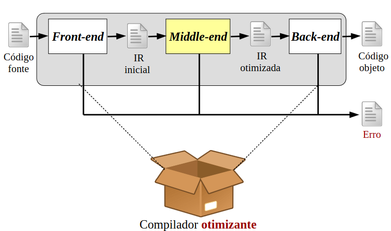
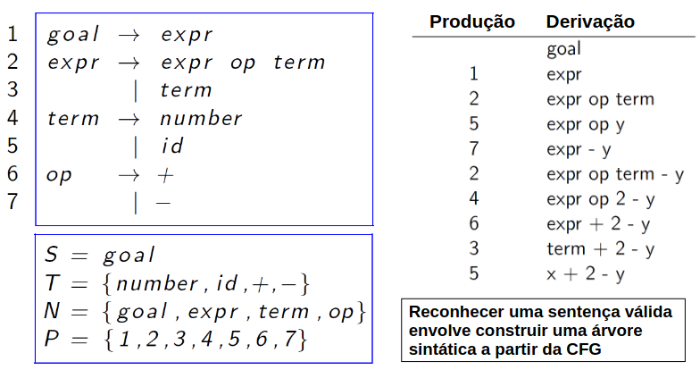
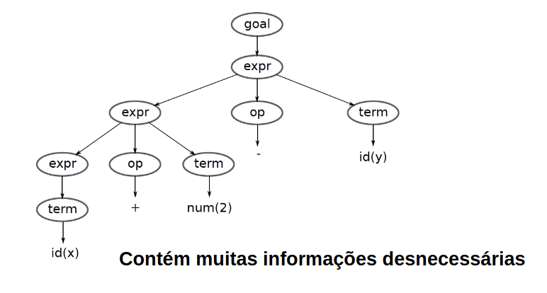

# Construção de Compiladores

## Estrutura básica de um compilador

- Back-end: responsável pela geração do código objeto.
- Front-end: responsável pela análise léxica, sintática e semântica do código fonte.

- Para realizar a comunicação entre as partes citadas acima, é necesária uma representação intermediária (IR) que seja independente de plataforma e linguagem.
  - isso permite que o back-end seja reutilizado para diferentes linguagens e plataformas (compiladores multilinguagens).

### Front-end

- valida a estrutura do código fonte quanto a sua forma (sintática) e significado (semântica).
  - sintaxe: conjunto de regras que determinam uma linguagem de programação (construções corretas)
  - semântica: como as regras devem ser interpretadas/entendidas/intrepretadas (entendimento das instruções), ou seja, o significado das construções.

#### Etapas (Front-end)

- Entrada:
  - Código fonte
- Processos:
  - Análise léxica
  - Análise sintática
  - Análise semântica
  - geração do código intermediário
- saída:
  - Representação intermediária (IR)
  - Mensagens de erros (se houver)

#### Etapa de análise

- Quebra o código em tokens (análise léxica)
  - tokens: menor unidade léxica (palavras reservadas, identificadores, operadores, etc)
- Valida se a estrutura sintática está correta (análise sintática)
  - Reconhece programas aceitos (ou não) pela linguagem
- Verifica a consistência semântica do programa (análise semântica)
  - Verificação de tipos, compatibilidade de operandos, etc.
- Gera a IR do código analisado anteriormente (geração do código intermediário)
  - IR é moldada para interfacear com o back-end
- Gera informações sobre o código e as armazena em uma estrutura de dados chamada de tabela de símbolos
  - Tabela manipulada em diferentes etapas do front-end
- Reporta erros de forma útil
- Boa parte do front-end pode ser automatizada

### Back-end

#### Etapas (Back-end)

- Entrada: IR
- Processos:
  - Geração do código
  - Otimização dependente da máquina
- Saída
  - Código objeto específico para a arquitetura alvo
  - Mensagens de erros (se houver)

#### Etapa de síntese

- Gera o código objeto para uma arquitetura alvo
  - Seleciona as instruções ISA para implementar as operações da IR
  - Define quais valores manter nos registradores (alocação)
  - Define a distribuição das instruções entre os recursos disponíveis para o escalonamento (escalonamento)
- Otimização de baixo nível (local)
  - Focada no hardware
  - Busca melhorar o desempenho do código gerado, considerando os recursos disponíveis na arquitetura alvo
- Garante a conformidade com as interfaces do sistema
- Automação mais complexa e difícil
  - Costuma houver heurísticas (não determinísticas)

### Compiladores multi-plataforma

- Ambientes atuais admitem diferentes front e back-ends


- Dificuldades dos projetos multi-plataforma
  - Todo conhecimento específico da linguagem deve estar no front-end
  - Deve codificar todas as características em uma única representação intermediária (IR)
  - Todo conhecimento específico da plataforma deve estar no back-end
- Sucesso limitado em ambientes com IRs de baixo nível
- Área de pesquisa ativa (Graal e Truffle)

### Compiladores Otimizantes

- Adotam uma terceira etapa (middle-end)



### Middle-end

#### Etapas (middle-end)

- Entrada: IR (original gerada pelo front-end)
- Processos:
  - Análise da IR atual
    - Gera conhecimento contextual do código
  - Aplicação de transformações
    - Forma monolítica (programa) ou estrutura (funções)
- Saída:
  - Representação intermediária (IR) otimizada

#### Etapa de otimização

- Otimização de alto nível (global)
  - Realiza modificações sintáticas no IR
    - Possibilitar ao back-end gerar um código melhor
  - Independente da arquitetura alvo
    - Otimização "especulativa" baseada em ações pré-definidas (passos de otimização)
  - Garantir a solução ótima é um problema indecidível
- Envolve a aplicação de uma sequência de passos de otimização sobre o código intermediário
  - Existem passos de anaĺise e de transformação
  - Quantidade de passos disponíveis varia entre os compiladores
  - Número e tipo dos passos aplicados afetam o tempo gasto no processo
  - Efetividade de um passo depende de condições específicas do código
  - Ordem de aplicação interfere no código gerado
    - Passos de otimização interagem entre si
    - Sequências distintas -> diferentes códigos e desempenho
  
### Estrutura do compilador


### Análise léxica

- Transforma sequência de caracteres em uma sequência de símbolos básicos da linguagem (tokens)
  - Reconhecer os tokens do programa
    - Reconhecimento de sequências elementares completas (padrões)
    - Identificação e classificação das palavras (átomos ou lexemas)
  - Eliminação de delimitadores e comentários
  - Preenchimento inicial da tabela de símbolos
  - Relatar ou recuperar erros léxicos
    - Ex: fim inesperado de arquivo, mal formação de lexemas, etc.
- Analisador léxico pode ser gerado de forma automática
  - A partir da especificação dos padrões por expressões regulares
  - Ex: Flex

---

- Lê o fluxo de caracteres do código fonte (scanning) e os agrupa em (lexemas)
  - Leitura é feita da esquerda (início) para a direita (fim)
- Cada lexema retorna um token no formato:
  - <tipo, atributo>
  - tipo: identificador do tipo do token
  - atributo: dados referentes ao lexema
    - Ex: localização na tabela de símbolos (chave), valor de uma constante, etc.

### Análise sintática

- Validar a estrutura gramatical da sequência de tokens
  - Agrupa os tokens em estruturas sintáticas da linguagem
    - Sequência válida de tokens e hierarquias de estruturas
  - Estruturas são especificadas em uma gramática livre de contexto (GLC)
- Gerar a IR que representa a estrutura do código
  - Concreta: codifica toda a estrutura sintática do programa
    - Árvore de derivação
  - Abstrata: codifica apenas as partes essenciais do código
    - Árvore Sintática Abstrata (AST)
- Reportar erros sintáticos
  - Ex: "; esperado", "parêntese desbalanceado", etc
- Também é possível usar geradores automáticos
  - Utilização de GLC
  - Ex: Yacc

### Gramática livre de contexto (CFG)



### Árvore de deviração



### Árvore sintática abstrata (AST)


- sumariza a estrutura gramatical
  - não inclui informações da derivação
- mais utilizada pelos compiladores
- é uma forma de IR

### Análise semântica (contexto)

- Verifica a consistência semântica do programa fonte a partir da definição da linguagem
  - Envolve a análise de contexto
  - Usa a AST (Árvore semântica abstrata) e as informações da tabela de símbolos no processo
- Relata erros de contexto e de tipos
  - Ex: variável não declarada, número de parâmetros inconsistente, incompatibilidade de tipos, etc.

### Geração de código intermediário

- Gera a IR usada internamente pelo compilador
  - IR explícita de baixa nível (ex: código de 3 endereços)
  - Independe da linguagem e da máquina (na teoria)
  - Programa para uma máquina abstrata
- IR deve ter 2 propriedades importantes em relação ao desempenho:
  - Ser facilmente produzida
  - Ser facilmente traduzida para máquina alvo
- Geralmente é realizada em conjunto com as análises sintática e semântica

### Código de 3 endereços

- É uma da IR mais utilizadas
- Conjunto de instruções com 3 operandos:
  - Atribuições possui no máximo um operador no lado direito
  - Compilador precisa gerar um nome temporário para guardar o resultado das instruções (registrador)
  - Algumas instruções possuem menos de 3 operandos
- Ex: dado que as variáveis são do tipo float, a instrução "x = y+z*10;" gera o seguinte código de 3 endereços
  
  ```IR
  t1 = inttofloat(10)
  t2 = id3 * t1
  t3 = id2 + t2
  id1 = t3
  ```
